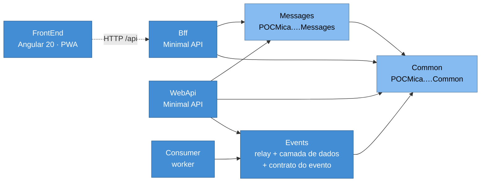
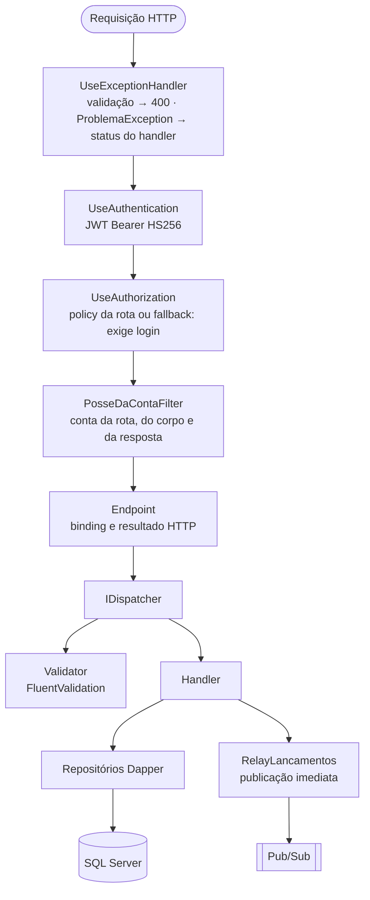

# Documento de Arquitetura de Software (SAD-App)

Como o aplicativo é organizado por dentro: módulos, camadas, componentes, padrões e as
restrições que moldam o código. Retrato do commit `45bcd17`, em 07/10/2026.

A visão da solução (nuvem, rede, integração entre sistemas, segurança, transição) está no
[SAD-Sol](../solucao/01-sad-sol.md). O que o sistema faz está nos
[requisitos funcionais](../../requisitos-funcionais.md), e o que ele garante, nos
[requisitos não funcionais](../../requisitos-nao-funcionais.md).

## 1. O aplicativo

Uma conta corrente com saldo consolidado assíncrono. O lançamento é gravado na hora; a
consolidação vem depois, por evento. São sete projetos de produção:

| Projeto | Tipo | Processo | Imagem |
|---|---|---|---|
| `.FrontEnd` | Angular 20 standalone, PWA | navegador | `nginx:1.27-alpine` |
| `.Bff` | Minimal API | sim | `aspnet:9.0` |
| `.WebApi` | Minimal API | sim | `aspnet:9.0` |
| `.Events` | Worker do relay e camada de dados compartilhada | sim | `runtime:9.0` |
| `.Consumer` | Worker de consolidação | sim | `runtime:9.0` |
| `.Messages` | Biblioteca: requests e responses da WebApi | não | pacote NuGet |
| `.Common` | Biblioteca: enums, helpers, roles, regra de posse | não | pacote NuGet |

Mais cinco projetos de teste e o `.TestSupport`, em `tests/`, e duas ferramentas de medição
fora da solução, em `tools/`.

## 2. Objetivos de qualidade que moldam o código

Cada objetivo abaixo explica uma escolha que, sem ele, pareceria excesso.

| # | Objetivo | Como aparece no código |
|---|---|---|
| Q1 | Nenhum lançamento somado duas vezes, nem fora de ordem na conta | Estágio na própria linha; todo `UPDATE` de transição traz o estágio esperado no `WHERE`; ordering key = conta; reserva que nunca traz sucessor de pendente |
| Q2 | Lançar não depende da consolidação | A linha é o outbox; a publicação imediata tem teto de 2 s e nunca devolve erro depois do commit |
| Q3 | Configuração errada derruba a subida, não a operação | `*Options` sem valor padrão, com `Valida` e `ValidateOnStart` |
| Q4 | Regra testável sem banco nem broker | Interfaces em `Contracts/`; consolidação separada do transporte; dispatcher que resolve handlers por tipo |
| Q5 | A mesma imagem no local e na nuvem | `EmulatorDetection.EmulatorOrProduction`; `Relay:LoopContinuo`; tudo que muda vem de variável de ambiente |
| Q6 | Dinheiro exato | Centavos em `bigint`; conversão num só lugar (`DinheiroHelper`) |

## 3. Restrições

| Restrição | Origem | Consequência no código |
|---|---|---|
| .NET 9, `Nullable` ligado em todos os projetos | escolha da POC | `required` nas mensagens; `string?` onde nulo é válido |
| SQL Server como único dialeto, local e no GCP | [ADR-SOL-02](../solucao/03-adrs/ADR-SOL-02-sql-server-como-motor-unico.md) | SQL escrito à mão com dicas do T-SQL: `UPDLOCK`, `READPAST`, `HOLDLOCK`, `OUTPUT` |
| Sem EF Core | [ADR-SW-02](03-adrs/ADR-SW-02-dapper-sem-orm.md) | Dapper; esquema idempotente garantido na subida, sem migrations |
| `.Common` sem ASP.NET Core | Events e Consumer rodam na imagem `runtime:9.0` | O filtro de posse tem uma cópia em cada API; só a regra (`PodeAcessarConta`) é compartilhada |
| Ordenação do Pub/Sub exige a opção no publicador e na subscription | Google Cloud Pub/Sub | `EnableMessageOrdering` nos dois lados; `ResumePublish` no `catch` do publicador |
| `PublisherClient.PublishAsync` não aceita `CancellationToken` | biblioteca do Google | O teto de 2 s é feito parando de esperar (`Task.WhenAny`), não cancelando |
| O front só conhece o BFF | [ADR-SOL-05](../solucao/03-adrs/ADR-SOL-05-bff-como-unica-porta.md) | Nenhuma chamada do Angular para a WebApi; o BFF repassa o mesmo Bearer |
| Pacotes no nuget.org só com o prefixo `POCMica.` | glob da API key | `PackageId` difere do namespace; versão publicada é permanente |
| Repositório público | publicação no GitHub | Nada de segredo de produção no código (ver as exceções em [06 · Segurança](../solucao/06-seguranca-e-threat-model.md#5-gestão-de-segredos)) |

## 4. Estilo arquitetural

- **Camadas finas por processo.** Endpoint, filtro, dispatcher, validador, handler e
  repositório. Cada camada faz uma coisa; o endpoint só faz binding.
- **CQRS sem banco separado.** Comandos e consultas têm handlers distintos. A escrita vai
  para `LancamentosDiarios`; a leitura do saldo vem do read model `SaldoConsolidado`,
  mantido pelo Consumer, mais uma soma dos pendentes.
- **Outbox transacional na própria linha**, com dois publicadores: a WebApi, logo após o
  commit, e o relay, por varredura.
- **Consumidor idempotente**, pelo estágio esperado no `WHERE`.
- **BFF.** Uma API só para a tela: agrega, formata em pt-BR e repassa o token.

Os padrões, um a um, estão na [seção 8](#8-padrões-aplicados).

## 5. Visão de módulos



Setas cheias são referências de projeto; a tracejada é chamada HTTP. Ninguém referencia o
BFF nem a WebApi.

| Projeto | Responsabilidade | Não pode |
|---|---|---|
| `.WebApi` | Regras de lançamento e saldo; usuários, emissão do JWT; publicação imediata | Formatar para a tela |
| `.Bff` | Rotas das telas; posse da conta antes de ir à WebApi; de-para para o payload da tela; repasse de `/auth` | Acessar banco ou broker; emitir token |
| `.Events` | `RelayLancamentos` e `RelayWorker`; `LancamentoRepository` e o esquema dos lançamentos; `PubSubPublicador`; o contrato `LancamentoRegistradoEvent` | Conhecer usuário ou login |
| `.Consumer` | Assinar a subscription e consolidar | Publicar |
| `.Messages` | Commands e responses que a WebApi recebe e devolve | Depender de Dapper, Pub/Sub ou ASP.NET Core |
| `.Common` | Enums, `DinheiroHelper`, `LancamentoHelper`, roles, policies, claims, `IReferenciaConta`, `ICommand`/`IQuery` | Depender de ASP.NET Core |
| `.FrontEnd` | Telas, sessão, polling do saldo, PWA | Falar com outra coisa que não o BFF |

**Por que a camada de dados mora no `.Events`.** WebApi, relay e Consumer escrevem na mesma
tabela, e a regra de transição de estágio está no SQL. Com um só repositório, os três
processos usam o mesmo SQL em vez de três cópias que divergiriam
([ADR-SW-06](03-adrs/ADR-SW-06-camada-de-dados-compartilhada-no-events.md)). O preço: a WebApi
carrega o Pub/Sub e o worker do relay como dependência transitiva, e o publish precisa do
alvo `IgnorarAppsettingsDasReferencias` para não levar o `appsettings.json` do `.Events`
(erro `NETSDK1152`).

## 6. Camadas por processo

### 6.1 WebApi



| Camada | Faz | Não faz | Onde |
|---|---|---|---|
| Endpoint | Binding de rota, query e corpo; escolhe 200, 201 ou 404 | Regra | [`Endpoints/`](../../../MeusLancamentosDiarios.Integrator.WebApi/Endpoints) |
| Filtro de posse | 403 quando a conta pedida não é do usuário (Admin passa) | Conferir role (é da policy) | [`Auth/PosseDaContaFilter.cs`](../../../MeusLancamentosDiarios.Integrator.WebApi/Auth/PosseDaContaFilter.cs) |
| Dispatcher | Valida e resolve o handler pelo tipo da mensagem | Conhecer handler concreto no endpoint | [`Cqrs/Dispatcher.cs`](../../../MeusLancamentosDiarios.Integrator.WebApi/Cqrs/Dispatcher.cs) |
| Validator | Regras de formato e de negócio síncronas | Acessar banco | `Features/**/…Validator.cs` |
| Handler | Um caso de uso | HTTP | `Features/**/…Handler.cs` |
| Repositório | SQL e transações | Regra de tela | `LancamentoRepository` (no `.Events`), `UsuarioRepository` |

Handlers e validators são registrados por varredura do assembly
([`CqrsExtensions`](../../../MeusLancamentosDiarios.Integrator.WebApi/Cqrs/CqrsExtensions.cs)):
uma feature nova funciona só por existir.

**Erros.** `ValidationException` vira 400 com `ValidationProblemDetails`, as chaves no
caminho da propriedade (`Itens[3].Valor`). `ProblemaException` leva o status que o handler
escolheu: 401 para credencial, 409 para e-mail em uso, 400 para link vencido. O resto vira
500 com `ProblemDetails`. Falha de binding, como JSON inválido ou campo `required` ausente,
volta 400 antes de chegar ao validador.

**Organização.**

```
WebApi/
├── Program.cs              DI, pipeline e garantia do esquema na subida
├── Endpoints/              Auth, Lancamentos e Saldo: só binding
├── Cqrs/                   Dispatcher, registro por varredura, tradutores de exceção
│   └── Contracts/          IDispatcher, ICommandHandler, IQueryHandler
├── Features/
│   ├── Lancamentos/Commands/CriarLancamento/          Handler + Validator
│   ├── Lancamentos/Commands/CriarLancamentosEmLote/   Handler + Validator
│   ├── Lancamentos/Queries/ObterLancamento/           Query + Handler
│   ├── Saldo/Queries/ObterSaldo/ e ListarContas/
│   └── Auth/Commands/<caso>/ e Queries/ObterUsuarioAtual/
└── Auth/                   JWT, policies, posse, tokens, usuários, e-mail e Google
    ├── Tokens/             EmissorDeTokens, AberturaDeSessao, SegredoOpaco
    ├── Data/               UsuarioRepository, AuthBootstrapper, entidades e enums
    └── Externos/           SmtpEnviadorEmail, ValidadorGoogle
```

### 6.2 BFF

```
endpoint ──► PosseDaContaFilter ──► I*Service ──► ILancamentosApiClient ──► WebApi
              recusa 403 cedo        regra da tela      HTTP + Bearer repassado
                                     e IConversor (de-para para o payload da tela)
```

- **Services** (`SaldoService`, `LancamentoService`, `AutenticacaoService`) aplicam a regra
  da tela. O exemplo é o novo lançamento: o cliente nunca escolhe conta, o BFF usa a do
  token; o admin pode informar outra.
- **Conversores** (`IConversor<TOrigem, TDestino>`) são funções puras: `SaldoResponse` vira
  `SaldoTela`, com moeda, data e rótulos em pt-BR e o `intervaloPollingMs`.
- **Cliente HTTP tipado** com `RepassarTokenHandler`: o `Authorization` que chegou do front
  segue para a WebApi. `RespostaApi<T>` carrega status e `ProblemDetails` da WebApi sem
  reinterpretar, e `Mapear` converte só o sucesso.
- **`/api/auth/*`** é repasse puro (`RespostaRepassada`): status e corpo da WebApi chegam ao
  front como saíram.

### 6.3 Events: o relay

```
RelayWorker (host)  ──►  RelayLancamentos.ExecutarCicloAsync  ──►  ILancamentoRepository
  LoopContinuo=true: a cada Relay:Intervalo                     ──►  IPublicadorEventos (PubSubPublicador)
  LoopContinuo=false: um ciclo e StopApplication()
```

O ciclo é público e não conhece o host
([ADR-SW-09](03-adrs/ADR-SW-09-relay-independente-do-host.md)). Na subida, o worker garante
o esquema e, com `PubSub:CriarRecursos`, cria tópico e subscription.

### 6.4 Consumer

```
ConsolidacaoWorker (transporte)  ──►  ConsolidadorDeMensagem (regra)  ──►  ILancamentoRepository
  SubscriberClient, FlowControl(20)     corpo JSON → Confirmar | Devolver
  Ack/Nack
```

A regra não conhece Pub/Sub; recebe o corpo e devolve o que fazer com a mensagem
([ADR-SW-10](03-adrs/ADR-SW-10-consumer-com-regra-isolada-do-transporte.md)).

### 6.5 Front-end

```
src/app/
├── core/                 a única camada que fala com o BFF
│   ├── api.config.ts     API_BASE_URL
│   ├── auth.service.ts   sessão (signals + localStorage), login, Google, renovação, logout
│   ├── auth.interceptor.ts  Bearer em toda chamada; renova uma vez no 401
│   ├── auth.guards.ts    exigeLogin, somenteConvidado
│   ├── lancamentos.service.ts  saldo com polling condicional, contas, inclusão
│   └── erros.ts, moeda.ts, google-identity.ts, *.models.ts
├── saldo-consolidado/    tela de saldo
├── novo-lancamento/      tela de lançamento
└── auth/                 entrar, cadastro, esqueci-senha, redefinir-senha, botão do Google
```

Componentes standalone com `OnPush`, rotas com `loadComponent` (carga sob demanda), estado
em signals e service worker do Angular só no build de produção.

## 7. Preocupações transversais

| Preocupação | Solução | Onde |
|---|---|---|
| Autenticação | JWT Bearer HS256 validado nas duas APIs com os mesmos parâmetros; `MapInboundClaims = false` | `Auth/JwtOptions.cs` (WebApi e BFF) |
| Autorização | Policies `ClienteOuAdmin` e `SomenteAdmin`; fallback exige login; posse por filtro de endpoint | `AutenticacaoServiceCollectionExtensions`, `PosseDaContaFilter` |
| Validação | FluentValidation, rodada pelo dispatcher antes do handler | `Cqrs/Dispatcher.cs` |
| Erros | `ProblemDetails` (RFC 9457) na WebApi; o BFF repassa como veio | `Cqrs/*ExceptionHandler.cs`, `Bff/Endpoints/ResultadosHttp.cs` |
| Configuração | Options sem padrão no código, validadas na subida | todo `*Options` |
| Tempo | `TimeProvider` nos handlers, validadores e tokens; "hoje" no fuso de São Paulo; banco em UTC (`datetimeoffset`) | `CriarLancamentoValidator`, `LancamentoHelper` |
| Dinheiro | Centavos em `long`; reais em `decimal` só na borda; arredondamento `AwayFromZero` | `DinheiroHelper` |
| Serialização | `System.Text.Json` com nomes em camelCase e enums como texto. BFF e evento omitem nulos; a WebApi os escreve | `Program.cs` das APIs, `EventosJson` |
| Identificadores | `Guid.CreateVersion7()`: ordenável no tempo, sem colisão entre processos | handlers e repositórios |
| Formatação pt-BR | No servidor, para web e um eventual app mostrarem o mesmo texto | `LancamentoHelper` (Common), conversores do BFF |
| Logs | `ILogger` com template estruturado, no console em texto | todos os processos |
| OpenAPI | `Microsoft.AspNetCore.OpenApi` e Swagger UI; um transformer põe o cadeado e a policy em cada rota | `SegurancaBearerNoOpenApi` (cópia em cada API) |

Dois desvios conhecidos: o `LancamentoRepository` usa `DateTimeOffset.UtcNow` direto, não o
`TimeProvider`, e o teto de 2 s da publicação usa `Task.Delay` com o relógio real. Os dois
dificultam teste de tempo; o segundo está em [cobertura-de-testes.md](../../cobertura-de-testes.md).

## 8. Padrões aplicados

| Padrão | Onde | Por quê |
|---|---|---|
| Transactional outbox, na própria linha | Coluna `Stage` de `LancamentosDiarios` | Banco e broker não têm transação comum; a linha nasce pendente de publicação no mesmo `INSERT` |
| Polling publisher | `RelayLancamentos.ExecutarCicloAsync` | Rede de proteção para o que a publicação imediata não levou |
| Publicação imediata após o commit | `CriarLancamentoHandler.TentarPublicarAsync` | Tira a espera do caminho feliz, que o agendador de 1 min imporia |
| Lease com expiração | `Lido` + `Relay:ReservaExpiraEm` | Recolhe a reserva de quem caiu no meio, sem processo extra |
| Retry com backoff exponencial | `RelayLancamentos.CalcularBackoff`, `ProximaTentativaEm` | Uma queda curta do broker não esgota as tentativas |
| Idempotent consumer | Estágio esperado no `WHERE` de `IniciarProcessamentoAsync` e `ConsolidarAsync` | Entrega do Pub/Sub é pelo menos uma vez |
| Competing consumers com chave de ordenação | `FlowControlSettings(20)` + ordering key | Contas em paralelo, uma mensagem por vez dentro da conta |
| CQRS | Commands e queries; read model `SaldoConsolidado` | Consulta barata do saldo, escrita sem `UPDATE` de saldo no request |
| Mediator | `Dispatcher` próprio | Endpoints não conhecem handlers ([ADR-SW-01](03-adrs/ADR-SW-01-minimal-api-cqrs-dispatcher-proprio.md)) |
| Repository | `ILancamentoRepository`, `IUsuarioRepository` | SQL num lugar só, testes com mock |
| Endpoint filter | `PosseDaContaFilter` | A regra de posse fora dos endpoints, igual em todas as rotas |
| Backend for frontend | `.Bff` | Payload pronto para a tela; a WebApi fica fora da internet |
| Access token relay | `RepassarTokenHandler` | A WebApi decide com o token do usuário, não com um do BFF |
| Options pattern com fail fast | `*Options` + `ValidateOnStart` | Falta de configuração aparece na subida |
| Result object | `RespostaApi<T>`, `RespostaRepassada` | Status e erro da WebApi atravessam o BFF sem exceção |
| Test data builder | `Dado.UmLancamento()…` (NBuilder) | Cenário de teste lido como frase |

## 9. Visão de execução

Os diagramas de componentes (C4 nível 3), de classes (nível 4) e as sequências dos fluxos
críticos estão em [02 · C4 níveis 3 e 4](02-c4-componentes-e-codigo.md). A máquina de
estados do lançamento está em [05 · Modelo de dados](05-modelo-de-dados.md#2-máquina-de-estados-do-lançamento).

## 10. Decisões

As decisões de software estão em [03 · ADRs de software](03-adrs/README.md). As de solução,
em [ADRs de solução](../solucao/03-adrs/README.md).

## 11. Dívida técnica conhecida

| # | Item | Impacto | Onde | Próximo passo |
|---|---|---|---|---|
| D1 | Conta enviada como `nvarchar(4000)` contra coluna `varchar(20)` | Varredura de tabela e trava da tabela inteira no `MAX + 1` e no saldo (medido em [RNF-01](../../requisitos-nao-funcionais.md#parte-2--50-consultas-por-segundo-com-até-5-de-perda)) | `LancamentoRepository` | `DbString { IsAnsi = true, Length = 20 }` nas consultas por conta |
| D2 | Consolidação em dois commits (`IniciarProcessamentoAsync` e `ConsolidarAsync`) | Queda entre os dois deixa o lançamento fora do saldo, para sempre | `ConsolidadorDeMensagem` | Um só comando ou uma transação |
| D3 | `UltimaSequencia = @Sequencia` sem guarda | Um reprocessamento fora de ordem faz o "consolidado até o nº N" andar para trás | `ConsolidarAsync` | Aplicar só se `UltimaSequencia = N − 1`, ou `MAX` |
| D4 | `Erro` terminal, sem reprocesso | A conta trava sem ferramenta para destravar | repositório, relay, Consumer | Ver [roadmap](../solucao/09-transicao-roadmap-e-riscos.md) |
| D5 | Filtro de posse, transformer do OpenAPI e `JwtOptions` duplicados | Mudança num lado esquecida no outro | WebApi e BFF | Pacote pequeno com ASP.NET Core, fora do `.Common` |
| D6 | `MarcarErroAsync` sem uso | Código morto | `LancamentoRepository` | Remover ou usar no reprocesso |
| D7 | Comentários desatualizados: "mesmo arquivo SQLite" e "Cloud SQL através do Auth Proxy" | Leitura enganosa | `LancamentosServiceCollectionExtensions`, `BancoOptions` | Corrigir o texto |
| D8 | Versões de pacote repetidas em cada `.csproj`; sem `.editorconfig` nem analisadores no .NET | Divergência de versão; estilo sem verificação | raiz da solução | `Directory.Packages.props`, `Directory.Build.props`, `dotnet format` |
| D9 | `API_BASE_URL` fixo em `http://localhost:5100/api` | O front não sai do `localhost` | `core/api.config.ts` | `/api` relativo, com proxy no local |
| D10 | `Location: /api/lancamentos/{id}` aponta para rota que o BFF não tem | Cliente que siga o header recebe 404 | `BffEndpoints` | Criar a rota ou tirar o header |
| D11 | `.TestSupport` faz o `dotnet test` sair com código 1 | CI leria falha | `tests/` | `<IsTestProject>false</IsTestProject>` |
