# Diagramas C4 — níveis 3 e 4, e sequências internas

Componentes de cada container (nível 3), as classes que carregam as regras (nível 4) e a
sequência dos fluxos internos que não podem errar. Retrato do commit `45bcd17`, em
07/10/2026. Os níveis 1 e 2 estão em
[C4 contexto e containers](../solucao/02-c4-contexto-e-containers.md).

**Notação.** Os diagramas usam a notação do C4 desenhada em `flowchart` do Mermaid, porque o
tipo C4 nativo do Mermaid ainda é marcado como experimental e o GitHub o desenha com pouco
controle de layout. As cores seguem o C4:

| Cor | Elemento |
|---|---|
| Azul-escuro | pessoa |
| Azul-médio | container |
| Azul-claro | componente |
| Cinza | sistema ou container fora do escopo do diagrama |

## Nível 3 — Componentes

### WebApi

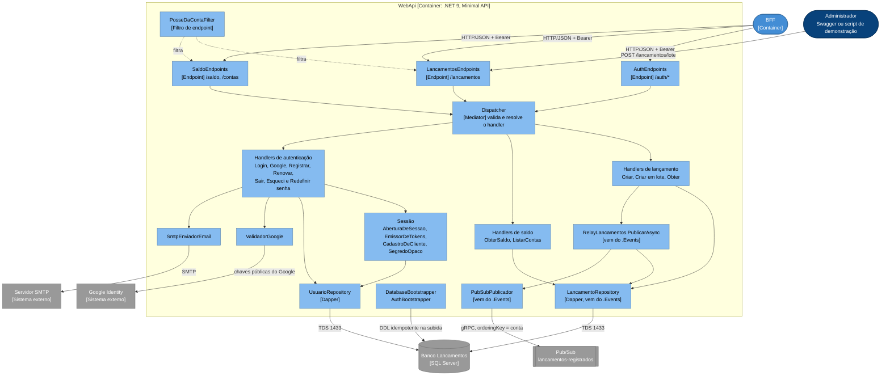

| Componente | Responsabilidade | Código |
|---|---|---|
| Endpoints | Rotas, policy por grupo, binding e status HTTP | [`Endpoints/`](../../../MeusLancamentosDiarios.Integrator.WebApi/Endpoints) |
| `PosseDaContaFilter` | Cliente só alcança a própria conta: confere rota (`contaId`), corpo (`IReferenciaConta`) e o recurso devolvido | [`Auth/PosseDaContaFilter.cs`](../../../MeusLancamentosDiarios.Integrator.WebApi/Auth/PosseDaContaFilter.cs) |
| `Dispatcher` | Roda o validator da mensagem, se houver, e chama o handler resolvido por tipo | [`Cqrs/Dispatcher.cs`](../../../MeusLancamentosDiarios.Integrator.WebApi/Cqrs/Dispatcher.cs) |
| `CriarLancamentoHandler` | Grava e tenta a publicação imediata, com teto de 2 s | [`Features/Lancamentos/Commands/CriarLancamento/`](../../../MeusLancamentosDiarios.Integrator.WebApi/Features/Lancamentos/Commands/CriarLancamento) |
| `CriarLancamentosEmLoteHandler` | Grava até 1.000 itens numa transação; publicação fica com o relay | [`Features/Lancamentos/Commands/CriarLancamentosEmLote/`](../../../MeusLancamentosDiarios.Integrator.WebApi/Features/Lancamentos/Commands/CriarLancamentosEmLote) |
| `ObterSaldoHandler` | Saldo consolidado, soma dos pendentes e lista dos pendentes | [`Features/Saldo/Queries/ObterSaldo/`](../../../MeusLancamentosDiarios.Integrator.WebApi/Features/Saldo/Queries/ObterSaldo) |
| Handlers de autenticação | Cadastro, login, Google, renovação com rotação, logout, redefinição de senha | [`Features/Auth/`](../../../MeusLancamentosDiarios.Integrator.WebApi/Features/Auth) |
| `AberturaDeSessao` | O par JWT + renovação que todo login devolve | [`Auth/Tokens/AberturaDeSessao.cs`](../../../MeusLancamentosDiarios.Integrator.WebApi/Auth/Tokens/AberturaDeSessao.cs) |
| `EmissorDeTokens` | JWT HS256 com `sub`, `email`, `name`, `jti`, `conta` e `role` | [`Auth/Tokens/EmissorDeTokens.cs`](../../../MeusLancamentosDiarios.Integrator.WebApi/Auth/Tokens/EmissorDeTokens.cs) |
| `CadastroDeCliente` | Cria o usuário Cliente com conta sorteada `AAA0000`, livre e sem histórico | [`Features/Auth/CadastroDeCliente.cs`](../../../MeusLancamentosDiarios.Integrator.WebApi/Features/Auth/CadastroDeCliente.cs) |
| `UsuarioRepository` | Usuários e tokens opacos, só por hash; consumo de token num comando só | [`Auth/Data/UsuarioRepository.cs`](../../../MeusLancamentosDiarios.Integrator.WebApi/Auth/Data/UsuarioRepository.cs) |
| `ValidadorGoogle` | Confere assinatura, emissor, validade e audiência do ID token | [`Auth/Externos/ValidadorGoogle.cs`](../../../MeusLancamentosDiarios.Integrator.WebApi/Auth/Externos/ValidadorGoogle.cs) |
| `SmtpEnviadorEmail` | E-mail de redefinição de senha | [`Auth/Externos/SmtpEnviadorEmail.cs`](../../../MeusLancamentosDiarios.Integrator.WebApi/Auth/Externos/SmtpEnviadorEmail.cs) |
| Bootstrappers | Banco (se `Banco:CriarBanco`), esquema dos lançamentos, esquema de usuários e usuários de demonstração | `DatabaseBootstrapper` (Events), [`Auth/Data/AuthBootstrapper.cs`](../../../MeusLancamentosDiarios.Integrator.WebApi/Auth/Data/AuthBootstrapper.cs) |

### BFF

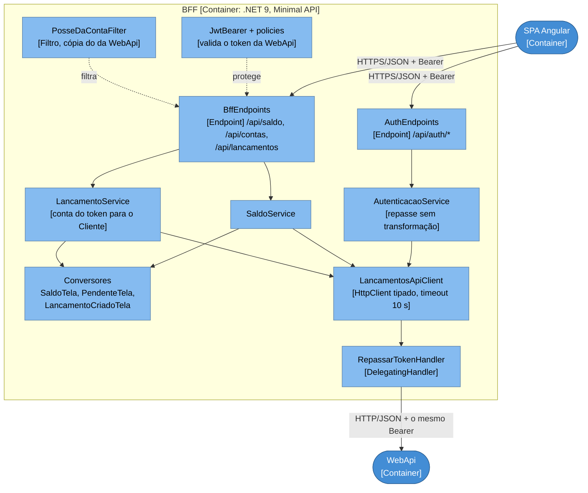

| Componente | Responsabilidade | Código |
|---|---|---|
| `BffEndpoints` | As três rotas das telas, todas com `ClienteOuAdmin`; `/api/contas` com `SomenteAdmin` | [`Endpoints/BffEndpoints.cs`](../../../MeusLancamentosDiarios.Integrator.Bff/Endpoints/BffEndpoints.cs) |
| `AuthEndpoints` | `/api/auth/*` vira `/auth/*` na WebApi | [`Endpoints/AuthEndpoints.cs`](../../../MeusLancamentosDiarios.Integrator.Bff/Endpoints/AuthEndpoints.cs) |
| `LancamentoService` | Monta o `CriarLancamentoCommand`: conta vazia usa o claim `conta` | [`Services/LancamentoService.cs`](../../../MeusLancamentosDiarios.Integrator.Bff/Services/LancamentoService.cs) |
| `SaldoTelaConversor` | Moeda, datas e rótulos em pt-BR; `intervaloPollingMs` = 2000 com pendente, 0 sem | [`Conversores/SaldoTelaConversor.cs`](../../../MeusLancamentosDiarios.Integrator.Bff/Conversores/SaldoTelaConversor.cs) |
| `LancamentosApiClient` | A única porta para a WebApi. Preserva status e `ProblemDetails` | [`Clients/LancamentosApiClient.cs`](../../../MeusLancamentosDiarios.Integrator.Bff/Clients/LancamentosApiClient.cs) |
| `RepassarTokenHandler` | Copia o `Authorization` da requisição de entrada para a de saída | [`Auth/RepassarTokenHandler.cs`](../../../MeusLancamentosDiarios.Integrator.Bff/Auth/RepassarTokenHandler.cs) |

### Events: o relay

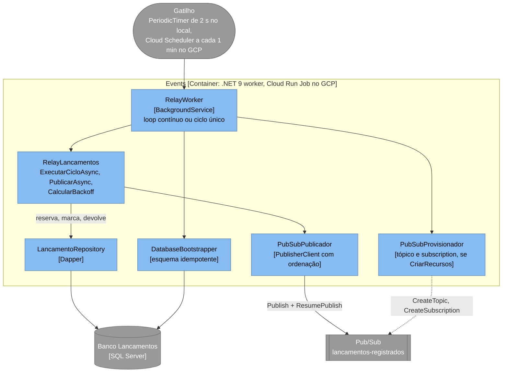

### Consumer

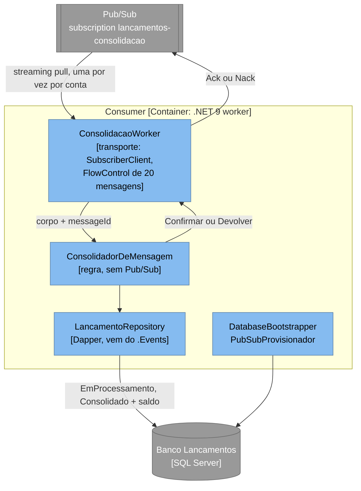

### Front-end

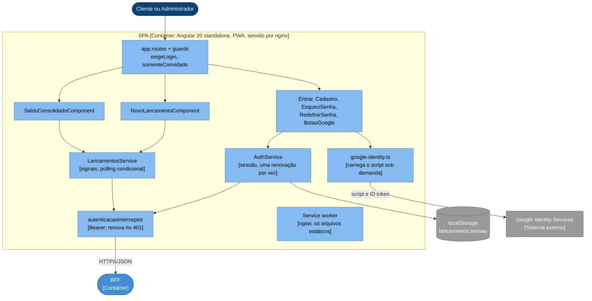

O `AuthService` lê a sessão do `localStorage` uma vez, ao abrir; a decisão e o preço estão em
[ADR-SW-14](03-adrs/ADR-SW-14-sessao-no-localstorage.md). O polling está em
[ADR-SW-11](03-adrs/ADR-SW-11-polling-condicional-no-front.md).

## Nível 4 — Código

Só as classes que carregam regra. DTOs e opções aparecem quando ajudam a ler a relação.

### CQRS na WebApi

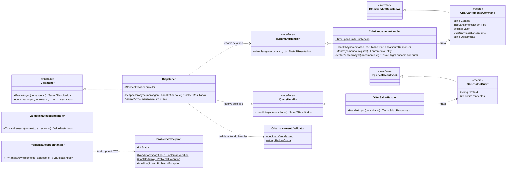

`ICommand<T>` e `IQuery<T>` moram no `.Common`, para o comando do `.Messages` ser a própria
mensagem que o BFF serializa. `ICommandHandler<TCommand, TResultado>` e
`IQueryHandler<TQuery, TResultado>` moram na WebApi: só ela trata.

### Persistência dos lançamentos

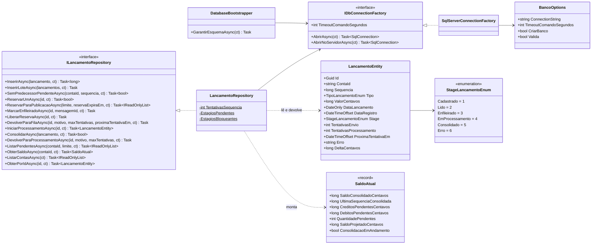

`EstagiosBloqueantes` (`Cadastrado`, `Lido`, `Erro`) é o que impede publicar o sucessor de um
pendente. `EstagiosPendentes` (`Cadastrado` a `EmProcessamento`) é o que a tela chama de
pendente.

### Publicação e consolidação

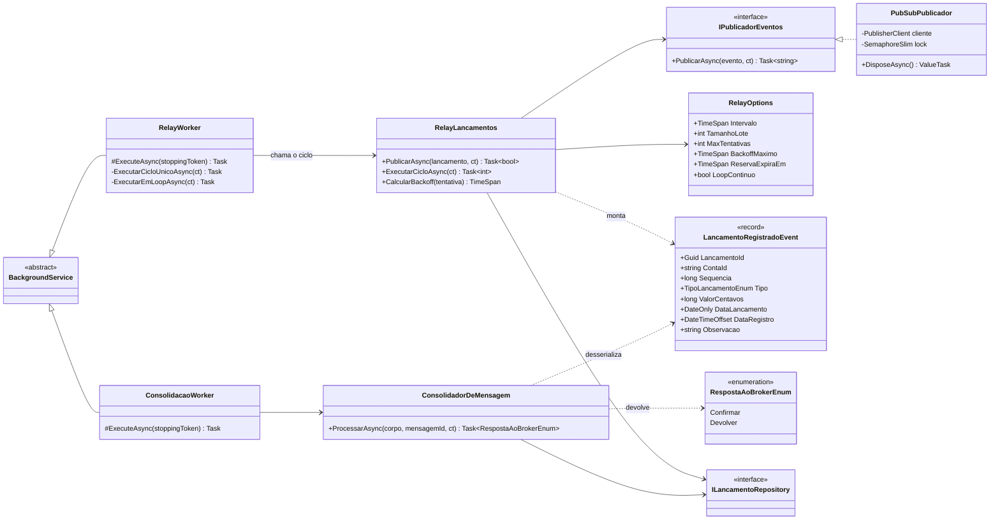

A WebApi usa o mesmo `RelayLancamentos.PublicarAsync` na publicação imediata. Por isso uma
falha ali conta tentativa e aplica o backoff exatamente como no relay.

### Autenticação e posse

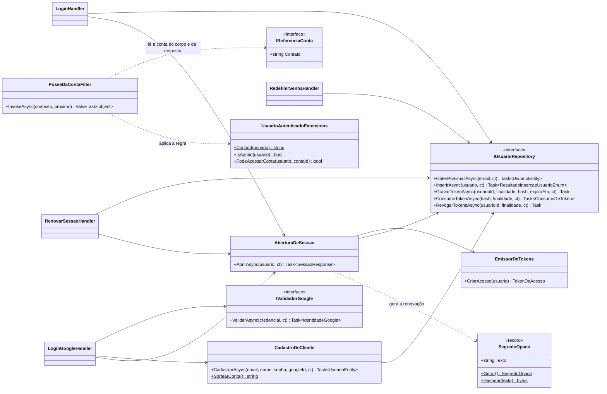

`SegredoOpaco` guarda o texto e o hash SHA-256 (`byte[]`): o texto vai ao cliente, o banco só
vê o hash.

### BFF

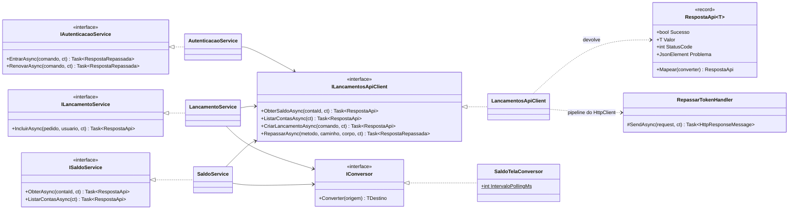

O conversor é `IConversor<TOrigem, TDestino>`. Os genéricos de dois parâmetros ficam fora do
diagrama porque o Mermaid não os desenha.

## Sequências dos fluxos internos críticos

### 1. Registrar um lançamento: caminho feliz

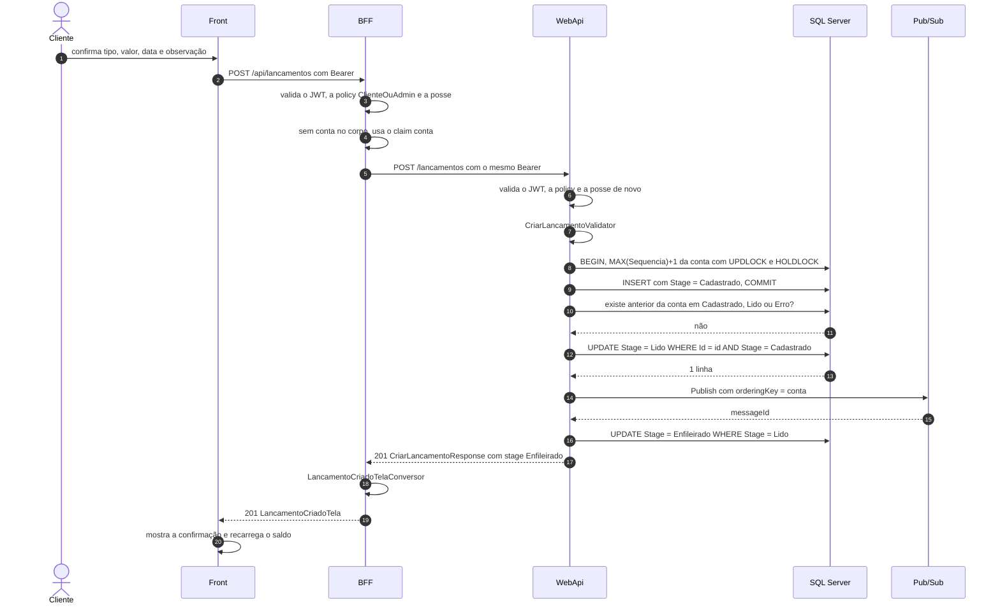

A sequência é atribuída dentro da transação do `INSERT`. Se dois `INSERT` da mesma conta
colidirem, o índice único `(ContaId, Sequencia)` recusa um deles, que recalcula e tenta de
novo, até 5 vezes.

### 2. Registrar um lançamento: quando a publicação imediata não acontece

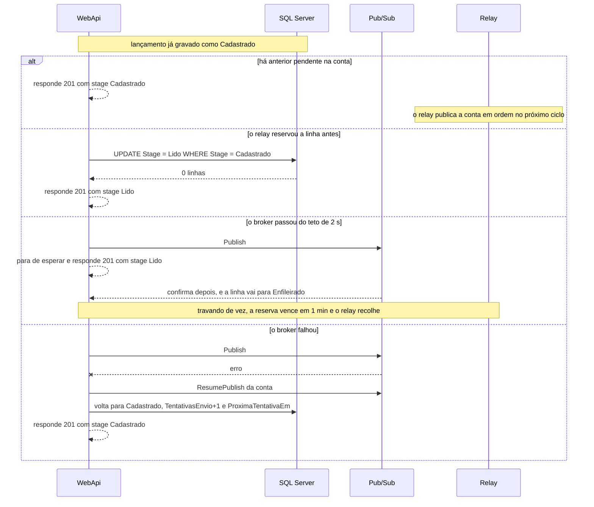

Em nenhum dos casos a WebApi devolve erro depois do commit: o usuário repetiria o lançamento
e criaria a duplicata.

### 3. Ciclo do relay com falha numa conta

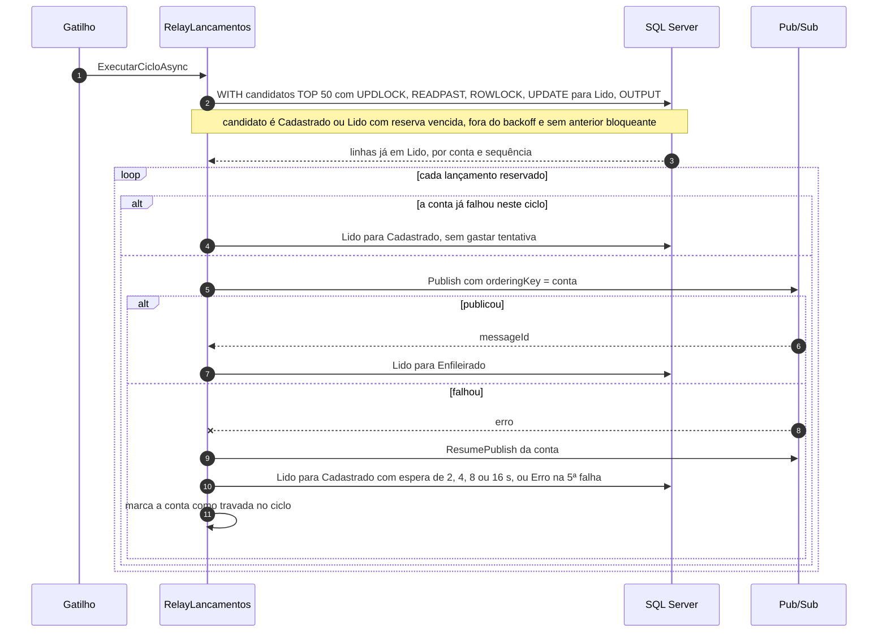

Como a reserva nunca traz um lançamento com anterior bloqueante, cada conta tem no máximo um
lançamento por ciclo. É o que limita o relay a 50 lançamentos por rodada e uma conta por vez;
a alternativa em lote está medida em [capacidade-do-relay.md](../../capacidade-do-relay.md).

### 4. Ciclo único no Cloud Run Job

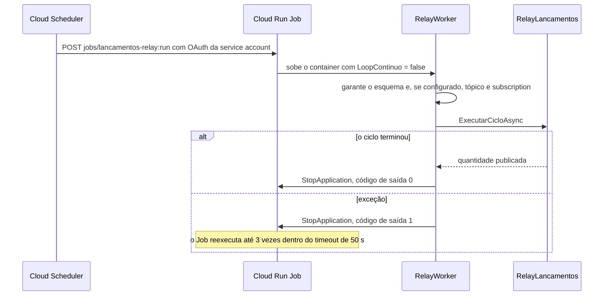

Sair do `ExecuteAsync` não encerra o host; sem o `StopApplication` o Job ficaria parado até
o timeout e contaria como falha.

### 5. Consolidação no Consumer

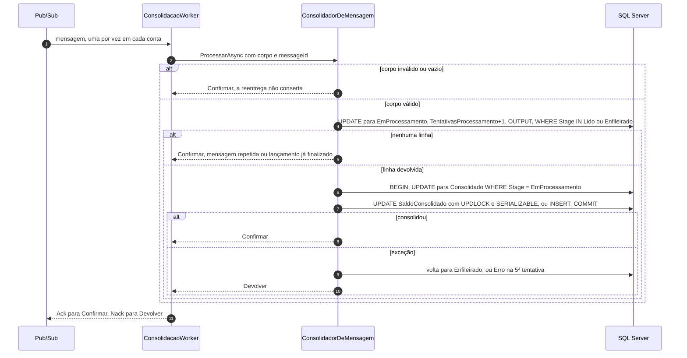

O valor somado vem da linha no banco, não do corpo da mensagem: o corpo só aponta o
`lancamentoId`. A reserva (`EmProcessamento`) e a consolidação são dois commits; uma queda
entre os dois deixa o lançamento fora do saldo
([dívida D2](01-sad-app.md#11-dívida-técnica-conhecida)).

### 6. Login, renovação e detecção de reuso

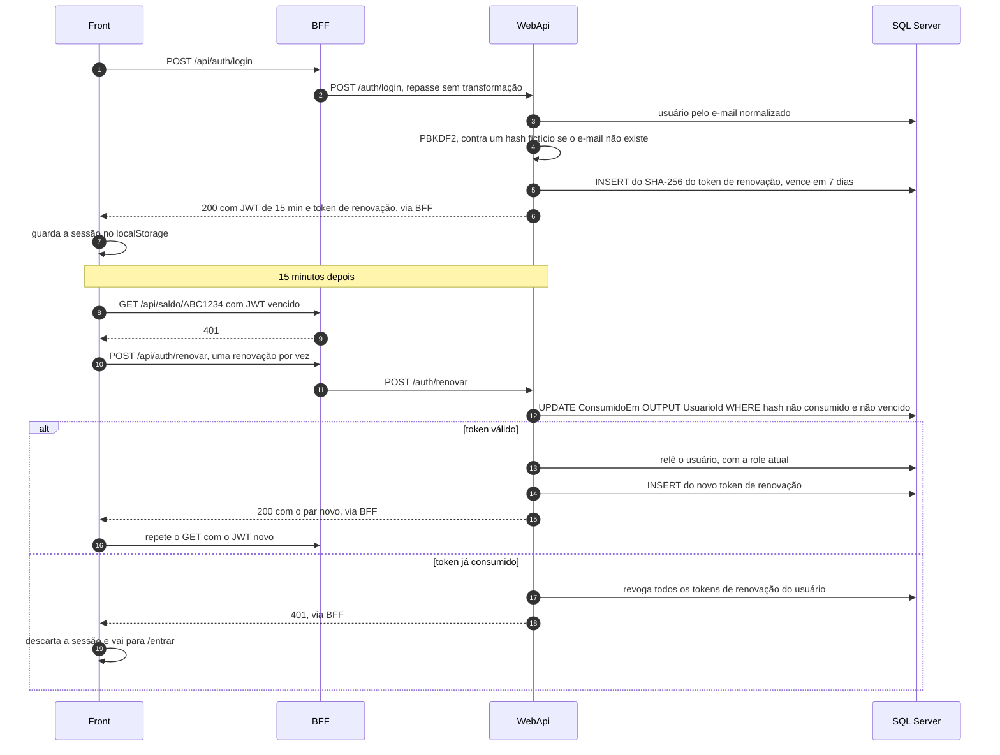

### 7. Tela de saldo com polling condicional

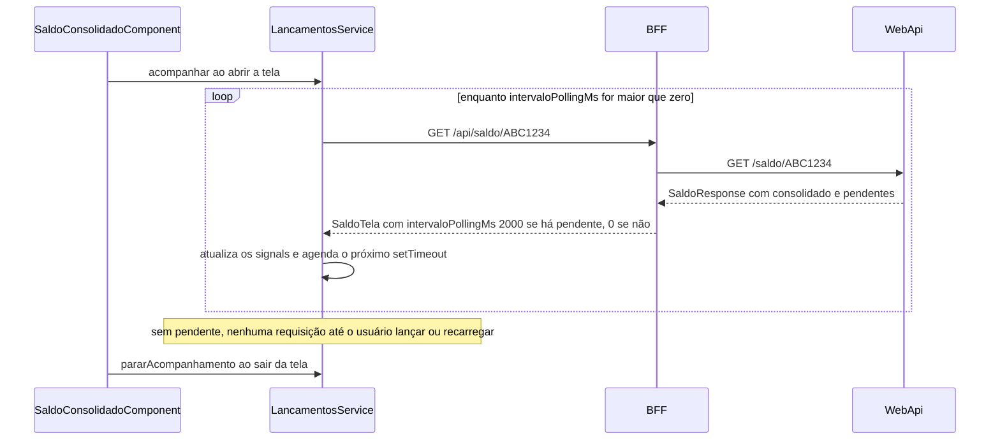

Se a consulta falha, o service mantém o último saldo e liga o aviso "Sem conexão". Uma tela
aberta antes de um lançamento feito em outro lugar só volta a consultar quando é recarregada.

### 8. Esqueci a senha e redefinição

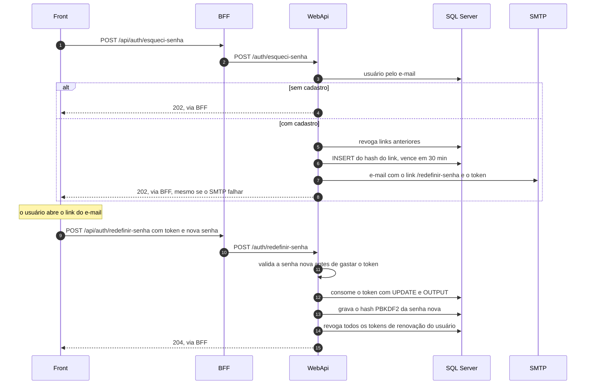

O envio acontece dentro da requisição, então o tempo de resposta pode revelar quem tem
cadastro ([RNF-20](../../requisitos-nao-funcionais.md#segurança)).
