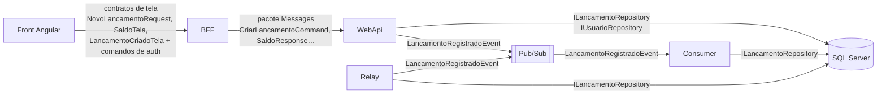

# Contratos de interfaces internas e APIs do aplicativo

As APIs que o aplicativo expõe, os DTOs que atravessam cada fronteira, o evento interno e as
interfaces entre camadas. Retrato do commit `45bcd17`, em 07/10/2026.

Os contratos com sistemas de fora (Google, SMTP) e a topologia do Pub/Sub estão em
[integração e contratos entre sistemas](../solucao/04-integracao-e-contratos.md).

## 1. Mapa dos contratos



| Contrato | Entre | Onde mora | Formato | Documento-fonte |
|---|---|---|---|---|
| API do BFF | Front e BFF | `.Bff/Contracts` + comandos do `.Messages` | HTTP/JSON | [`openapi-bff.v1.json`](../contratos/openapi-bff.v1.json) |
| API da WebApi | BFF (e o admin) e WebApi | `.Messages` | HTTP/JSON | [`openapi-webapi.v1.json`](../contratos/openapi-webapi.v1.json) |
| Token de acesso | WebApi emite; BFF e WebApi validam | `ClaimsDoToken`, `EmissorDeTokens` | JWT HS256 | [seção 6](#6-token-de-acesso) |
| Evento de lançamento | WebApi e relay publicam; Consumer lê | `.Events/Contracts` | JSON no Pub/Sub | [`asyncapi-lancamentos.v1.yaml`](../contratos/asyncapi-lancamentos.v1.yaml) |
| Interfaces internas | Camadas de cada processo | pastas `Contracts/` | C# | [seção 8](#8-interfaces-internas) |

Os dois OpenAPI foram exportados da stack local em 07/10/2026, em `/openapi/v1.json` de cada
API; as rotas e os esquemas conferem com o código deste commit. O AsyncAPI foi escrito à mão
a partir do contrato C#.

## 2. Convenções de serialização

| Aspecto | Regra | Exemplo |
|---|---|---|
| Nomes | camelCase (`JsonSerializerDefaults.Web`) | `dataLancamento` |
| Enums | Texto (`JsonStringEnumConverter`) | `"Credito"`, `"EmProcessamento"` |
| Data de competência | `DateOnly`, `yyyy-MM-dd` | `"2026-10-01"` |
| Instante | `DateTimeOffset`, ISO 8601 com offset; o servidor grava em UTC | `"2026-10-01T13:45:10.1234567+00:00"` |
| Dinheiro na API | Reais, número JSON com até duas casas | `35.9` |
| Dinheiro no evento | Centavos, inteiro | `3590` |
| Ids | GUID v7, formato `D` | `"0199a7c4-3f2e-7b10-9a51-6d2f0c1e8b44"` |
| Nulos | **WebApi escreve** (`"observacao": null`); **BFF e evento omitem** | — |
| Textos de tela | Prontos no BFF, em pt-BR | `"valorFormatado": "R$ 35,90"` |

**Erros** seguem o `ProblemDetails` (RFC 9457). Validação devolve
`ValidationProblemDetails` com as mensagens por propriedade, inclusive dentro de listas:

```json
{
  "title": "Dados invalidos.",
  "status": 400,
  "instance": "/lancamentos/lote",
  "errors": {
    "Itens[3].Valor": ["O valor aceita no maximo duas casas decimais."],
    "Itens[7].DataLancamento": ["A data do lancamento nao pode ser futura."]
  }
}
```

O BFF repassa o corpo de erro da WebApi como veio; o front junta as mensagens de `errors` ou
usa o `title` (`core/erros.ts`).

## 3. API da WebApi

Interna: no GCP fica sem entrada pública ([ADR-SOL-05](../solucao/03-adrs/ADR-SOL-05-bff-como-unica-porta.md)).
Quem chama é o BFF, com o Bearer do usuário, e o admin, para o lote, pelo Swagger ou por
script.

| Método e rota | Acesso | Corpo | Sucesso | Erros | Handler |
|---|---|---|---|---|---|
| `POST /auth/registrar` | público | `RegistrarUsuarioCommand` | 201 `SessaoResponse` | 400, 409 | `RegistrarUsuarioHandler` |
| `POST /auth/login` | público | `LoginCommand` | 200 `SessaoResponse` | 400, 401 | `LoginHandler` |
| `POST /auth/google` | público | `LoginGoogleCommand` | 200 `SessaoResponse` | 400 (Google desligado), 401, 409 | `LoginGoogleHandler` |
| `POST /auth/renovar` | público | `RenovarSessaoCommand` | 200 `SessaoResponse` | 400, 401 | `RenovarSessaoHandler` |
| `POST /auth/sair` | público | `EncerrarSessaoCommand` | **204** | 400 | `EncerrarSessaoHandler` |
| `POST /auth/esqueci-senha` | público | `SolicitarRedefinicaoSenhaCommand` | **202**, exista o e-mail ou não | 400 | `SolicitarRedefinicaoSenhaHandler` |
| `POST /auth/redefinir-senha` | público | `RedefinirSenhaCommand` | 204 | 400 (validação, link inválido ou vencido) | `RedefinirSenhaHandler` |
| `GET /auth/config` | público | — | 200 `ConfiguracaoAuthResponse` | — | no endpoint |
| `GET /auth/eu` | `ClienteOuAdmin` | — | 200 `UsuarioResponse` | 401 | `ObterUsuarioAtualHandler` |
| `POST /lancamentos` | `ClienteOuAdmin` + posse | `CriarLancamentoCommand` | 201 `CriarLancamentoResponse`, `Location: /lancamentos/{id}` | 400, 401, 403 | `CriarLancamentoHandler` |
| `POST /lancamentos/lote` | `SomenteAdmin` | `CriarLancamentosEmLoteCommand` | 201 `CriarLancamentosEmLoteResponse` | 400, 401, 403 | `CriarLancamentosEmLoteHandler` |
| `GET /lancamentos/{id}` | `ClienteOuAdmin` + posse na saída | — | 200 `LancamentoDetalheResponse` | 401, 403, 404 | `ObterLancamentoHandler` |
| `GET /saldo/{contaId}?limitePendentes=` | `ClienteOuAdmin` + posse | — | 200 `SaldoResponse` | 400 (limite ≤ 0), 401, 403 | `ObterSaldoHandler` |
| `GET /contas` | `SomenteAdmin` | — | 200 `string[]` | 401, 403 | `ListarContasHandler` |
| `GET /health` | público, fora do OpenAPI | — | 200 `{"status":"ok"}` | — | no endpoint |

`/openapi/v1.json` e `/swagger` só existem em `Development` ou com `Swagger:Habilitado`.

**Onde o OpenAPI gerado diverge do comportamento.** O documento declara 200 para
`/auth/sair` (o real é 204) e não declara o 202 de `/auth/esqueci-senha` nem o 204 de
`/auth/redefinir-senha`, porque esses endpoints não têm `.Produces(...)`. Quem gerar cliente a
partir do arquivo deve corrigir esses três status, ou o código deve ganhar as anotações.

## 4. API do BFF

A única API que o navegador enxerga. Todas as rotas de tela exigem `ClienteOuAdmin`.

| Método e rota | Acesso | Corpo | Sucesso | Na WebApi |
|---|---|---|---|---|
| `POST /api/auth/registrar`, `/login`, `/google`, `/renovar`, `/sair`, `/esqueci-senha`, `/redefinir-senha` | público | o comando do `.Messages` | o status e o corpo da WebApi | a mesma rota sem `/api` |
| `GET /api/auth/config` | público | — | `ConfiguracaoAuthResponse` | `GET /auth/config` |
| `GET /api/auth/eu` | `ClienteOuAdmin` | — | `UsuarioResponse` | `GET /auth/eu` |
| `GET /api/saldo/{contaId}` | `ClienteOuAdmin` + posse | — | 200 `SaldoTela` | `GET /saldo/{contaId}`, sem `limitePendentes` (vale o padrão, 20) |
| `GET /api/contas` | `SomenteAdmin` | — | 200 `string[]` | `GET /contas` |
| `POST /api/lancamentos` | `ClienteOuAdmin` + posse | `NovoLancamentoRequest` | 201 `LancamentoCriadoTela` | `POST /lancamentos` |
| `GET /health` | público | — | 200 | — |

Comportamento de erro do BFF:

| Situação | Resposta do BFF |
|---|---|
| WebApi respondeu 4xx ou 5xx | O mesmo status e o mesmo `ProblemDetails` |
| WebApi respondeu 2xx com o corpo `null` nas rotas de tela | 502 |
| Token sem o claim `conta` num lançamento sem conta informada | 403 |
| WebApi fora do ar ou sem resposta em 10 s | 500, porque a exceção do `HttpClient` não é tratada. Deveria ser 502 ou 504 |

O 201 de `POST /api/lancamentos` traz `Location: /api/lancamentos/{id}`, rota que o BFF não
tem (dívida D10 do [SAD-App](01-sad-app.md#11-dívida-técnica-conhecida)).

## 5. DTOs

### 5.1 Comandos e respostas da WebApi (`.Messages`)

**`CriarLancamentoCommand`** — também é o item do lote.

| Campo | Tipo | Obrigatório | Regra |
|---|---|---|---|
| `contaId` | string | sim | 3 a 20 caracteres, `^[A-Za-z0-9-]+$`. A WebApi grava com `Trim().ToUpperInvariant()` |
| `tipo` | `Credito` \| `Debito` | sim | membro válido do enum |
| `valor` | decimal | sim | maior que zero, até 1.000.000,00, no máximo duas casas |
| `dataLancamento` | date | sim | não futura no fuso de São Paulo |
| `observacao` | string | não | até 200 caracteres; em branco vira nulo |

**`CriarLancamentosEmLoteCommand`**: `itens`, de 1 a 1.000 `CriarLancamentoCommand`. O erro
aponta o item (`Itens[3].Valor`).

**`CriarLancamentoResponse`**: `id`, `contaId`, `sequencia`, `tipo`, `valor`,
`dataLancamento`, `dataRegistro`, `observacao` e `stage`. O `stage` é `Enfileirado` quando a
publicação imediata deu certo, e `Cadastrado` ou `Lido` quando ficou para o relay. Nunca
`Consolidado`.

**`CriarLancamentosEmLoteResponse`**: `quantidade` e `lancamentos`, na ordem recebida, cada um
com `id`, `contaId`, `sequencia` e `stage` (sempre `Cadastrado`).

**`LancamentoDetalheResponse`**: os campos do lançamento mais `stageAtualizadoEm`,
`tentativasEnvio`, `tentativasProcessamento` e `erro`.

**`SaldoResponse`**

| Campo | Tipo | Significado |
|---|---|---|
| `contaId` | string | Conta normalizada |
| `saldoConsolidado` | decimal | O que o Consumer já aplicou |
| `ultimaSequenciaConsolidada` | long | Até que lançamento da conta o saldo está em dia |
| `atualizadoEm` | date-time ou nulo | Nulo enquanto a conta nunca consolidou |
| `creditosPendentes`, `debitosPendentes` | decimal | Somas dos pendentes por tipo |
| `saldoProjetado` | decimal | Consolidado + créditos pendentes − débitos pendentes |
| `consolidacaoEmAndamento` | bool | Há pendente |
| `pendentes` | `LancamentoPendenteResponse[]` | Até `limitePendentes`, do mais recente para o mais antigo |

"Pendente" são os estágios `Cadastrado`, `Lido`, `Enfileirado` e `EmProcessamento`. Um
lançamento em `Erro` não entra em nenhuma das somas.

**Autenticação**

| DTO | Campos | Regras |
|---|---|---|
| `RegistrarUsuarioCommand` | `nome`, `email`, `senha` | nome até 100; e-mail válido até 254; senha de 8 a 128 com letra e número |
| `LoginCommand` | `email`, `senha` | presentes; a força da senha não é conferida no login |
| `LoginGoogleCommand` | `credencial` | o ID token do Google Identity Services |
| `RenovarSessaoCommand`, `EncerrarSessaoCommand` | `tokenRenovacao` | presente |
| `SolicitarRedefinicaoSenhaCommand` | `email` | e-mail válido |
| `RedefinirSenhaCommand` | `token`, `novaSenha` | a mesma regra de senha do cadastro, validada antes de gastar o token |
| `SessaoResponse` | `tokenAcesso`, `expiraEm`, `tokenRenovacao`, `usuario` | — |
| `UsuarioResponse` | `id`, `nome`, `email`, `contaId`, `role` | — |
| `ConfiguracaoAuthResponse` | `googleClientId` | vazio quando o Google está desligado |

### 5.2 Contratos de tela (BFF)

**`NovoLancamentoRequest`**: igual ao comando, com `contaId` opcional. O cliente nunca a
informa; o admin pode. Sem conta, vale a do token.

**`SaldoTela`**: os campos de `SaldoResponse`, cada valor também em texto, e o intervalo de
polling.

| Campo da WebApi | Campo da tela | Conversão |
|---|---|---|
| `saldoConsolidado` | `saldoConsolidado`, `saldoConsolidadoFormatado` | `R$ 9.164,88` |
| `atualizadoEm` | `atualizadoEm`, `ultimaAtualizacaoFormatada` | `dd/MM/yyyy HH:mm:ss` em Brasília, ou `nunca` |
| `saldoProjetado` | `saldoProjetado`, `saldoProjetadoFormatado` | moeda |
| `creditosPendentes`, `debitosPendentes` | os mesmos + `…Formatado` | moeda |
| `consolidacaoEmAndamento` | o mesmo + `intervaloPollingMs` | 2000 com pendente, 0 sem |
| `pendentes[]` | `PendenteTela[]` | `tipoRotulo` (`Crédito`, `Débito`), `sinal` (`+`, `-`), `valorFormatado`, `dataLancamentoFormatada`, `stageRotulo` |

Rótulos de estágio: `Cadastrado`, `Lido pelo publicador`, `Na fila`, `Consolidando`,
`Consolidado`, `Erro`.

**`LancamentoCriadoTela`**: o `CriarLancamentoResponse` com `tipoRotulo`, `valorFormatado`,
`sinal`, `dataLancamentoFormatada`, `dataRegistroFormatada` e `stageRotulo`.

### 5.3 Tipos comuns (`.Common`)

| Tipo | Valores | Observação |
|---|---|---|
| `TipoLancamentoEnum` | `Credito = 1`, `Debito = 2` | Texto no JSON, inteiro no banco |
| `StageLancamentoEnum` | `Cadastrado = 1` … `Erro = 6` | Idem. Renomear quebra o JSON; renumerar quebra o banco |
| `Roles` | `Cliente`, `Admin` | Vão no claim `role` |
| `Politicas` | `ClienteOuAdmin`, `SomenteAdmin` | — |
| `ClaimsDoToken` | `conta`, `role` | Claims próprios do token |
| `IReferenciaConta` | `ContaId` | Marca o que aponta para uma conta: o filtro de posse lê |

## 6. Token de acesso

| Claim | Valor |
|---|---|
| `sub` | Id do usuário (GUID) |
| `email`, `name` | E-mail e nome |
| `jti` | GUID novo por token |
| `conta` | A conta do usuário |
| `role` | `Cliente` ou `Admin` |
| `iss` | `lancamentos-webapi` |
| `aud` | `lancamentos` |
| `iat`, `nbf`, `exp` | Emissão, início e fim; 15 min de validade |

Assinatura HS256. Os dois lados validam emissor, audiência, assinatura e validade, aceitam só
`HS256` e toleram 30 s de diferença de relógio. `MapInboundClaims = false` mantém os nomes
curtos dos claims.

O token de renovação não é JWT: são 32 bytes aleatórios em Base64Url. O banco guarda só o
SHA-256.

## 7. Evento interno: `LancamentoRegistradoEvent`

```csharp
public sealed record LancamentoRegistradoEvent
{
    public required Guid LancamentoId { get; init; }
    public required string ContaId { get; init; }        // também é a ordering key
    public required long Sequencia { get; init; }        // vai no corpo, não na chave
    public required TipoLancamentoEnum Tipo { get; init; }
    public required long ValorCentavos { get; init; }
    public required DateOnly DataLancamento { get; init; }
    public required DateTimeOffset DataRegistro { get; init; }
    public string? Observacao { get; init; }
}
```

| Item | Valor |
|---|---|
| Tópico | `lancamentos-registrados` |
| Ordering key | `ContaId` |
| Atributos | `lancamentoId`, `contaId`, `sequencia`, `tipo` (todos texto) |
| Corpo | JSON com `EventosJson.Options`: camelCase, enums como texto, nulos omitidos |
| Leitura | O Consumer usa só `lancamentoId`; o resto vem da linha no banco |

Exemplo de corpo:

```json
{
  "lancamentoId": "0199a7c4-3f2e-7b10-9a51-6d2f0c1e8b44",
  "contaId": "XYZ9999",
  "sequencia": 2,
  "tipo": "Debito",
  "valorCentavos": 3590,
  "dataLancamento": "2026-10-01",
  "dataRegistro": "2026-10-01T13:45:10.1234567+00:00",
  "observacao": "tarifa"
}
```

A especificação completa, com servidores, canal, operações e exemplos, está em
[`asyncapi-lancamentos.v1.yaml`](../contratos/asyncapi-lancamentos.v1.yaml).

## 8. Interfaces internas

| Interface | Projeto | Implementação | Usada por | O que promete |
|---|---|---|---|---|
| `IDispatcher` | WebApi | `Dispatcher` | endpoints | Valida antes do handler; `ValidationException` em dado inválido; `InvalidOperationException` se faltar handler |
| `ICommandHandler<TCommand, TResultado>`, `IQueryHandler<TQuery, TResultado>` | WebApi | um handler por caso | `Dispatcher` | Um handler por mensagem, registrado por varredura |
| `ICommand<T>`, `IQuery<T>` | Common | records do `.Messages` e da WebApi | dispatcher | Marcadores; `T` é o resultado |
| `ILancamentoRepository` | Events | `LancamentoRepository` | WebApi, relay, Consumer | Toda transição de estágio, com o estágio esperado no `WHERE` (tabela abaixo) |
| `IDbConnectionFactory` | Events | `SqlServerConnectionFactory` | repositórios, bootstrappers | Conexão já aberta; quem recebe fecha |
| `IPublicadorEventos` | Events | `PubSubPublicador` | `RelayLancamentos` | Devolve o id da mensagem; em falha, libera a ordering key e lança |
| `IUsuarioRepository` | WebApi | `UsuarioRepository` | handlers de autenticação | Tokens só por hash; consumo atômico; recusa conta com histórico |
| `IEnviadorEmail` | WebApi | `SmtpEnviadorEmail` | `SolicitarRedefinicaoSenhaHandler` | Lança em falha; o handler registra e responde 202 assim mesmo |
| `IValidadorGoogle` | WebApi | `ValidadorGoogle` | `LoginGoogleHandler` | `null` para credencial inválida ou de outra audiência |
| `ILancamentosApiClient` | BFF | `LancamentosApiClient` | services do BFF | Não lança por status HTTP; lança por falha de rede e timeout |
| `IConversor<TOrigem, TDestino>` | BFF | três conversores | services | Função pura, sem I/O |
| `ISaldoService`, `ILancamentoService`, `IAutenticacaoService` | BFF | um service cada | endpoints | Devolvem `RespostaApi<T>` ou `RespostaRepassada` |

**`ILancamentoRepository`, método a método**

| Método | Quem chama | Efeito | Devolve |
|---|---|---|---|
| `InserirAsync` | WebApi | `INSERT` em `Cadastrado`; sequência `MAX + 1` | a sequência |
| `InserirLoteAsync` | WebApi | Todos em `Cadastrado`, numa transação | — (preenche a sequência de cada item) |
| `SemPredecessorPendenteAsync` | WebApi | Leitura | `true` se nenhum anterior da conta está em `Cadastrado`, `Lido` ou `Erro` |
| `ReservarUmAsync` | WebApi | `Cadastrado` → `Lido` | `false` se a linha já saiu de `Cadastrado` |
| `ReservarParaPublicacaoAsync` | relay | `Cadastrado`, ou `Lido` vencido, → `Lido`; sem anterior bloqueante, fora do backoff | as linhas, por conta e sequência |
| `MarcarEnfileiradoAsync` | relay, WebApi | `Lido` → `Enfileirado`; grava `MensagemId`; limpa erro e backoff | — |
| `LiberarReservaAsync` | relay | `Lido` → `Cadastrado`, sem contar tentativa | — |
| `DevolverParaFilaAsync` | relay, WebApi | `Lido` → `Cadastrado` com `ProximaTentativaEm`, ou `Erro` na última tentativa | — |
| `IniciarProcessamentoAsync` | Consumer | `Lido` ou `Enfileirado` → `EmProcessamento` | a linha, ou `null` |
| `ConsolidarAsync` | Consumer | `EmProcessamento` → `Consolidado` e soma ao saldo, numa transação | `false` se a linha saiu de `EmProcessamento` |
| `DevolverParaProcessamentoAsync` | Consumer | `EmProcessamento` → `Enfileirado`, ou `Erro` ao atingir o máximo | — |
| `MarcarErroAsync` | ninguém | qualquer estágio → `Erro` | — (código morto) |
| `ListarPendentesAsync`, `ObterSaldoAsync`, `ListarContasAsync`, `ObterPorIdAsync` | WebApi | Leitura | — |

**No front**, a fronteira é de serviço, não de interface: `AuthService` (sessão, login,
renovação) e `LancamentosService` (saldo, contas, inclusão) são os únicos que usam o
`HttpClient`. Os modelos TypeScript em `core/*.models.ts` espelham os contratos de tela.

## 9. Versionamento e compatibilidade

| Contrato | Hoje | Regra proposta |
|---|---|---|
| API do BFF | v1 implícita, sem versão na rota | Mudança aditiva livre. Mudança que quebra pede rota nova. **O BFF precisa aceitar a versão anterior do front**: o service worker serve a versão em cache até a próxima abertura do app, então um PWA antigo continua chamando o BFF novo |
| API da WebApi | v1 implícita | Mudança aditiva livre. O BFF e a WebApi sobem em momentos diferentes no deploy: a WebApi nova precisa aceitar o BFF anterior |
| Pacotes `.Messages` e `.Common` | 1.0.0 no nuget.org | SemVer. Remover ou renomear campo é versão maior. Versão publicada é permanente |
| Evento | sem versão explícita | Acrescentar campo opcional é compatível (o Consumer ignora o que não conhece). Mudar o sentido ou o tipo de um campo pede outro evento ou um atributo de versão (`versao=2`) |
| Enums | texto no JSON, inteiro no banco | Só acrescentar membro, com número novo |

Para não depender de disciplina, o [plano de testes](07-testes-e-padroes-de-codigo.md#5-testes-de-contrato)
propõe gerar o OpenAPI no build e falhar o CI quando uma mudança quebrar o contrato
publicado, e fixar o JSON do evento num teste de snapshot.
