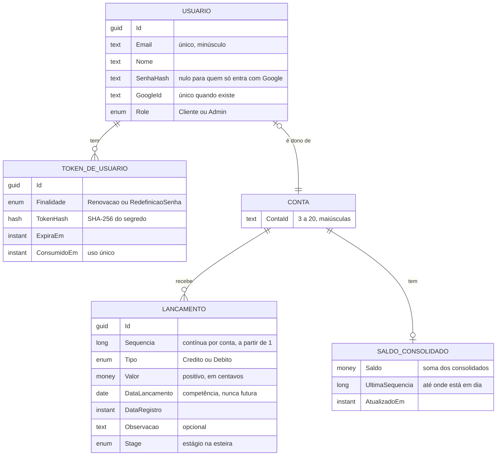
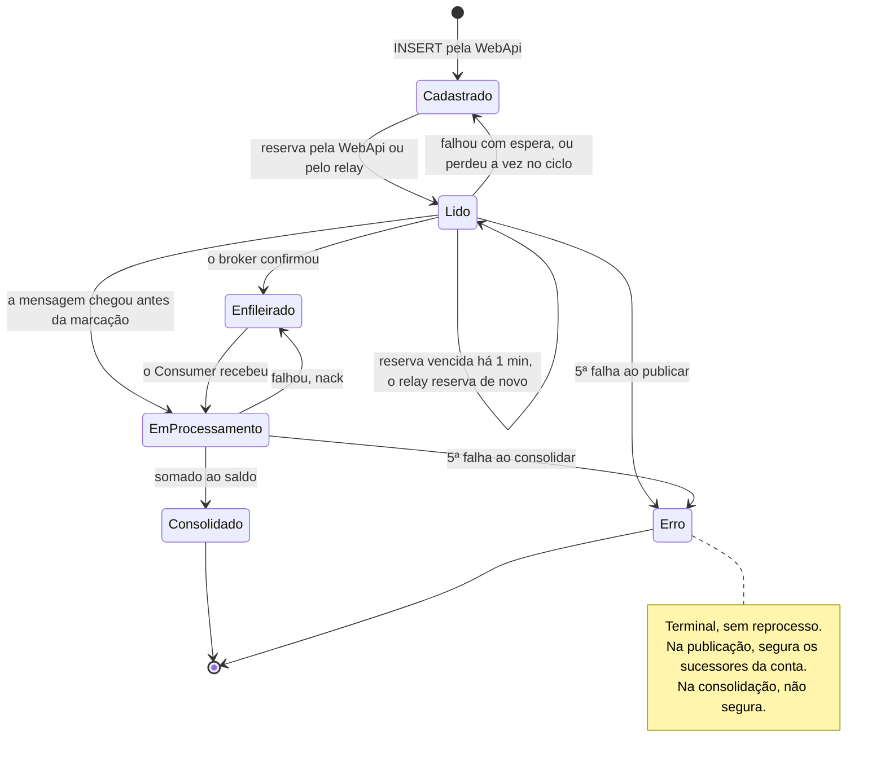
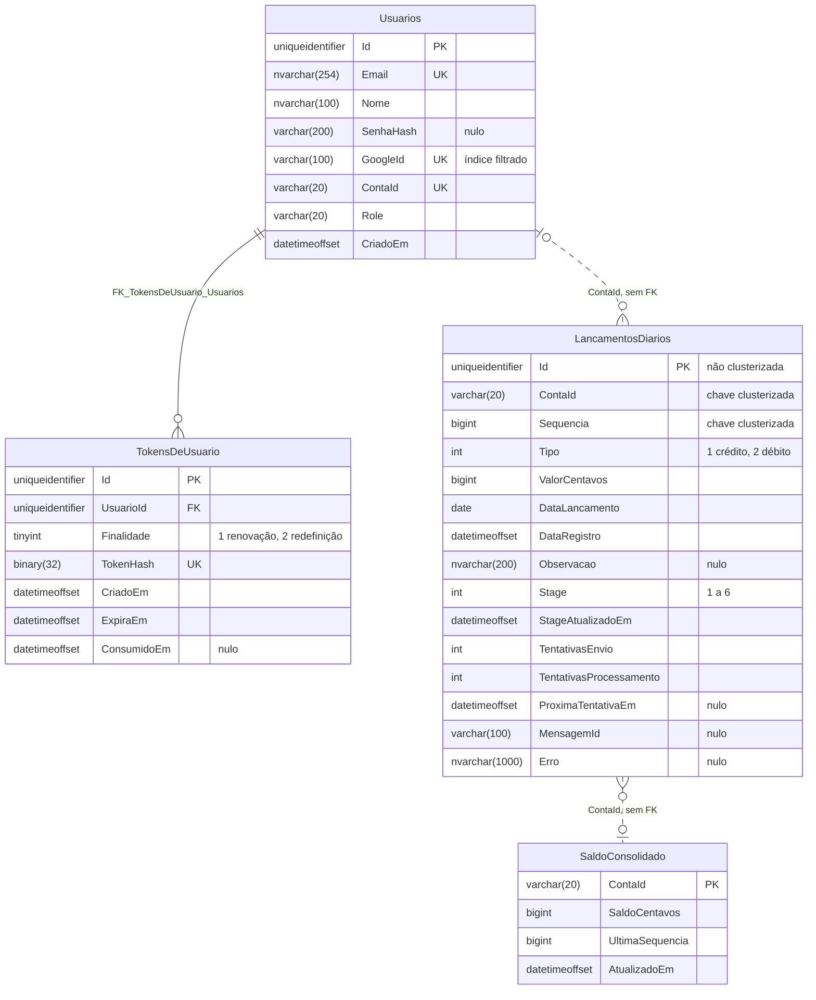

# Modelo de dados lógico e físico

As entidades do domínio, a máquina de estados do lançamento, as tabelas e índices como estão
no banco, e as estratégias de persistência e concorrência. Retrato do commit `45bcd17`, em
07/10/2026. A visão entre sistemas, a propriedade dos dados e a migração estão em
[dados macro e migração](../solucao/05-dados-macro-e-migracao.md).

## 1. Modelo lógico



| Entidade | Invariantes |
|---|---|
| Conta | Não é tabela: existe como `ContaId` nas outras. Passa a existir no primeiro lançamento ou no cadastro do dono. Formato aceito: letras, números e hífen, de 3 a 20; as sorteadas no cadastro seguem `AAA0000` |
| Usuário | Exatamente uma conta; uma conta tem no máximo um dono. E-mail único. Conta sorteada nunca reaproveita conta com histórico |
| Lançamento | Conta, sequência, tipo, valor e datas não mudam depois de gravados. Sequência única e sem buracos dentro da conta. Valor positivo; o sinal vem do tipo |
| Saldo consolidado | Igual à soma, com sinal, dos lançamentos `Consolidado` da conta. É derivado: pode ser reconstruído a partir dos lançamentos |
| Token de usuário | Guardado só como hash. Vale uma vez, até `ExpiraEm` |

## 2. Máquina de estados do lançamento



| De | Para | Quem | Método | Guarda no `WHERE` | Também grava |
|---|---|---|---|---|---|
| — | `Cadastrado` | WebApi | `InserirAsync`, `InserirLoteAsync` | — | `Sequencia` (`MAX + 1` da conta) |
| `Cadastrado` | `Lido` | WebApi | `ReservarUmAsync` | `Id = @Id AND Stage = Cadastrado` | `StageAtualizadoEm` |
| `Cadastrado`, ou `Lido` vencido | `Lido` | relay | `ReservarParaPublicacaoAsync` | Reserva vencida há mais de `Relay:ReservaExpiraEm`; fora do backoff; sem anterior da conta em `Cadastrado`, `Lido` ou `Erro` | `StageAtualizadoEm` |
| `Lido` | `Enfileirado` | WebApi, relay | `MarcarEnfileiradoAsync` | `Stage = Lido` | `MensagemId`; `TentativasEnvio + 1`; limpa `ProximaTentativaEm` e `Erro` |
| `Lido` | `Cadastrado` | relay | `LiberarReservaAsync` | `Stage = Lido` | nada: perdeu a vez, sem tentativa |
| `Lido` | `Cadastrado` ou `Erro` | WebApi, relay | `DevolverParaFilaAsync` | `Stage = Lido` | `TentativasEnvio + 1`; `ProximaTentativaEm`; `Erro` = motivo. Vai para `Erro` quando `TentativasEnvio + 1 >= 5` |
| `Lido` ou `Enfileirado` | `EmProcessamento` | Consumer | `IniciarProcessamentoAsync` | `Stage IN (Lido, Enfileirado)` | `TentativasProcessamento + 1` |
| `EmProcessamento` | `Consolidado` | Consumer | `ConsolidarAsync` | `Stage = EmProcessamento` | limpa `Erro`; soma ao saldo na mesma transação |
| `EmProcessamento` | `Enfileirado` ou `Erro` | Consumer | `DevolverParaProcessamentoAsync` | `Stage = EmProcessamento` | `Erro` = motivo. Vai para `Erro` quando `TentativasProcessamento >= 5` |

Como cada guarda confere o estágio de origem, uma transição repetida ou atrasada não altera
nada. Um efeito disso: se o Consumer move a linha de `Lido` para `EmProcessamento` antes de o
publicador marcar `Enfileirado`, a marcação não acontece e o `MensagemId` fica vazio.

**Espera entre tentativas de publicação.** `2^tentativa` segundos, com teto em
`Relay:BackoffMaximo` (1 min): 2, 4, 8 e 16 s. Na 5ª falha a linha vai para `Erro`. Isso dá
uns 30 s até o `Erro` no local, onde o relay roda a cada 2 s, e uns 4 min no GCP, onde roda a
cada minuto. Na consolidação não há espera: a reentrega do Pub/Sub é imediata.

## 3. Modelo físico

Banco `Lancamentos`, esquema `dbo`, SQL Server 2022 no container e Cloud SQL for SQL Server
no GCP. Instantes em `datetimeoffset(7)`, sempre gravados em UTC.



As tabelas do fluxo não têm chave estrangeira entre si nem para `Usuarios`. A linha de saldo
só nasce na primeira consolidação da conta, e a conta pode ter lançamentos antes de ter dono.

### 3.1 DDL

O que os bootstrappers criam, sem os blocos `IF … IS NULL` que os tornam idempotentes.
Fontes: [`DatabaseBootstrapper`](../../../MeusLancamentosDiarios.Integrator.Events/Data/DatabaseBootstrapper.cs)
(lançamentos e saldo) e [`AuthBootstrapper`](../../../MeusLancamentosDiarios.Integrator.WebApi/Auth/Data/AuthBootstrapper.cs)
(usuários e tokens).

```sql
CREATE TABLE dbo.LancamentosDiarios (
    Id                      uniqueidentifier  NOT NULL CONSTRAINT PK_LancamentosDiarios PRIMARY KEY NONCLUSTERED,
    ContaId                 varchar(20)       NOT NULL,
    Sequencia               bigint            NOT NULL,
    Tipo                    int               NOT NULL,
    ValorCentavos           bigint            NOT NULL,
    DataLancamento          date              NOT NULL,
    DataRegistro            datetimeoffset(7) NOT NULL,
    Observacao              nvarchar(200)     NULL,
    Stage                   int               NOT NULL,
    StageAtualizadoEm       datetimeoffset(7) NOT NULL,
    TentativasEnvio         int               NOT NULL CONSTRAINT DF_Lanc_TentEnvio DEFAULT (0),
    TentativasProcessamento int               NOT NULL CONSTRAINT DF_Lanc_TentProc  DEFAULT (0),
    ProximaTentativaEm      datetimeoffset(7) NULL,
    MensagemId              varchar(100)      NULL,
    Erro                    nvarchar(1000)    NULL
);

-- Ordem física da conta. É também o que transforma a corrida do MAX + 1 em erro.
CREATE UNIQUE CLUSTERED INDEX UX_LancamentosDiarios_Conta_Sequencia
    ON dbo.LancamentosDiarios (ContaId, Sequencia);

-- Varredura do relay: por estágio, na ordem da conta.
CREATE INDEX IX_LancamentosDiarios_Stage
    ON dbo.LancamentosDiarios (Stage, ContaId, Sequencia)
    INCLUDE (ProximaTentativaEm, StageAtualizadoEm);

CREATE TABLE dbo.SaldoConsolidado (
    ContaId         varchar(20)       NOT NULL CONSTRAINT PK_SaldoConsolidado PRIMARY KEY,
    SaldoCentavos   bigint            NOT NULL CONSTRAINT DF_Saldo_Centavos  DEFAULT (0),
    UltimaSequencia bigint            NOT NULL CONSTRAINT DF_Saldo_Sequencia DEFAULT (0),
    AtualizadoEm    datetimeoffset(7) NOT NULL
);

CREATE TABLE dbo.Usuarios (
    Id        uniqueidentifier  NOT NULL CONSTRAINT PK_Usuarios PRIMARY KEY,
    Email     nvarchar(254)     NOT NULL,
    Nome      nvarchar(100)     NOT NULL,
    SenhaHash varchar(200)      NULL,
    GoogleId  varchar(100)      NULL,
    ContaId   varchar(20)       NOT NULL,
    Role      varchar(20)       NOT NULL,
    CriadoEm  datetimeoffset(7) NOT NULL,
    CONSTRAINT UX_Usuarios_Email   UNIQUE (Email),
    CONSTRAINT UX_Usuarios_ContaId UNIQUE (ContaId)
);

-- Filtrado: vários usuários sem Google não contam como duplicata.
-- Exige QUOTED_IDENTIFIER ligado em quem escreve na tabela (sqlcmd -I).
CREATE UNIQUE INDEX UX_Usuarios_GoogleId ON dbo.Usuarios (GoogleId) WHERE GoogleId IS NOT NULL;

CREATE TABLE dbo.TokensDeUsuario (
    Id          uniqueidentifier  NOT NULL CONSTRAINT PK_TokensDeUsuario PRIMARY KEY,
    UsuarioId   uniqueidentifier  NOT NULL CONSTRAINT FK_TokensDeUsuario_Usuarios REFERENCES dbo.Usuarios (Id),
    Finalidade  tinyint           NOT NULL,
    TokenHash   binary(32)        NOT NULL,
    CriadoEm    datetimeoffset(7) NOT NULL,
    ExpiraEm    datetimeoffset(7) NOT NULL,
    ConsumidoEm datetimeoffset(7) NULL,
    CONSTRAINT UX_TokensDeUsuario_Hash UNIQUE (TokenHash)
);

-- Revogação: os tokens vivos de um usuário.
CREATE INDEX IX_TokensDeUsuario_Usuario
    ON dbo.TokensDeUsuario (UsuarioId, Finalidade) WHERE ConsumidoEm IS NULL;
```

### 3.2 Escolhas de tipo

| Coluna | Tipo | Por quê |
|---|---|---|
| `Id` das quatro tabelas | `uniqueidentifier` com valor GUID v7 | Gerado na aplicação, sem ida ao banco; o v7 é crescente no tempo, o que reduz a fragmentação nas chaves clusterizadas de `Usuarios` e `TokensDeUsuario` |
| `PK_LancamentosDiarios` | não clusterizada | A ordem física que interessa é `(ContaId, Sequencia)`, que quase toda consulta percorre |
| `ContaId` | `varchar(20)` | ASCII por regra de validação. **O parâmetro precisa ir como `varchar`**, ver [4.3](#43-o-defeito-de-tipo-do-parâmetro) |
| `ValorCentavos`, `SaldoCentavos` | `bigint` | [ADR-SW-05](03-adrs/ADR-SW-05-dinheiro-em-centavos.md) |
| `Tipo`, `Stage` | `int` | Valor do enum; o texto só existe no JSON |
| `DataLancamento` | `date` | Competência, sem hora nem fuso |
| `Observacao`, `Nome`, `Email` | `nvarchar` | Texto livre com acentos |
| `TokenHash` | `binary(32)` | SHA-256 do segredo; serve de chave de busca |
| `Erro` | `nvarchar(1000)` | O repositório trunca a mensagem da exceção |

### 3.3 Índices e as consultas que os usam

| Consulta | Método | Índice | Observação |
|---|---|---|---|
| `MAX(Sequencia)` da conta, `WITH (UPDLOCK, HOLDLOCK)` | `InserirAsync`, `InserirLoteAsync` | `UX_…_Conta_Sequencia` | Deveria ler uma linha e travar a faixa da conta |
| Existe anterior bloqueante? | `SemPredecessorPendenteAsync` | `UX_…_Conta_Sequencia` ou `IX_…_Stage` | O otimizador escolhe |
| Reserva do relay | `ReservarParaPublicacaoAsync` | `IX_…_Stage`, que cobre o filtro | O `NOT EXISTS` também busca no índice de estágio |
| Transição por `Id` | `ReservarUmAsync`, `Marcar…`, `Devolver…`, `Consolidar…` | `PK_LancamentosDiarios` e busca na clusterizada | — |
| Pendentes da conta, `TOP (n)` decrescente | `ListarPendentesAsync` | `UX_…_Conta_Sequencia` | Percorre o histórico da conta de trás para frente até achar `n` pendentes |
| Soma dos pendentes da conta | `ObterSaldoAsync` | idem | Lê o histórico inteiro da conta |
| Saldo da conta | `ObterSaldoAsync` | `PK_SaldoConsolidado` | — |
| Contas distintas | `ListarContasAsync` | clusterizada inteira | Cresce com o histórico de todas as contas |
| Conta livre no cadastro | `UsuarioRepository.InserirAsync` | `UX_…_Conta_Sequencia` | `NOT EXISTS` na tabela de lançamentos |
| Usuário por e-mail, por Google | `ObterPorEmailAsync`, `ObterPorGoogleIdAsync` | `UX_Usuarios_Email`, `UX_Usuarios_GoogleId` | — |
| Consumo de token | `ConsumirTokenAsync` | `UX_TokensDeUsuario_Hash` | `UPDATE … OUTPUT` |
| Revogação | `RevogarTokensAsync` | `IX_TokensDeUsuario_Usuario` | O filtro `ConsumidoEm IS NULL` casa com o índice filtrado |

## 4. Estratégias de persistência

### 4.1 Acesso

- **Dapper** sobre `Microsoft.Data.SqlClient` ([ADR-SW-02](03-adrs/ADR-SW-02-dapper-sem-orm.md)).
- **Uma conexão por operação**, com o pool do ADO.NET (padrão de 100 conexões por processo e
  por connection string).
- **Timeout de comando** em `Banco:TimeoutComandoSegundos`, hoje 30 s.
- **Transação explícita** só em três lugares: `InserirAsync` (`MAX + 1` e `INSERT`),
  `InserirLoteAsync` (o lote inteiro) e `ConsolidarAsync` (estágio e saldo).
- **Isolamento `READ COMMITTED` com travas**, o padrão do SQL Server. O
  `READ_COMMITTED_SNAPSHOT` está desligado.

### 4.2 Concorrência

| Ponto | Dicas | Escopo pretendido da trava |
|---|---|---|
| Sequência | `UPDLOCK, HOLDLOCK` no `MAX`, índice único e até 5 novas tentativas | A faixa da conta, até o commit |
| Lote | Contas travadas em ordem ordinal | Evita deadlock entre lotes |
| Reserva | `UPDLOCK, READPAST, ROWLOCK` com `OUTPUT` | As linhas reservadas; outra instância pula as travadas |
| Saldo | `UPDLOCK, SERIALIZABLE` no `UPDATE`, depois `INSERT` se não havia linha | A linha (ou a faixa vazia) da conta |
| Tokens | `UPDATE … OUTPUT` com `ConsumidoEm IS NULL` no filtro | O token |

A decisão e as alternativas estão em [ADR-SW-04](03-adrs/ADR-SW-04-concorrencia-no-banco.md).

### 4.3 O defeito de tipo do parâmetro

O Dapper envia `string` como `nvarchar(4000)`. Contra `ContaId varchar(20)`, com a collation
do banco, a conversão impede a busca pelo índice. Medido em
[RNF-01](../../requisitos-nao-funcionais.md#parte-2--50-consultas-por-segundo-com-até-5-de-perda):

- cada `GET /saldo` faz duas varreduras de `LancamentosDiarios` e uma de `SaldoConsolidado`;
- o `MAX + 1` trava 29 faixas, a tabela inteira, em vez de 2;
- o `UPDATE` do saldo trava todas as contas em vez de uma.

O mesmo acontece no `NOT EXISTS` do cadastro de usuário e na busca por `GoogleId`
(`varchar(100)`). A correção é tipar o parâmetro:

```csharp
new { ContaId = new DbString { Value = conta, IsAnsi = true, Length = 20 } }
```

ou trocar as colunas `ContaId` para `nvarchar(20)`, o que pede recriar o índice clusterizado.

### 4.4 Esquema na subida

O esquema é garantido por script idempotente em cada subida da WebApi, do relay e do
Consumer. Com `Banco:CriarBanco`, o processo conecta no `master` e cria o banco; em produção
fica `false`. Se as tabelas já existem, o script só lê metadados, e um usuário sem permissão
de DDL basta. A estratégia de evolução está em
[dados macro e migração](../solucao/05-dados-macro-e-migracao.md#5-estratégia-de-migração).

## 5. Volume e crescimento

Estimativas pelo tamanho das colunas, sem medição em volume.

| Tabela | Por linha, com índices | Cresce com | Observação |
|---|---|---|---|
| `LancamentosDiarios` | ~300 bytes | Cada lançamento | ~300 MB por milhão de lançamentos |
| `SaldoConsolidado` | ~60 bytes | Cada conta | Desprezível |
| `Usuarios` | ~400 bytes | Cada cadastro | Desprezível |
| `TokensDeUsuario` | ~200 bytes | Cada login e cada renovação | **Nunca é limpa.** Com 10 mil usuários renovando 10 vezes por dia, ~36 milhões de linhas por ano, perto de 7 GB |

Um token consumido não pode ser apagado logo: é o `ConsumidoEm` preenchido que permite
reconhecer um token de renovação que reaparece. Depois do vencimento ele não serve mais para
isso, e pode sair.

## 6. Recomendações

Por ordem de retorno. As duas primeiras não mudam o esquema.

| # | Recomendação | Resolve |
|---|---|---|
| 1 | Parâmetro de conta como `varchar(20)` em todas as consultas por conta e no cadastro | Varreduras e travas de tabela inteira |
| 2 | `ALTER DATABASE Lancamentos SET READ_COMMITTED_SNAPSHOT ON` | Leitura do saldo esperando escrita de outra conta |
| 3 | Índice `(ContaId, Stage) INCLUDE (Tipo, ValorCentavos, Sequencia)` | Pendentes e soma do saldo sem ler o histórico da conta |
| 4 | Consolidação num comando só: `UPDATE … OUTPUT` de `Lido`/`Enfileirado` direto para `Consolidado`, com o saldo na mesma transação | Lançamento perdido quando o Consumer cai entre a reserva e a soma |
| 5 | Guarda de ordem no saldo: somar N só se `UltimaSequencia = N − 1`; senão devolver à fila | `UltimaSequencia` andando para trás e consolidação por cima de um `Erro` |
| 6 | `CHECK` em `ValorCentavos > 0`, `Tipo IN (1, 2)` e `Stage BETWEEN 1 AND 6` | Dado inválido gravado por fora da aplicação |
| 7 | Coluna `CriadoPor` (`uniqueidentifier`, o `sub` do token) em `LancamentosDiarios` | Não se sabe quem lançou ([RNF-27](../../requisitos-nao-funcionais.md#observabilidade)) |
| 8 | Tabela `Contas` (`ContaId`, `CriadaEm`, `Situacao`) com chave estrangeira a partir de lançamentos e usuários | Conta implícita; admin lançando em conta inexistente |
| 9 | `ListarContas` a partir de `SaldoConsolidado` ou de `Contas` | `DISTINCT` sobre o histórico inteiro |
| 10 | Limpeza diária de `TokensDeUsuario` vencidos há mais de 7 dias | Crescimento sem fim |
| 11 | Limite inferior para `DataLancamento` | Datas como 02/01/0001 |

A 8 e a 11 mudam regra de negócio; as demais são técnicas. Como aplicar cada uma sem parar o
sistema está em [dados macro e migração](../solucao/05-dados-macro-e-migracao.md#53-evolução-do-esquema).
