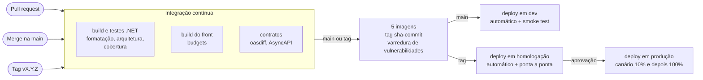

# Plano de build e deploy do artefato

Como cada artefato é construído, versionado, empacotado e implantado. Retrato do commit
`45bcd17`, em 07/10/2026: hoje o build é local e manual, e o único script de deploy é o do
relay. O que está marcado como proposta ainda não existe no repositório. Onde cada artefato
roda, com rede e IAM, está em
[topologia de implantação](../solucao/07-implantacao-e-infraestrutura.md).

## 1. Artefatos

| Artefato | Origem | Formato | Base | Destino | Versão hoje |
|---|---|---|---|---|---|
| `lancamentos/webapi` | `.WebApi/Dockerfile`, contexto na raiz | imagem OCI | `aspnet:9.0` | Cloud Run Service (proposto) | `latest` no local |
| `lancamentos/bff` | `.Bff/Dockerfile`, contexto na raiz | imagem OCI | `aspnet:9.0` | Cloud Run Service (proposto) | `latest` |
| `lancamentos/events` | `.Events/Dockerfile`, contexto na raiz | imagem OCI | `runtime:9.0` | Cloud Run Job (decidido) | data e hora, no script de deploy |
| `lancamentos/consumer` | `.Consumer/Dockerfile`, contexto na raiz | imagem OCI | `runtime:9.0` | Cloud Run worker pool (proposto) | `latest` |
| `lancamentos/frontend` | `.FrontEnd/Dockerfile`, **contexto na pasta do front** | imagem OCI | `nginx:1.27-alpine` | Cloud Run Service (proposto) | `latest` |
| `POCMica.MeusLancamentosDiarios.Integrator.Common` | `dotnet pack` | pacote NuGet | — | nuget.org | 1.0.0 |
| `POCMica.MeusLancamentosDiarios.Integrator.Messages` | `dotnet pack` | pacote NuGet | — | nuget.org | 1.0.0 |
| Contratos | [`docs/arquitetura/contratos`](../contratos) | OpenAPI e AsyncAPI | — | repositório | v1 |

## 2. Como o build funciona hoje

### 2.1 Imagens .NET

Os quatro Dockerfiles .NET seguem o mesmo molde, em dois estágios:

```
sdk:9.0  ── COPY NuGet.config + os .csproj ──► dotnet restore      (camada de cache dos pacotes)
         ── COPY do código dos projetos     ──► dotnet publish -c Release --no-restore
aspnet:9.0 ou runtime:9.0 ── COPY /app ── ENV de produção ── USER $APP_UID ── ENTRYPOINT
```

| Cuidado | Onde | Por quê |
|---|---|---|
| `NuGet.config` com `<clear />` copiado primeiro | todos | Restauração só do nuget.org; sem ele o restore tenta um feed privado herdado e falha com 401 |
| `.csproj` antes do código | todos | Mudar um `.cs` não invalida o cache dos pacotes |
| `runtime:9.0` no relay e no Consumer | `.Events`, `.Consumer` | Não servem HTTP; imagem menor e sem ASP.NET Core |
| Alvo `IgnorarAppsettingsDasReferencias` | `.WebApi.csproj`, `.Consumer.csproj` | Sem ele o `appsettings.json` do `.Events` disputa o caminho no publish (`NETSDK1152`) |
| `ENV` com o padrão de produção | Dockerfiles | `ASPNETCORE_ENVIRONMENT=Production`; `Relay__LoopContinuo=false`; `PubSub__CriarRecursos=false`. O compose sobrescreve o que muda no local |
| `USER $APP_UID` | todos os .NET | Usuário não root das imagens oficiais |
| `.dockerignore` | raiz | `bin/` e `obj/` do Windows quebrariam o restore no Linux |

### 2.2 Imagem do front

`node:22-alpine` roda `npm ci` e `ng build --configuration production`: `outputHashing: all`,
budgets de 500 kB (aviso) e 1 MB (erro) no pacote inicial, service worker ligado. O
resultado vai para `nginx:1.27-alpine`, com `index.html` e `ngsw.json` servidos sem cache.

**O endereço do BFF é fixado no build** (`API_BASE_URL = 'http://localhost:5100/api'`). Antes
de qualquer implantação fora da máquina, ele precisa virar `/api` relativo, com um proxy no
`ng serve` e no nginx locais. Sem isso a imagem do front não é a mesma entre ambientes.

### 2.3 Comandos

```bash
dotnet build MeusLancamentosDiarios.sln
dotnet test  MeusLancamentosDiarios.sln          # sai com código 1 por causa do .TestSupport
docker compose up -d --build                     # as cinco imagens e a infraestrutura local
```

Em máquina com pouco disco ou memória, construa uma imagem por vez
(`docker compose build webapi`, depois a próxima): as cinco em paralelo pesam no Docker
Desktop.

## 3. Pipeline proposto



| Portão | Falha o pipeline quando |
|---|---|
| Build | Erro de compilação ou aviso novo de analisador |
| Formatação | `dotnet format --verify-no-changes` encontra diferença |
| Testes | Qualquer teste falha; cobertura abaixo do piso |
| Arquitetura | Uma regra de dependência quebra ([07 · Testes](07-testes-e-padroes-de-codigo.md#3-testes-de-arquitetura)) |
| Contrato | `oasdiff` aponta mudança incompatível; AsyncAPI inválido |
| Front | Build de produção estoura o budget |
| Imagem | Vulnerabilidade crítica sem exceção registrada |
| Smoke test | `/health` ou login de teste falham depois do deploy |

### 3.1 Referência em GitHub Actions

O repositório está no GitHub. O workflow abaixo é referência: ainda não existe em
`.github/workflows`. A autenticação no GCP é por Workload Identity Federation, sem chave de
service account guardada no GitHub. Fixe as actions por SHA ao adotar.

```yaml
name: ci

on:
  pull_request:
  push:
    branches: [main]
    tags: ['v*']

permissions:
  contents: read

jobs:
  dotnet:
    runs-on: ubuntu-latest
    steps:
      - uses: actions/checkout@v4
      - uses: actions/setup-dotnet@v4
        with:
          dotnet-version: 9.0.x
      - run: dotnet restore MeusLancamentosDiarios.sln
      - run: dotnet build MeusLancamentosDiarios.sln -c Release --no-restore
      - run: dotnet format MeusLancamentosDiarios.sln --verify-no-changes --no-restore
      - run: >
          dotnet test MeusLancamentosDiarios.sln -c Release --no-build
          --collect:"XPlat Code Coverage" --results-directory TestResults
      - uses: actions/upload-artifact@v4
        with:
          name: cobertura
          path: TestResults/**/coverage.cobertura.xml

  frontend:
    runs-on: ubuntu-latest
    defaults:
      run:
        working-directory: MeusLancamentosDiarios.Integrator.FrontEnd
    steps:
      - uses: actions/checkout@v4
      - uses: actions/setup-node@v4
        with:
          node-version: 22
          cache: npm
          cache-dependency-path: MeusLancamentosDiarios.Integrator.FrontEnd/package-lock.json
      - run: npm ci
      - run: npx ng build --configuration production

  contratos:
    runs-on: ubuntu-latest
    steps:
      - uses: actions/checkout@v4
      - run: npx --yes @asyncapi/cli validate docs/arquitetura/contratos/asyncapi-lancamentos.v1.yaml
      # O OpenAPI novo sai do build da WebApi e do BFF (Microsoft.Extensions.ApiDescription.Server).
      - run: >
          docker run --rm -v "$PWD:/w" tufin/oasdiff breaking
          /w/docs/arquitetura/contratos/openapi-webapi.v1.json
          /w/artefatos/openapi-webapi.json --fail-on ERR

  imagens:
    if: github.event_name == 'push'
    needs: [dotnet, frontend, contratos]
    runs-on: ubuntu-latest
    permissions:
      contents: read
      id-token: write
    strategy:
      matrix:
        include:
          - { nome: webapi,   dockerfile: MeusLancamentosDiarios.Integrator.WebApi/Dockerfile,   contexto: . }
          - { nome: bff,      dockerfile: MeusLancamentosDiarios.Integrator.Bff/Dockerfile,      contexto: . }
          - { nome: events,   dockerfile: MeusLancamentosDiarios.Integrator.Events/Dockerfile,   contexto: . }
          - { nome: consumer, dockerfile: MeusLancamentosDiarios.Integrator.Consumer/Dockerfile, contexto: . }
          - { nome: frontend, dockerfile: MeusLancamentosDiarios.Integrator.FrontEnd/Dockerfile, contexto: MeusLancamentosDiarios.Integrator.FrontEnd }
    steps:
      - uses: actions/checkout@v4
      - uses: google-github-actions/auth@v2
        with:
          workload_identity_provider: ${{ vars.GCP_WIF_PROVIDER }}
          service_account: ${{ vars.GCP_SA_CI }}
      - uses: google-github-actions/setup-gcloud@v2
      - run: gcloud auth configure-docker southamerica-east1-docker.pkg.dev --quiet
      - run: |
          IMAGEM="southamerica-east1-docker.pkg.dev/${{ vars.GCP_PROJECT }}/lancamentos/${{ matrix.nome }}:sha-${GITHUB_SHA::12}"
          docker build -f "${{ matrix.dockerfile }}" -t "$IMAGEM" "${{ matrix.contexto }}"
          docker push "$IMAGEM"
```

Os jobs de deploy usam GitHub Environments (`dev`, `homologacao`, `producao`), com revisores
obrigatórios em produção.

## 4. Versionamento

| O quê | Esquema | Regra |
|---|---|---|
| Release da aplicação | SemVer, tag `vX.Y.Z` | Uma tag gera as cinco imagens com a mesma versão |
| Imagem | `sha-<12 caracteres do commit>` sempre; `vX.Y.Z` na tag | O deploy referencia o digest. Nada de `latest` na nuvem. O script do relay hoje usa data e hora: trocar pelo SHA, para ligar a imagem ao commit |
| Assembly | `-p:Version=X.Y.Z` | O SDK anexa o hash do commit ao `InformationalVersion` (`1.2.0+abc123…`). Expor no `/health` e nos logs |
| Pacotes NuGet | SemVer próprio de cada pacote | Versão publicada é permanente. `.Common` antes de `.Messages`. Mudança que quebra é versão maior |
| Front | `version` do `package.json`, hoje `0.0.0` | Acompanhar a release |
| Esquema do banco | sem versão | Tabela de histórico da ferramenta de migração ([dados macro](../solucao/05-dados-macro-e-migracao.md#5-estratégia-de-migração)) |
| Contratos | `v1` no nome do arquivo | Mudança incompatível cria `v2` ao lado da `v1` |

**Pacotes NuGet**, por tag `pacotes-vX.Y.Z`:

```bash
dotnet pack MeusLancamentosDiarios.Integrator.Common   -c Release -o nupkgs
dotnet pack MeusLancamentosDiarios.Integrator.Messages -c Release -o nupkgs
dotnet nuget push "nupkgs/*.nupkg" --api-key "$NUGET_API_KEY" \
  --source https://api.nuget.org/v3/index.json --skip-duplicate
```

A chave fica num segredo do GitHub, nunca no repositório. A API key só aceita nomes com o
prefixo `POCMica.`.

## 5. Deploy

### 5.1 Ordem numa release

Mudanças incompatíveis são divididas em expandir e contrair: primeiro se acrescenta, numa
release seguinte se remove. Dentro de uma release, a ordem é:

| # | Artefato | Por que nesta posição |
|---|---|---|
| 1 | Migração do banco, só aditiva | A versão anterior do código continua funcionando com o esquema novo |
| 2 | Consumer | Lê o evento como leitor tolerante; precisa aceitar o campo novo antes de alguém publicá-lo |
| 3 | WebApi e relay | Publicam o evento e servem a API. A WebApi nova aceita o BFF anterior |
| 4 | BFF | Aceita o front anterior: o PWA em cache continua chamando enquanto não é reaberto |
| 5 | Front | Os usuários pegam a versão nova na próxima abertura do app |
| 6 | Contração, numa release seguinte | Remover coluna, campo ou rota que ninguém usa mais |

### 5.2 Como cada artefato sobe

| Artefato | Mecanismo | Rollback |
|---|---|---|
| WebApi, BFF, front | `gcloud run deploy --no-traffic`, smoke test na revisão nova pela URL de tag, depois `gcloud run services update-traffic` com 10% e, sem alarme, 100% | Devolver o tráfego à revisão anterior, na hora |
| Relay | `gcloud run jobs deploy` com a imagem nova; a próxima execução do Scheduler já usa | Implantar de novo a imagem anterior |
| Consumer | Atualização do worker pool com a imagem nova | Imagem anterior |
| Banco | Migração num passo próprio, com usuário de DDL | Correção para a frente. A restauração pontual (PITR) é o último recurso, porque descarta o que veio depois |

```bash
# Canário da WebApi: sobe sem tráfego, testa pela tag e então divide.
gcloud run deploy lancamentos-webapi --image "$IMAGEM" --region southamerica-east1 \
  --no-traffic --tag candidata
gcloud run services update-traffic lancamentos-webapi --region southamerica-east1 \
  --to-tags candidata=10
```

### 5.3 Smoke test depois do deploy

- `GET /health` no BFF, pelo Load Balancer, e na WebApi, de dentro da VPC.
- `GET /api/auth/config` responde 200.
- Fora de produção: login com usuário de teste, um lançamento numa conta de teste e o saldo
  consolidado em até 10 s.
- Em produção: uma conta sintética da equipe de operação, com lançamento de crédito e débito
  de mesmo valor, para o saldo voltar a zero.

### 5.4 Configuração por ambiente

O que cada container recebe fora do `appsettings.json` da imagem. Segredos vêm do Secret
Manager como variável de ambiente (`--set-secrets`).

| Variável | WebApi | BFF | Relay | Consumer | Origem |
|---|---|---|---|---|---|
| `Banco__ConnectionString` | sim | — | sim | sim | segredo |
| `Banco__CriarBanco=false` | sim | — | sim | sim | configuração |
| `PubSub__ProjectId` | sim | — | sim | sim | configuração |
| `Auth__Jwt__Chave` | sim | sim | — | — | segredo, o mesmo nos dois |
| `Auth__Google__ClientId` | sim | — | — | — | configuração |
| `Auth__RedefinicaoSenha__UrlDoFront` | sim | — | — | — | `https://<domínio>/redefinir-senha` |
| `Auth__Email__Host`, `__Porta`, `__UsarSsl`, `__Remetente` | sim | — | — | — | configuração |
| `Auth__Email__Usuario`, `Auth__Email__Senha` | sim | — | — | — | segredo |
| `WebApi__BaseUrl` | — | sim | — | — | URL interna da WebApi |
| `Consumer__Concorrencia`, `Consumer__MaxTentativas` | — | — | — | sim | configuração (a imagem traz 20 e 5) |

`Auth__SemearUsuariosDemo` e `Swagger__Habilitado` ficam no padrão da imagem (`false`) em
qualquer ambiente na nuvem, exceto numa demonstração planejada.

## 6. Cadeia de suprimentos

| Item | Hoje | Proposto |
|---|---|---|
| Origem dos pacotes .NET | só nuget.org (`NuGet.config` com `<clear />`) | manter |
| Trava de versões .NET | não há | `packages.lock.json` com `--locked-mode` |
| Trava de versões npm | `package-lock.json` e `npm ci` | manter |
| Imagens base | por tag (`sdk:9.0`, `nginx:1.27-alpine`) | Fixar por digest; Dependabot ou Renovate atualiza |
| Varredura de vulnerabilidades | não há | Varredura do Artifact Registry ou Trivy no CI |
| SBOM | não há | Gerado no build da imagem e guardado com ela |
| Atualização de dependências | manual | Dependabot para NuGet, npm, Docker e Actions |
| Licenças | MIT nos pacotes publicados; FluentAssertions travado na 6.x | Verificação de licença no CI ([ADR-SW-13](03-adrs/ADR-SW-13-testes-case-when-then.md)) |
