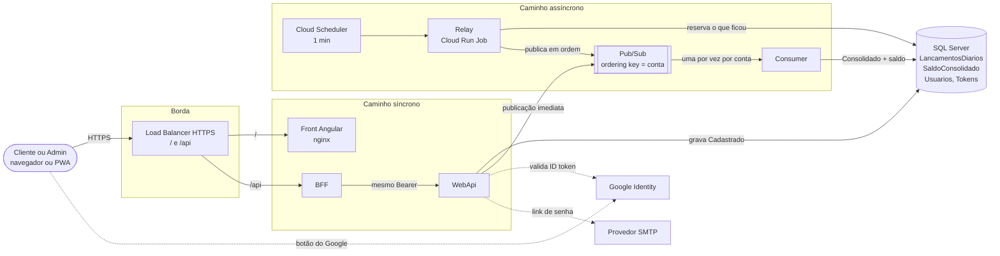

# Documento de Arquitetura de Solução (SAD-Sol)

A solução de ponta a ponta: o problema, o escopo, as premissas e restrições, como as peças
se combinam e por que foram escolhidas. Retrato do commit `45bcd17`, em 07/10/2026.

A organização interna do aplicativo está no [SAD-App](../software/01-sad-app.md). O que o
sistema faz e garante está nos [requisitos funcionais](../../requisitos-funcionais.md) e nos
[não funcionais](../../requisitos-nao-funcionais.md).

## 1. Contexto de negócio

Um comerciante precisa controlar o fluxo de caixa diário, com lançamentos de crédito e de
débito, e de um relatório com o saldo diário consolidado. Os mockups em
[`Saldo Consolidado.pdf`](<../../../Saldo Consolidado.pdf>) mostram duas telas: o saldo
(consolidado, última atualização, pendentes, saldo projetado e o aviso de consolidação em
andamento) e o novo lançamento (tipo, valor, data e observação).

O requisito que mais pesa na arquitetura:

> O serviço de controle de lançamento não deve ficar indisponível se o sistema de
> consolidado diário cair. Em dias de picos, o serviço de consolidado diário recebe 50
> requisições por segundo, com no máximo 5% de perda de requisições.

Daí a forma da solução: o lançamento é gravado na hora e a consolidação acontece depois,
por evento. A tela mostra o saldo consolidado, o que está em trânsito e o saldo projetado.

## 2. Escopo

| Dentro | Fora |
|---|---|
| Registrar lançamento de crédito e de débito, avulso e em lote | Saldo por dia e relatório por período (RF-08, não atendido) |
| Consolidar o saldo por conta, de forma assíncrona e em ordem | Extrato, estorno, edição ou exclusão de lançamento |
| Consultar saldo consolidado, pendentes e saldo projetado | Integração bancária, fiscal ou com maquininha |
| Cadastro, login com senha e com Google, renovação, logout, redefinição de senha | Gestão de usuários e de contas pela tela |
| Perfis Cliente e Admin; posse da conta | Multimoeda; múltiplas contas por usuário |
| Aplicativo web instalável (PWA) | App nativo de loja |
| Execução local completa em `docker compose`; desenho de implantação no GCP | Operação em produção (não executada) |

## 3. Partes interessadas

| Parte | Preocupação | Onde é tratada |
|---|---|---|
| Comerciante (Cliente) | Lançar rápido, ver o saldo certo, não perder lançamento | Requisitos funcionais; [NFRs de solução](08-nfrs-de-solucao.md) |
| Administrador | Ver qualquer conta; lançar em lote | Perfis e posse ([segurança](06-seguranca-e-threat-model.md#3-autorização)) |
| Avaliação técnica | Decisões justificadas, riscos à vista, o que foi medido | Este documento, os ADRs e as medições |
| Desenvolvimento | Onde mexer, como testar, como subir | [SAD-App](../software/01-sad-app.md), [testes](../software/07-testes-e-padroes-de-codigo.md), [build e deploy](../software/08-build-e-deploy.md) |
| Operação | Saber que algo travou e o que fazer | [Observabilidade e operação](10-observabilidade-e-operacao.md) |
| Segurança e privacidade | Acesso por conta, segredos, LGPD | [Segurança, compliance e threat model](06-seguranca-e-threat-model.md) |

## 4. Premissas

| Id | Premissa | Se não valer |
|---|---|---|
| P-01 | O alvo de implantação é o GCP, região `southamerica-east1` | O mapeamento para a AWS está no [README](../../../README.md#vindo-da-aws) |
| P-02 | Cada usuário tem exatamente uma conta, e cada conta no máximo um dono | Modelo de posse e de dados mudam |
| P-03 | Pico de 50 consultas de saldo por segundo; volume de lançamentos de um comércio, não de um banco | Rever capacidade do relay e do Consumer |
| P-04 | O negócio tolera segundos de atraso na consolidação, e até ~1 min na recuperação de falha | Relay sempre ligado em vez de Job por minuto |
| P-05 | Moeda única, real | Modelo de dinheiro muda ([ADR-SW-05](../software/03-adrs/ADR-SW-05-dinheiro-em-centavos.md)) |
| P-06 | O dia do lançamento é o de São Paulo | Validação de data e exibição mudam |
| P-07 | Usuário com navegador moderno e acesso por HTTPS | PWA e login do Google exigem HTTPS |
| P-08 | A POC não guarda dado real; os usuários de demonstração são públicos | Antes de dado real: [plano de segurança](06-seguranca-e-threat-model.md#10-plano-de-ação) |

## 5. Restrições

| Id | Restrição | Consequência |
|---|---|---|
| R-01 | SQL Server como único dialeto, local e na nuvem | Cloud SQL for SQL Server, com licença no custo ([ADR-SOL-02](03-adrs/ADR-SOL-02-sql-server-como-motor-unico.md)) |
| R-02 | Cloud Scheduler não dispara com intervalo menor que 1 minuto | Publicação imediata na WebApi; o relay é rede de proteção ([ADR-SOL-04](03-adrs/ADR-SOL-04-publicacao-hibrida.md)) |
| R-03 | Não há Cloud SQL Connector para .NET, e o socket do Cloud SQL não atende SQL Server | Conexão por IP privado na porta 1433, com Direct VPC egress |
| R-04 | No Pub/Sub, a ordem vale por ordering key, e cada chave tem teto de vazão (1 MB/s) | Chave = conta; nenhuma conta chega perto do teto |
| R-05 | PWA e login com Google exigem HTTPS e um domínio | Load Balancer com certificado gerenciado; domínio a definir |
| R-06 | Repositório público | Nenhum segredo de produção no código; só fontes e ativos com licença livre |
| R-07 | Pacotes no nuget.org só com o prefixo `POCMica.` | `PackageId` diferente do namespace |

## 6. Visão ponta a ponta

**Lançar.** O front chama o BFF, que confere token, role e conta e repassa à WebApi com o
mesmo Bearer. A WebApi confere de novo, grava o lançamento como `Cadastrado` com a próxima
sequência da conta e, se nenhum lançamento anterior da conta está pendente, publica no
Pub/Sub na mesma requisição, esperando no máximo 2 s. Responde 201 em qualquer caso: o
lançamento já está gravado.

**Consolidar.** O Pub/Sub entrega uma mensagem por vez em cada conta. O Consumer marca a
linha e soma o valor ao saldo da conta. O relay, a cada minuto no GCP, publica o que a
WebApi não publicou: falha do broker, conta com anterior pendente, lote.

**Consultar.** A tela pede o saldo ao BFF; a WebApi lê o read model `SaldoConsolidado` e
soma os pendentes. Enquanto há pendente, a tela consulta de novo a cada 2 s; sem pendente,
para.

**Autenticar.** Só a WebApi emite token. O BFF expõe as rotas de autenticação como repasse.

## 7. Atributos de qualidade

Cenários no formato estímulo, resposta e medida. A situação de cada um vem das medições em
[requisitos-nao-funcionais.md](../../requisitos-nao-funcionais.md).

| Id | Atributo | Cenário | Resposta esperada | Tática | Situação |
|---|---|---|---|---|---|
| QA-1 | Disponibilidade | Consumer, relay ou broker fora; o cliente lança | 201 para todo lançamento; consolida depois da volta | Outbox na linha; publicação com teto de 2 s | Atendido (medido no local) |
| QA-2 | Consistência | O Pub/Sub entrega a mesma mensagem duas vezes | O saldo não muda na segunda | Transição condicional por estágio | Atendido (código e testes) |
| QA-3 | Consistência | A publicação do lançamento 1 falha; o 2 já está gravado | O 2 não é publicado antes do 1 | Reserva sem sucessor de pendente; chave = conta | Atendido na publicação; na consolidação, um `Erro` não segura os seguintes |
| QA-4 | Desempenho | Pico de 50 consultas de saldo por segundo | Até 5% de perda | Read model; polling só com pendente | Atendido numa base pequena; não comprovado com volume |
| QA-5 | Segurança | Cliente pede o saldo de outra conta | 403 no BFF e na WebApi | Policy + filtro de posse nas duas APIs | Atendido |
| QA-6 | Operabilidade | Um lançamento para em `Erro` | A operação sabe em minutos e tem como destravar | Estágio na linha; alerta e ferramenta | Parcial: o estágio existe; falta alerta e reprocesso |
| QA-7 | Portabilidade | Implantar no GCP | Mesma imagem, só variáveis de ambiente | Emulador ↔ real automático; `LoopContinuo` | Atendido no código; o front tem o endereço da API fixo |

Por que a ordem importa, se a soma comuta: o "consolidado até o lançamento nº N" só é
verdadeiro se tudo antes de N entrou, e qualquer regra futura sobre o saldo corrente
(limite, extrato com saldo linha a linha, saldo por dia) depende da ordem.

## 8. Visão geral da solução

| Container | Tecnologia | Responsabilidade | No GCP | Exposição |
|---|---|---|---|---|
| Front | Angular 20, PWA, nginx | Telas | Cloud Run Service | Pública, pelo Load Balancer, em `/` |
| BFF | .NET 9, Minimal API | API das telas; posse; formatação pt-BR | Cloud Run Service | Pública, pelo Load Balancer, em `/api` |
| WebApi | .NET 9, Minimal API | Regras; emissão do JWT; publicação imediata | Cloud Run Service | Só interna |
| Relay | .NET 9 worker | Publicar o que ficou para trás | Cloud Run Job + Cloud Scheduler | Nenhuma |
| Consumer | .NET 9 worker | Consolidar o saldo | Cloud Run worker pool | Nenhuma |
| Banco | SQL Server 2022 | Lançamentos, saldo, usuários, tokens | Cloud SQL for SQL Server, IP privado | Só na VPC |
| Mensageria | Google Cloud Pub/Sub | Tópico e subscription com ordenação | Pub/Sub | IAM |

Diagramas de contexto e de containers em [C4 níveis 1 e 2](02-c4-contexto-e-containers.md);
rede, ambientes e IaC em [topologia de implantação](07-implantacao-e-infraestrutura.md).

## 9. Decisões e justificativas

| ADR | Decisão | Justificativa em uma linha | Situação |
|---|---|---|---|
| [ADR-SOL-01](03-adrs/ADR-SOL-01-gcp-serverless.md) | GCP com serviços gerenciados e serverless | Sem servidor para administrar; escala e cobrança por uso onde o padrão de carga permite | Aceita, não executada |
| [ADR-SOL-02](03-adrs/ADR-SOL-02-sql-server-como-motor-unico.md) | SQL Server local e Cloud SQL for SQL Server | Um dialeto, um caminho de código; acabou com os problemas do SQLite | Aceita |
| [ADR-SOL-03](03-adrs/ADR-SOL-03-consolidacao-assincrona-pubsub.md) | Consolidação assíncrona por Pub/Sub, ordering key = conta | Lançar não depende de consolidar; ordem por conta, contas em paralelo | Aceita |
| [ADR-SOL-04](03-adrs/ADR-SOL-04-publicacao-hibrida.md) | Publicação imediata + relay por Job a cada minuto | Caminho feliz sem esperar o agendador; garantia de entrega intacta | Aceita, não executada no GCP |
| [ADR-SOL-05](03-adrs/ADR-SOL-05-bff-como-unica-porta.md) | BFF como única porta do front; WebApi interna | Payload pronto para a tela; menos superfície exposta | Aceita |
| [ADR-SOL-06](03-adrs/ADR-SOL-06-identidade-propria-jwt.md) | Identidade própria: JWT HS256 emitido pela WebApi; Google como provedor federado | Controle de perfis e da conta no token; sem dependência de um IdP pago | Aceita |
| [ADR-SOL-07](03-adrs/ADR-SOL-07-banco-unico-com-read-model.md) | Um banco para os processos do mesmo serviço; read model no mesmo banco | Transação local entre linha e saldo; um sistema a operar | Aceita |
| [ADR-SOL-08](03-adrs/ADR-SOL-08-load-balancer-como-entrada.md) | Load Balancer HTTPS externo como entrada única | Mesmo domínio para front e API, sem CORS; HTTPS gerenciado | Proposta |
| [ADR-SOL-09](03-adrs/ADR-SOL-09-consumer-em-worker-pool.md) | Consumer em worker pool do Cloud Run, com pull | O processo não abre porta HTTP | Proposta |
| [ADR-SOL-10](03-adrs/ADR-SOL-10-segredos-e-imagem-unica.md) | Segredos no Secret Manager; uma imagem para todos os ambientes | Nada de segredo na imagem; promoção sem rebuild | Aceita para o relay; proposta para os demais |
| [ADR-SOL-11](03-adrs/ADR-SOL-11-pwa.md) | PWA em vez de app de loja | Instalação sem loja, uma base de código | Aceita |
| [ADR-SOL-12](03-adrs/ADR-SOL-12-email-por-smtp.md) | E-mail por SMTP genérico | Troca de provedor por configuração | Aceita; provedor a definir |
| [ADR-SOL-13](03-adrs/ADR-SOL-13-terraform.md) | Infraestrutura como código com Terraform | Ambientes reproduzíveis; tópico e subscription fora da aplicação | Proposta |

**Alternativas descartadas, em resumo**

| Alternativa | Motivo |
|---|---|
| Consolidar no próprio request | Viola o requisito: lançar dependeria da consolidação |
| SQLite | Sem decimal exato, *type handlers* frágeis, sem caminho gerenciado na nuvem |
| Cloud Functions para o relay | Reescrever o projeto no formato de função |
| Cloud Tasks se reagendando a cada 5 s | O mais caro para o pior resultado entre as opções medidas |
| Change Data Capture com Debezium | Infraestrutura pesada para o que o polling resolve |
| SignalR para atualizar a tela | Exige caminho do Consumer ao BFF para ganhar ~2 s |
| API Gateway na entrada | Não valida o JWT HS256 na borda; o BFF já confere token, role e conta |

## 10. Situação por parte

| Parte | Local, hoje | No GCP | Situação |
|---|---|---|---|
| Relay | `RelayWorker` em loop de 2 s | Cloud Run Job + Cloud Scheduler a cada 1 min | Decidido; script pronto, não executado |
| Banco | SQL Server 2022 em container | Cloud SQL for SQL Server, IP privado, Direct VPC egress | Decidido |
| Pub/Sub | Emulador; tópico e subscription criados na subida | Pub/Sub gerenciado, provisionado por Terraform | Terraform pendente |
| Consumer | Worker com pull, sempre ligado | Worker pool do Cloud Run | Proposta |
| WebApi | Container na 5101 | Cloud Run Service, ingress interno | Proposta |
| BFF | Container na 5100 | Cloud Run Service atrás do Load Balancer | Proposta |
| Front | nginx na 4200 | Mesma imagem no Cloud Run, atrás do Load Balancer | Proposta; o endereço da API precisa virar `/api` |
| Domínio e HTTPS | `localhost`, sem TLS | Load Balancer com certificado gerenciado | Domínio a escolher |
| Chave do JWT | `appsettings.Development.json` e compose | Secret Manager | Decidido |
| E-mail | Mailpit | Provedor SMTP | A definir |
| Login com Google | Desligado sem `GOOGLE_CLIENT_ID` | Client ID com o domínio como origem | Depende do domínio |
| Observabilidade | Logs em texto no console | Cloud Logging, Monitoring e Trace | Proposta ([plano](10-observabilidade-e-operacao.md)) |

## 11. Riscos principais

Os cinco de maior exposição. A matriz completa está em
[transição, roadmap e riscos](09-transicao-roadmap-e-riscos.md#7-matriz-de-riscos).

| Risco | Exposição | Mitigação |
|---|---|---|
| A consulta do saldo não sustenta volume real por causa do tipo do parâmetro | Alta | Corrigir o tipo, ligar o `READ_COMMITTED_SNAPSHOT`, medir com volume |
| Lançamento aceito e fora do saldo, sem ninguém perceber | Alta | Consolidação numa transação, guarda de ordem, reconciliação diária, alertas |
| Conta travada em `Erro` sem ferramenta | Média | `Erro` não terminal para falha passageira, *dead-letter*, reprocesso |
| Segredo do repositório público reaproveitado num ambiente real | Média | Nenhum valor do repositório fora do local; segredos só no Secret Manager |
| Custo de licença do SQL Server dominar o orçamento | Média | Dimensionar a instância; avaliar PostgreSQL se o custo pesar |

## 12. Documentos relacionados

- Arquiteto de software: [SAD-App](../software/01-sad-app.md) e os demais em [`../software`](../software).
- Arquiteto de solução: [C4 níveis 1 e 2](02-c4-contexto-e-containers.md),
  [ADRs](03-adrs/README.md), [integração](04-integracao-e-contratos.md),
  [dados e migração](05-dados-macro-e-migracao.md), [segurança](06-seguranca-e-threat-model.md),
  [implantação](07-implantacao-e-infraestrutura.md), [NFRs](08-nfrs-de-solucao.md),
  [transição e riscos](09-transicao-roadmap-e-riscos.md),
  [observabilidade e operação](10-observabilidade-e-operacao.md).
- Anteriores: [arquitetura](<../../Arquitetura dos Lançamentos Diários.md>),
  [capacidade do relay](../../capacidade-do-relay.md),
  [cobertura dos testes](../../cobertura-de-testes.md).
