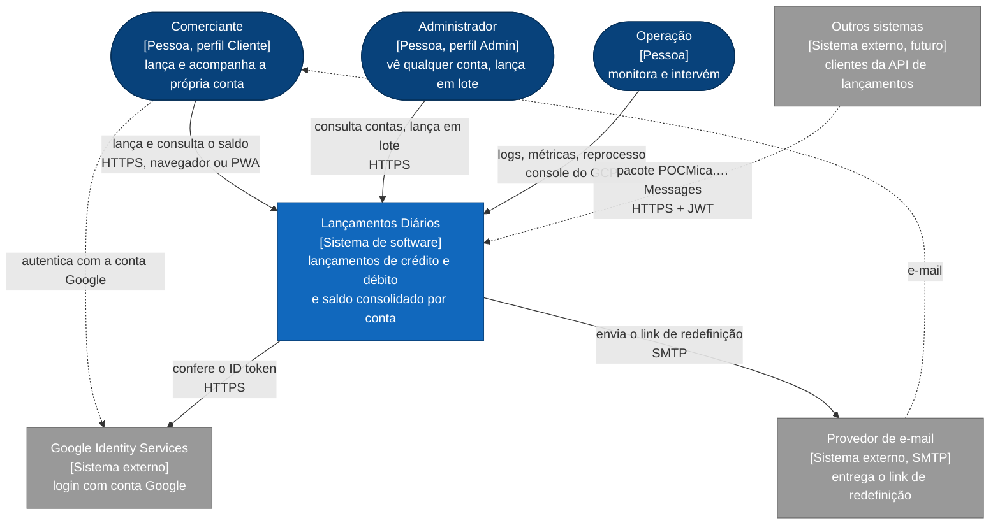
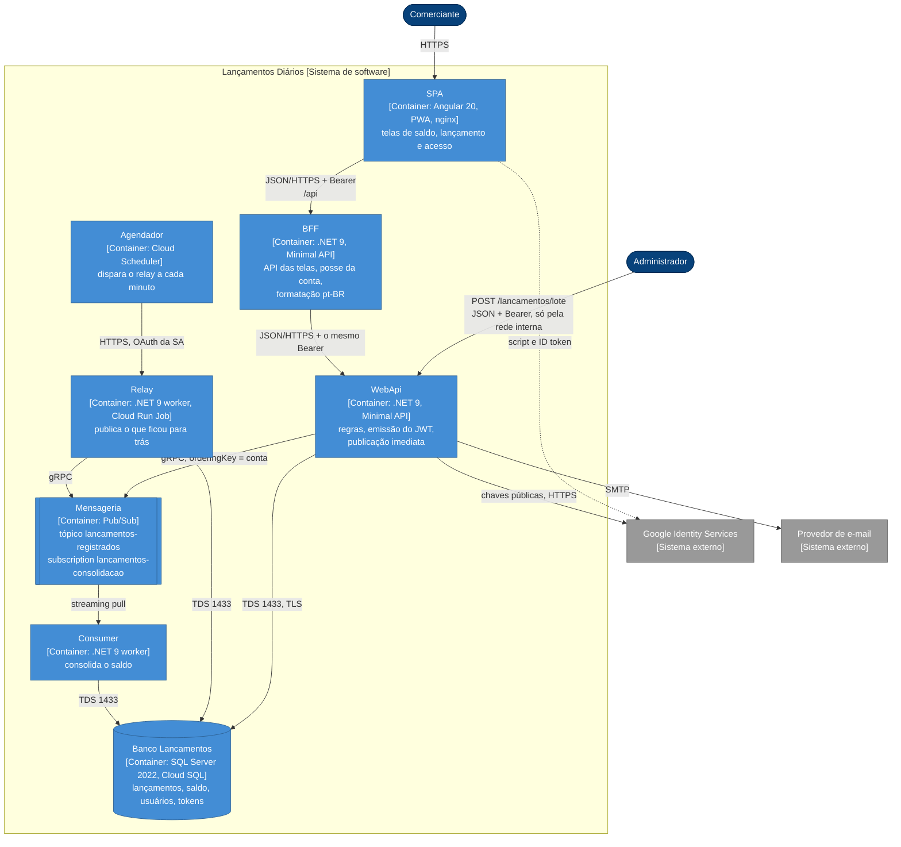

# Diagramas C4 — níveis 1 e 2

O sistema no seu contexto (nível 1) e os containers que o compõem (nível 2), com as
integrações entre eles e com os sistemas de fora. Retrato do commit `45bcd17`, em
07/10/2026. Os níveis 3 e 4 estão em
[C4 componentes e código](../software/02-c4-componentes-e-codigo.md).

**Notação.** C4 desenhado em `flowchart` do Mermaid, pelo mesmo motivo do nível 3: o tipo C4
nativo do Mermaid ainda é experimental. Azul-escuro para pessoas, azul para o sistema e seus
containers, cinza para sistemas externos. Linha tracejada é integração opcional ou futura.

## Nível 1 — Contexto

| Elemento | Tipo | Papel | Interação com o sistema |
|---|---|---|---|
| Comerciante | Pessoa (Cliente) | Dono de uma conta | Lança, consulta saldo e pendentes, gerencia a própria sessão |
| Administrador | Pessoa (Admin) | Opera o sistema | Consulta qualquer conta, lista contas, lança em lote pela API |
| Operação | Pessoa | Mantém o sistema no ar | Acompanha logs e métricas; hoje intervém por SQL ([runbooks](10-observabilidade-e-operacao.md#10-runbooks)) |
| Google Identity Services | Sistema externo | Provedor de identidade federado | O navegador obtém o ID token; a WebApi confere assinatura e audiência |
| Provedor de e-mail | Sistema externo | Entrega de e-mail transacional | Recebe o e-mail de redefinição de senha por SMTP |
| Outros sistemas | Sistema externo, futuro | Clientes da API de lançamentos | Usariam os contratos publicados no nuget.org |

## Nível 2 — Containers

| Container | Tecnologia | Responsabilidade | Dados que possui | Escala |
|---|---|---|---|---|
| SPA | Angular 20 standalone, signals, PWA; nginx 1.27 | Telas; sessão no navegador; polling do saldo enquanto há pendente | Sessão (`localStorage`) | Estático |
| BFF | .NET 9, Minimal API | Valida o token, confere a posse, monta o payload da tela, repassa `/auth` | Nenhum | Horizontal, sem estado |
| WebApi | .NET 9, Minimal API, Dapper | Lançamento, lote, saldo, contas; cadastro, login, renovação; publicação imediata | Usuários e tokens; escreve lançamentos | Horizontal, sem estado |
| Agendador | Cloud Scheduler | Disparar o Job do relay | — | — |
| Relay | .NET 9 worker | Reservar e publicar em ordem o que não foi publicado | Escreve o estágio | Uma execução por vez |
| Mensageria | Google Cloud Pub/Sub | Entregar pelo menos uma vez, em ordem por conta | Mensagens em trânsito | Gerenciado |
| Consumer | .NET 9 worker | Consolidar o saldo | Escreve o estágio e o saldo | Horizontal entre contas; em série dentro da conta |
| Banco | SQL Server 2022; Cloud SQL for SQL Server | Fonte da verdade e read model | Todas as tabelas | Vertical; réplica a avaliar |

No local, o agendador é o `PeriodicTimer` dentro do próprio relay, que fica sempre ligado.

## Integrações

| De | Para | Protocolo | Estilo | Autenticação | Contrato | Falha |
|---|---|---|---|---|---|---|
| Navegador | SPA | HTTPS | estático | — | — | Service worker serve a versão em cache |
| SPA | BFF | HTTPS, JSON | síncrono | JWT Bearer | [`openapi-bff.v1.json`](../contratos/openapi-bff.v1.json) | Mantém o último saldo e avisa |
| BFF | WebApi | HTTPS, JSON | síncrono | o mesmo JWT; no GCP, rede interna | [`openapi-webapi.v1.json`](../contratos/openapi-webapi.v1.json) | 500 depois de 10 s |
| WebApi | Banco | TDS | síncrono | usuário do SQL Server | [modelo físico](../software/05-modelo-de-dados.md#3-modelo-físico) | 500 |
| WebApi | Pub/Sub | gRPC | assíncrono | service account | [`asyncapi-lancamentos.v1.yaml`](../contratos/asyncapi-lancamentos.v1.yaml) | 201 assim mesmo; o relay recolhe |
| Agendador | Relay | HTTPS (API do Cloud Run) | gatilho | OAuth da service account | — | O Job tenta até 3 vezes |
| Relay | Banco, Pub/Sub | TDS, gRPC | lote | usuário do banco, service account | idem | Backoff por lançamento; `Erro` na 5ª |
| Pub/Sub | Consumer | gRPC, streaming pull | assíncrono | service account | idem | Nack e reentrega; `Erro` na 5ª |
| Navegador | Google | HTTPS | redirecionamento | conta Google | Google Identity Services | Botão some sem Client ID |
| WebApi | Google | HTTPS | síncrono | — | certificados públicos do Google | 401 para o usuário |
| WebApi | Provedor de e-mail | SMTP | síncrono, dentro da requisição | usuário e senha opcionais | — | Registra e responde 202 assim mesmo |

O catálogo completo, com garantias de entrega e regras de versionamento, está em
[integração e contratos](04-integracao-e-contratos.md).

## Do local ao GCP

| Container | `docker compose` | GCP |
|---|---|---|
| SPA | `frontend`, porta 4200 | Cloud Run Service atrás do Load Balancer, em `/` |
| BFF | `bff`, porta 5100 | Cloud Run Service atrás do Load Balancer, em `/api` |
| WebApi | `webapi`, porta 5101 | Cloud Run Service com ingress interno |
| Relay | `events`, `LoopContinuo=true` | Cloud Run Job, `LoopContinuo=false` |
| Agendador | `PeriodicTimer` de 2 s | Cloud Scheduler, `* * * * *` |
| Consumer | `consumer` | Cloud Run worker pool |
| Mensageria | emulador `pubsub`, porta 8085 | Pub/Sub |
| Banco | `sqlserver`, porta 1433, volume `sqlserver-dados` | Cloud SQL for SQL Server com IP privado |
| E-mail | `mailpit`, portas 1025 e 8025 | Provedor SMTP |

A topologia com rede, zonas e IAM está em [implantação e infraestrutura](07-implantacao-e-infraestrutura.md).
