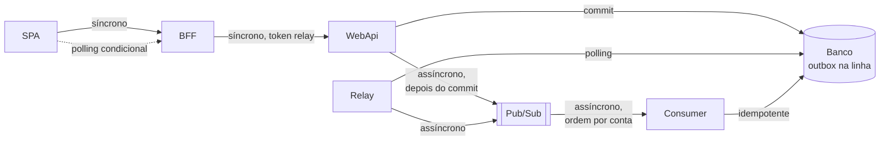
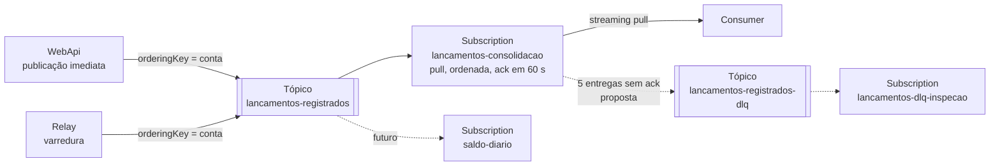

# Arquitetura de integração e contratos entre sistemas

Como as peças conversam: APIs síncronas, mensageria, sistemas externos, garantias de entrega,
tratamento de falha e governança dos contratos. Retrato do commit `45bcd17`, em 07/10/2026.

Os contratos campo a campo (DTOs, status por rota, interfaces internas) estão em
[contratos internos e APIs](../software/04-contratos-internos-e-apis.md). Os arquivos de
contrato estão em [`contratos/`](../contratos):

| Arquivo | O quê | Como foi obtido |
|---|---|---|
| [`openapi-bff.v1.json`](../contratos/openapi-bff.v1.json) | API pública do BFF | Exportado da stack local, `/openapi/v1.json` |
| [`openapi-webapi.v1.json`](../contratos/openapi-webapi.v1.json) | API interna da WebApi | Exportado da stack local, `/openapi/v1.json` |
| [`asyncapi-lancamentos.v1.yaml`](../contratos/asyncapi-lancamentos.v1.yaml) | Evento de lançamento no Pub/Sub | Escrito a partir do contrato C# e do publicador |

## 1. Catálogo de integrações

| Id | De → Para | Estilo | Protocolo | Autenticação | Contrato | Criticidade |
|---|---|---|---|---|---|---|
| INT-01 | Navegador → SPA | estático | HTTPS | — | — | alta |
| INT-02 | SPA → BFF | requisição e resposta | HTTPS, JSON | JWT Bearer | OpenAPI do BFF | alta |
| INT-03 | BFF → WebApi | requisição e resposta | HTTP(S), JSON | o mesmo JWT; rede interna no GCP | OpenAPI da WebApi; pacote `.Messages` | alta |
| INT-04 | WebApi → Pub/Sub | evento | gRPC | service account | AsyncAPI | média: falha cai no relay |
| INT-05 | Cloud Scheduler → Relay | gatilho | HTTPS, API do Cloud Run | OAuth da service account | — | média |
| INT-06 | Relay → Pub/Sub | evento | gRPC | service account | AsyncAPI | média |
| INT-07 | Pub/Sub → Consumer | evento | gRPC, streaming pull | service account | AsyncAPI | média: atrasa a consolidação, não o lançamento |
| INT-08 | WebApi, Relay, Consumer → Banco | dados | TDS na 1433, TLS | usuário do SQL Server | [modelo físico](../software/05-modelo-de-dados.md#3-modelo-físico) | alta |
| INT-09 | Navegador → Google Identity Services | federação | HTTPS | conta Google | Google Identity Services | baixa: opcional |
| INT-10 | WebApi → Google (chaves públicas) | validação | HTTPS | — | ID token OIDC | baixa |
| INT-11 | WebApi → Provedor de e-mail | envio | SMTP | usuário e senha | — | baixa |
| INT-12 | Administrador → WebApi (lote) | requisição e resposta | HTTP(S), JSON | JWT de Admin | OpenAPI da WebApi | baixa |

## 2. Padrões de integração



| Padrão | Onde | Por quê |
|---|---|---|
| Backend for frontend | INT-02 | Payload por tela; WebApi fora da internet |
| Access token relay | INT-03 | A WebApi decide com o token do usuário |
| Transactional outbox | WebApi e banco | Banco e broker não têm commit comum |
| Polling publisher | INT-05, INT-06 | Publica o que a publicação imediata não levou |
| Publicação logo após o commit | INT-04 | Tira o atraso do agendador do caminho feliz |
| Publish-subscribe com chave de ordenação | INT-06, INT-07 | Ordem por conta, paralelismo entre contas, novos assinantes sem mudar o publicador |
| Idempotent consumer | INT-07 | Entrega pelo menos uma vez |
| Polling condicional | INT-02 | A tela só consulta enquanto há pendente |
| Identidade federada | INT-09, INT-10 | Login com Google trocado pela sessão própria |

## 3. APIs síncronas

### 3.1 SPA → BFF

- Base `/api` no mesmo domínio do front, atrás do Load Balancer ([ADR-SOL-08](03-adrs/ADR-SOL-08-load-balancer-como-entrada.md)).
  Hoje o front aponta para `http://localhost:5100/api`.
- Toda rota de tela exige `ClienteOuAdmin`; `/api/contas` exige `SomenteAdmin`; `/api/auth/*`
  é pública, menos `/api/auth/eu`.
- O front renova a sessão uma vez no primeiro 401 e repete o pedido.
- O polling segue o `intervaloPollingMs` que o BFF devolve: 2000 com pendente, 0 sem.

### 3.2 BFF → WebApi

- O BFF repassa o `Authorization` recebido (`RepassarTokenHandler`); não usa credencial
  própria.
- Timeout de 10 s, sem retentativa.
- Erro da WebApi (4xx e 5xx) chega ao front com o mesmo status e o mesmo `ProblemDetails`.
  Falha de rede ou timeout vira 500 no BFF.
- No GCP, a WebApi tem ingress interno, e o BFF a alcança pela VPC.

### 3.3 Outros clientes da WebApi

A WebApi é a API de domínio. Um cliente novo (outro sistema, um job de importação) usaria os
contratos publicados no nuget.org (`POCMica.MeusLancamentosDiarios.Integrator.Messages`) e
um JWT emitido pela própria WebApi. Hoje não há autenticação de máquina para máquina: um
cliente desse tipo precisaria de um usuário. Ver [integrações futuras](#8-integrações-futuras).

## 4. Mensageria

### 4.1 Topologia



### 4.2 Garantias

| Garantia | Como | Limite |
|---|---|---|
| Nada se perde antes do broker | A linha é o outbox; o relay recolhe | Na 5ª falha de publicação a linha vai para `Erro`, terminal |
| Ordem por conta | A reserva nunca publica a sequência N antes da N−1; ordering key = conta; ordenação ligada nos dois lados | Mesma chave e mesma região. Um `Erro` na consolidação não segura os seguintes |
| Pelo menos uma vez | Garantia do Pub/Sub | Repetições acontecem e são esperadas |
| Sem efeito duplicado | O Consumer só avança a linha que está no estágio esperado | — |
| Corpo não é fonte da verdade | O Consumer usa o `lancamentoId` e lê o resto do banco | — |
| Mensagem envenenada | Corpo inválido recebe ack e vai para o log de erro | Some; não há *dead-letter* |

**Por que a ordem não pode ficar só com o broker.** O Pub/Sub ordena o que recebeu; ele não
sabe de uma mensagem que nunca chegou. Se a sequência 1 falhasse ao publicar e a 2 desse
certo, o broker entregaria a 2 sem ter o que segurar. Por isso a trava fica no banco.

### 4.3 Configuração, hoje e proposta

| Item | Hoje | Proposto para o GCP |
|---|---|---|
| Ordenação | ligada (publicador e subscription) | manter |
| Prazo de ack | 60 s | manter |
| Política de retentativa | nenhuma: reentrega imediata depois do nack | Espera exponencial de 10 s a 10 min |
| *Dead-letter topic* | nenhum | `lancamentos-registrados-dlq`, depois de 5 entregas, com uma subscription de inspeção e alerta |
| Retenção na subscription | padrão do Pub/Sub, 7 dias | manter |
| Retenção no tópico | desligada | Ligar por alguns dias, para uma subscription nova poder reprocessar um período (`seek`) |
| Região de armazenamento | qualquer | `message_storage_policy` só em `southamerica-east1` |
| Endpoint do cliente | global | Regional (`southamerica-east1-pubsub.googleapis.com:443`): mensagens ordenadas devem ser publicadas na mesma região |
| Esquema | nenhum | Opcional: o Pub/Sub valida esquema em Avro ou Protocol Buffers, não em JSON Schema; o teste de contrato no CI cobre o essencial |
| Entrega exatamente uma vez | não usada | Desnecessária: o Consumer já é idempotente |
| Criação | pela aplicação, com o emulador | Terraform; `PubSub:CriarRecursos=false` |

Com *dead-letter*, a conta das tentativas fica alinhada: o Consumer põe a linha em `Erro` na
5ª falha, e o Pub/Sub manda a mensagem ao tópico de mortos depois da 5ª entrega. O Pub/Sub
precisa de permissão de publicar no tópico de mortos e de assinar a subscription de origem.

### 4.4 O evento

```yaml
# Trecho de contratos/asyncapi-lancamentos.v1.yaml
channels:
  lancamentosRegistrados:
    address: projects/{projectId}/topics/lancamentos-registrados
    messages:
      lancamentoRegistrado:
        $ref: '#/components/messages/LancamentoRegistrado'

components:
  messages:
    LancamentoRegistrado:
      contentType: application/json
      headers:            # atributos do Pub/Sub, todos texto
        $ref: '#/components/schemas/AtributosDaMensagem'
      payload:
        $ref: '#/components/schemas/LancamentoRegistradoEvent'
      x-ordering-key: contaId
  schemas:
    LancamentoRegistradoEvent:
      type: object
      additionalProperties: true
      required: [lancamentoId, contaId, sequencia, tipo, valorCentavos, dataLancamento, dataRegistro]
      properties:
        lancamentoId:   { type: string, format: uuid }
        contaId:        { type: string, minLength: 3, maxLength: 20, pattern: '^[A-Z0-9-]+$' }
        sequencia:      { type: integer, format: int64, minimum: 1 }
        tipo:           { type: string, enum: [Credito, Debito] }
        valorCentavos:  { type: integer, format: int64, minimum: 1, maximum: 100000000 }
        dataLancamento: { type: string, format: date }
        dataRegistro:   { type: string, format: date-time }
        observacao:     { type: string, maxLength: 200 }
```

Tamanho medido de uma mensagem: 367 bytes, corpo e atributos
([capacidade do relay](../../capacidade-do-relay.md#como-foi-medido)).

## 5. Integrações externas

### 5.1 Google Identity Services

1. Com `Auth:Google:ClientId` preenchido, `GET /api/auth/config` devolve o Client ID e a tela
   de login carrega o script `https://accounts.google.com/gsi/client`. Sem Client ID, o botão
   não aparece e `POST /auth/google` devolve 400.
2. O botão entrega ao front um ID token (`credential`), assinado pelo Google.
3. O front manda o token ao BFF, que repassa à WebApi.
4. A WebApi confere com `GoogleJsonWebSignature.ValidateAsync`: assinatura pelas chaves
   públicas do Google, emissor, validade e audiência igual ao nosso Client ID. Para isso a
   WebApi precisa de saída HTTPS para o Google.
5. A WebApi troca a identidade pela sessão própria ([ADR-SOL-06](03-adrs/ADR-SOL-06-identidade-propria-jwt.md)).

Para produção: o Client ID precisa do domínio do Load Balancer como origem JavaScript
autorizada, e a CSP do front precisa permitir o script e o frame de `accounts.google.com`.

### 5.2 Provedor de e-mail

SMTP configurável em `Auth:Email` ([ADR-SOL-12](03-adrs/ADR-SOL-12-email-por-smtp.md)). Um
e-mail por pedido de redefinição, com link de uso único válido por 30 min para
`Auth:RedefinicaoSenha:UrlDoFront?token=…`. No GCP, porta 587 com STARTTLS; o `SmtpClient`
não fala o TLS implícito da 465.

O token vai na query string, e o Load Balancer registra a URL completa nos logs de
requisição. O token é de uso único e vence em 30 min, o que limita o risco; levá-lo no
fragmento (`#token=`), que o navegador não envia ao servidor, elimina-o.

## 6. Falhas entre sistemas

| Integração | Timeout | Retentativa | Se falhar | Idempotência |
|---|---|---|---|---|
| SPA → BFF | sem limite próprio | renovação única no 401 | Mantém o último saldo; mensagem de erro no formulário | GET sim; POST não (sem chave de idempotência) |
| BFF → WebApi | 10 s | nenhuma | 500 para o front | idem |
| WebApi → Pub/Sub | 2 s de espera | a do cliente; depois, o relay | 201 assim mesmo; relay publica depois | A reserva impede publicação dupla concorrente; repetição é descartada no Consumer |
| Scheduler → Relay | 50 s por execução | até 3 execuções | Próxima execução em 1 min | O ciclo é idempotente |
| Relay → Pub/Sub | — | 5 por lançamento, 2 a 16 s | `Erro`, terminal | idem |
| Pub/Sub → Consumer | ack em 60 s | 5, sem espera (hoje) | `Erro`; com *dead-letter*, a mensagem vai para inspeção | Transição condicional |
| WebApi → Google | o padrão da biblioteca | nenhuma | 401 para o usuário | — |
| WebApi → SMTP | o padrão do `SmtpClient` | nenhuma | Registra e responde 202 | Pedir de novo invalida o link anterior |

As medidas para o que falta (retentativa com espera na subscription, *dead-letter*, chave de
idempotência, 502 e 504 no BFF) estão no [roadmap](09-transicao-roadmap-e-riscos.md#3-fases).

## 7. Governança dos contratos

| Regra | Como |
|---|---|
| Onde mora | `docs/arquitetura/contratos`, versionado com o código |
| Quem é dono | O time do serviço de lançamentos |
| Mudança compatível | Acrescentar campo opcional, rota ou atributo. Entra direto, com o arquivo atualizado no mesmo PR |
| Mudança incompatível | Remover ou renomear campo, mudar tipo ou sentido, mudar status de sucesso. Exige versão nova ao lado da antiga (`/v2`, `…v2.json`, outro evento ou atributo de versão), aviso aos consumidores e um prazo para desligar a antiga |
| Verificação | No CI: `oasdiff` contra o OpenAPI aprovado; validação do AsyncAPI; snapshot do JSON do evento ([testes de contrato](../software/07-testes-e-padroes-de-codigo.md#5-testes-de-contrato)) |
| Pacotes | SemVer; versão publicada é permanente; `.Common` antes de `.Messages` |
| Ordem de deploy | Consumidor antes do produtor quando o evento ganha campo; WebApi aceita o BFF anterior; BFF aceita o front anterior ([deploy](../software/08-build-e-deploy.md#51-ordem-numa-release)) |

## 8. Integrações futuras

| Integração | Forma | O que muda |
|---|---|---|
| Saldo por dia (RF-08) | Segunda subscription no mesmo tópico, com o próprio read model por conta e dia | Nada nos publicadores |
| Notificação de consolidação | Outra subscription, ou um tópico "saldo atualizado" publicado pelo Consumer | O front poderia trocar o polling por push |
| Consumer sem instância ociosa | Push subscription para um endpoint autenticado por token OIDC | O transporte do Consumer ([ADR-SOL-09](03-adrs/ADR-SOL-09-consumer-em-worker-pool.md)) |
| Cliente de máquina da WebApi | Conta de serviço com credencial própria (client credentials) | Emissão de token para máquina, que hoje não existe |
| Importação de histórico | Lote pela API, ou carga direta com reconciliação ([migração](05-dados-macro-e-migracao.md#54-carga-inicial-de-dados-de-um-comerciante)) | Ritmo do relay, se for pela API |
