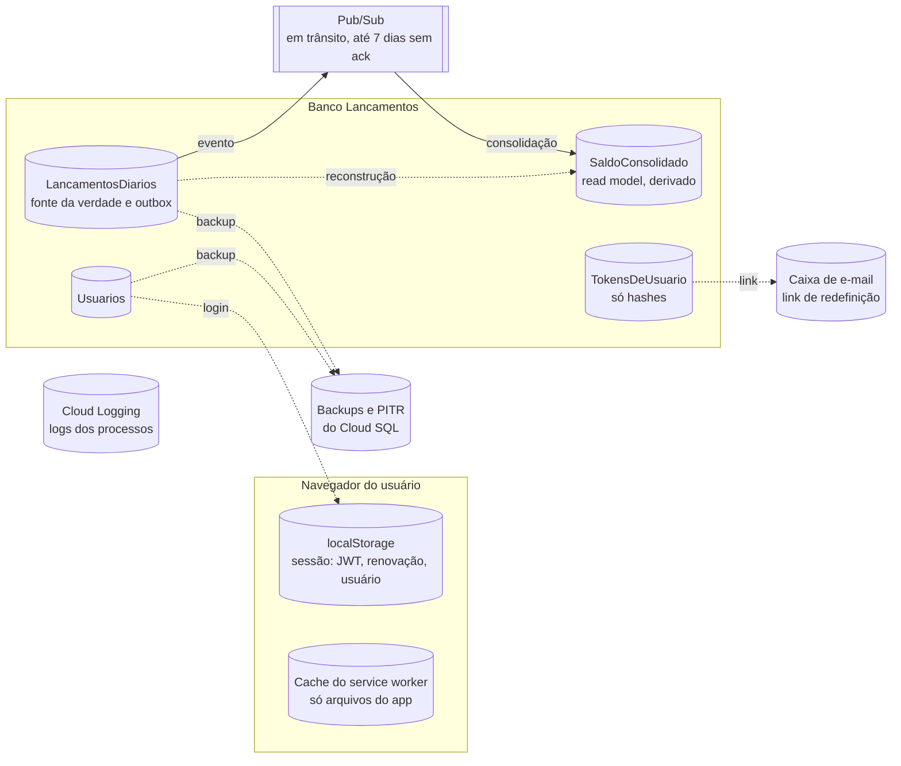

# Modelo de dados macro e estratégia de migração

Onde cada dado vive, quem é dono de quê, os dados mestres, a consistência entre os
armazenamentos, como o esquema evolui, como entram dados de fora e como se reconcilia o
saldo. Retrato do commit `45bcd17`, em 07/10/2026. O modelo lógico e físico, tabela a
tabela, está em [modelo de dados](../software/05-modelo-de-dados.md).

## 1. Visão macro



| Dado | Sistema de registro | Cópias e derivados | Retenção hoje | Classificação |
|---|---|---|---|---|
| Lançamento: conta, tipo, valor, datas, observação | `LancamentosDiarios` | Evento no Pub/Sub; soma em `SaldoConsolidado`; conta e sequência nos logs | indefinida | Financeiro. Pessoal quando o comerciante é pessoa física. A observação é texto livre e pode citar terceiros |
| Saldo consolidado | derivado de `LancamentosDiarios` | Último valor na memória da tela | indefinida | Financeiro |
| Usuário: nome, e-mail, conta, role, `GoogleId`, hash da senha | `Usuarios` | Nome, e-mail, conta e role no JWT, guardado no navegador | indefinida | Pessoal |
| Token de renovação e de redefinição | `TokensDeUsuario`, só o hash | O segredo no navegador ou no e-mail | **nunca é limpo** | Credencial |
| Sessão | `localStorage` | — | até o logout ou a renovação falhar | Credencial e pessoal |
| Mensagem | Pub/Sub | — | até o ack; 7 dias sem ack | Financeiro |
| Logs | saída padrão dos processos | Cloud Logging no GCP | 30 dias, o padrão do Cloud Logging | Técnico, com identificadores de conta e de usuário |

## 2. Quem escreve o quê

Nenhum processo apaga linha.

| Tabela | WebApi | Relay | Consumer | BFF e front |
|---|---|---|---|---|
| `LancamentosDiarios` | cria; lê; muda o estágio na publicação imediata | lê; reserva; marca e devolve | lê; marca `EmProcessamento` e `Consolidado`; devolve | — |
| `SaldoConsolidado` | lê | — | cria e atualiza | — |
| `Usuarios` | cria; lê; atualiza senha e `GoogleId` | — | — | — |
| `TokensDeUsuario` | cria; lê; consome; revoga | — | — | — |
| Esquema (DDL) | lançamentos e usuários | lançamentos | lançamentos | — |

Os três processos são unidades de implantação do mesmo serviço e compartilham o banco de
propósito ([ADR-SOL-07](03-adrs/ADR-SOL-07-banco-unico-com-read-model.md)). O SQL de cada
transição existe uma vez só, no repositório compartilhado.

## 3. Dados mestres

| Mestre | Hoje | Proposta |
|---|---|---|
| **Conta** | Implícita: existe como `ContaId` nas tabelas. Nasce no primeiro lançamento ou no cadastro do dono. O admin pode lançar numa conta que não existe e ela passa a existir | Tabela `Contas` (`ContaId`, `Situacao`, `CriadaEm`), dona do ciclo de vida: ativa, bloqueada, encerrada. Lançamento para conta inexistente vira 400 |
| **Usuário** | `Usuarios`, mantido só pela WebApi. Login pelo e-mail normalizado em minúsculas; Google pelo `sub` | Manter. Se a identidade migrar para um provedor gerenciado, `GoogleId` vira um identificador externo genérico |
| **Tipo e estágio** | Enums no `.Common`; inteiro no banco, texto no JSON | `CHECK` no banco ([recomendações](../software/05-modelo-de-dados.md#6-recomendações)). Tabela de domínio só se surgir relatório fora da aplicação |
| **Calendário** | O dia é o de São Paulo | Manter; o saldo por dia herda essa regra |

## 4. Consistência entre armazenamentos

- **A fonte da verdade é `LancamentosDiarios`.** O saldo é derivado e pode ser reconstruído
  ([5.5](#55-reconstrução-do-read-model)). O Pub/Sub não é fonte da verdade: qualquer
  mensagem pode ser republicada a partir da linha.
- **O saldo é eventualmente consistente.** No caminho feliz, segundos (medido no local). Na
  recuperação pelo relay no GCP, até ~1 min mais o backoff.
- **Invariante:** o saldo de cada conta é a soma, com sinal, dos lançamentos `Consolidado`.
  Hoje ninguém confere ([6](#6-reconciliação)).
- **Inconsistência transitória na leitura.** `ObterSaldoAsync` lê o saldo e a soma dos
  pendentes em duas consultas, sem transação comum. Se uma consolidação terminar entre as
  duas, o lançamento some do projetado por uma leitura. Com o `READ_COMMITTED_SNAPSHOT`
  ligado e as duas consultas numa transação `SNAPSHOT`, as duas veem o mesmo instante.

## 5. Estratégia de migração

### 5.1 O que já migrou: SQLite para SQL Server

A primeira fase da POC rodava em SQLite. A troca para SQL Server
([ADR-SOL-02](03-adrs/ADR-SOL-02-sql-server-como-motor-unico.md)) levou junto o dialeto das
travas, tirou os *type handlers* do Dapper e mudou o dinheiro para o `bigint` exato. Não
houve migração de dados: o movimento de demonstração é recriado pelo
[script](../../../scripts/inicializar-banco-demo.ps1). A pasta `dados/` do SQLite segue no
`.gitignore`.

### 5.2 Do local para o GCP

Não há dado de produção a migrar. O primeiro ambiente nasce vazio:

1. Terraform cria a instância, o banco `Lancamentos` e os usuários do SQL Server
   ([IaC](07-implantacao-e-infraestrutura.md#7-iac-de-referência)).
2. Dois usuários de banco: um de migração, com DDL, usado só no passo de esquema; e um da
   aplicação, só com leitura e escrita.
3. O esquema é aplicado pelo passo de migração (5.3), não na subida da aplicação.
4. `READ_COMMITTED_SNAPSHOT` ligado antes do primeiro tráfego.
5. Os containers sobem com `Banco__CriarBanco=false` e `Auth__SemearUsuariosDemo=false`.
6. Smoke test ([deploy](../software/08-build-e-deploy.md#53-smoke-test-depois-do-deploy)).

```sql
-- Usuário da aplicação: lê e escreve, não altera esquema. O login é criado pelo
-- Cloud SQL (Terraform); a senha vem do Secret Manager.
USE Lancamentos;
CREATE USER lancamentos_app FOR LOGIN lancamentos_app;
ALTER ROLE db_datareader ADD MEMBER lancamentos_app;
ALTER ROLE db_datawriter ADD MEMBER lancamentos_app;
```

Com as tabelas já criadas, o script de esquema que a aplicação roda na subida só lê
metadados, e o usuário sem DDL basta: quem lê uma tabela enxerga os metadados dela.

### 5.3 Evolução do esquema

Hoje o esquema é garantido por scripts idempotentes na subida de cada processo, sem histórico
de versões ([ADR-SW-02](../software/03-adrs/ADR-SW-02-dapper-sem-orm.md)). Para evoluir sem
parar o sistema:

- **Migrações versionadas**, num passo próprio do deploy: um Cloud Run Job de migração que
  roda antes das aplicações, com o usuário de DDL. Para a stack .NET e SQL escrito à mão, o
  DbUp encaixa: scripts SQL numerados, com a tabela de histórico no próprio banco.
- **Expandir e contrair.** Primeiro se acrescenta (coluna anulável, tabela nova, índice); o
  código novo passa a usar; numa release seguinte se remove o que sobrou.
- Os scripts de subida continuam como rede de segurança para o ambiente local.

As mudanças já recomendadas, uma a uma:

| Mudança | Expandir | Contrair | Cuidado |
|---|---|---|---|
| Parâmetro de conta como `varchar(20)` | — | — | Só código; nenhum esquema muda |
| `READ_COMMITTED_SNAPSHOT` | `ALTER DATABASE Lancamentos SET READ_COMMITTED_SNAPSHOT ON WITH ROLLBACK IMMEDIATE` | — | Exige um instante sem outras conexões; derruba transações abertas |
| Índice `(ContaId, Stage)` | `CREATE INDEX … INCLUDE (Tipo, ValorCentavos, Sequencia)` | — | `ONLINE = ON` só na edição Enterprise; na Standard, criar em horário de pouco movimento |
| `CHECK` de valor, tipo e estágio | `ADD CONSTRAINT … WITH NOCHECK`, depois `WITH CHECK CHECK CONSTRAINT` | — | Conferir antes que nenhuma linha viola |
| `CriadoPor` | Coluna anulável; código grava o `sub` do token | — | Linhas antigas ficam nulas: não há como saber quem lançou |
| Tabela `Contas` | Criar; preencher a partir de `LancamentosDiarios` e `Usuarios`; código passa a criar conta no cadastro | Chave estrangeira validada | Contas sem dono viram contas sem dono explícitas |
| Saldo por dia | Tabela nova, alimentada por uma segunda subscription; carga inicial a partir dos consolidados | — | Ver abaixo |

**Saldo por dia (RF-08).** Guardar o **movimento** de cada conta por dia (créditos e débitos
do dia), não o saldo do dia: um lançamento retroativo muda uma linha só. O saldo ao fim de
cada dia sai de uma soma acumulada na consulta, com
`SUM(…) OVER (PARTITION BY ContaId ORDER BY Data)`. A carga inicial agrupa os lançamentos
`Consolidado` por conta e `DataLancamento`; daí em diante, a subscription nova mantém a
tabela.

```sql
-- Carga inicial do movimento por dia, a partir do que já consolidou.
INSERT INTO dbo.MovimentoDiario (ContaId, Data, CreditosCentavos, DebitosCentavos)
SELECT ContaId,
       DataLancamento,
       SUM(CASE WHEN Tipo = 1 THEN ValorCentavos ELSE 0 END),
       SUM(CASE WHEN Tipo = 2 THEN ValorCentavos ELSE 0 END)
FROM dbo.LancamentosDiarios
WHERE Stage = 5
GROUP BY ContaId, DataLancamento;
```

### 5.4 Carga inicial de dados de um comerciante

Para um comerciante que chega com histórico de outro controle:

| Opção | Como | A favor | Contra |
|---|---|---|---|
| **Saldo de abertura** | Um lançamento de crédito, ou de débito, na data de corte, pela API | Passa por todas as regras; auditável; uma linha | Sem o histórico item a item |
| Histórico pela API de lote | Lotes de até 1.000 itens | Mesmas validações e mesmo fluxo | O relay publica um lançamento por conta por execução: 10 mil lançamentos de uma conta levariam ~7 dias no GCP. Exige o relay em lote antes |
| Carga direta no banco | Script que grava as linhas já como `Consolidado`, com sequência contínua, e calcula o saldo | Rápida | Pula a validação da aplicação; exige validar antes e reconciliar depois |

**Recomendação:** saldo de abertura sempre; histórico só se o negócio pedir, por carga
direta numa janela controlada, com os itens marcados como importados (na observação, ou numa
coluna de origem) e a reconciliação da seção 6 conferindo, por conta, quantidade, soma dos
créditos e soma dos débitos contra os totais da origem.

### 5.5 Reconstrução do read model

O saldo é derivado; se divergir, reconstrói-se a partir dos lançamentos. Com o Consumer
parado, para nenhuma consolidação correr junto:

```sql
BEGIN TRANSACTION;

DELETE FROM dbo.SaldoConsolidado;

INSERT INTO dbo.SaldoConsolidado (ContaId, SaldoCentavos, UltimaSequencia, AtualizadoEm)
SELECT ContaId,
       SUM(CASE WHEN Tipo = 2 THEN -ValorCentavos ELSE ValorCentavos END),
       MAX(Sequencia),
       SYSDATETIMEOFFSET()
FROM dbo.LancamentosDiarios
WHERE Stage = 5
GROUP BY ContaId;

COMMIT;
```

Se houver lançamento em `Erro` no meio da conta, a `UltimaSequencia` reconstruída passa por
cima dele, como acontece hoje no Consumer. A reconciliação R3 mostra esses casos.

## 6. Reconciliação

Consultas para rodar todo dia, com o resultado virando métrica e alerta
([observabilidade](10-observabilidade-e-operacao.md#4-métricas)). Nenhuma existe hoje no
sistema.

**R1 — O saldo bate com a soma dos consolidados.**

```sql
SELECT s.ContaId, s.SaldoCentavos, COALESCE(c.SomaCentavos, 0) AS SomaCentavos
FROM dbo.SaldoConsolidado AS s
LEFT JOIN (
    SELECT ContaId, SUM(CASE WHEN Tipo = 2 THEN -ValorCentavos ELSE ValorCentavos END) AS SomaCentavos
    FROM dbo.LancamentosDiarios
    WHERE Stage = 5
    GROUP BY ContaId
) AS c ON c.ContaId = s.ContaId
WHERE s.SaldoCentavos <> COALESCE(c.SomaCentavos, 0);
```

**R2 — A sequência de cada conta não tem buraco.**

```sql
SELECT ContaId, COUNT(*) AS Linhas, MAX(Sequencia) AS MaiorSequencia
FROM dbo.LancamentosDiarios
GROUP BY ContaId
HAVING COUNT(*) <> MAX(Sequencia);
```

**R3 — "Consolidado até o nº N" é verdade.**

```sql
SELECT s.ContaId, s.UltimaSequencia, l.Sequencia AS ForaDoSaldo, l.Stage
FROM dbo.SaldoConsolidado AS s
JOIN dbo.LancamentosDiarios AS l
  ON l.ContaId = s.ContaId AND l.Sequencia <= s.UltimaSequencia
WHERE l.Stage <> 5;
```

**R4 — Pendentes por estágio e idade.**

```sql
SELECT Stage, COUNT(*) AS Quantidade, MIN(StageAtualizadoEm) AS MaisAntigo
FROM dbo.LancamentosDiarios
WHERE Stage IN (1, 2, 3, 4)
GROUP BY Stage;
```

**R5 — Presos depois do broker** (mensagem perdida, ou Consumer que caiu no meio).

```sql
SELECT Id, ContaId, Sequencia, Stage, StageAtualizadoEm
FROM dbo.LancamentosDiarios
WHERE (Stage = 3 AND StageAtualizadoEm < DATEADD(MINUTE, -15, SYSDATETIMEOFFSET()))
   OR (Stage = 4 AND StageAtualizadoEm < DATEADD(MINUTE, -5, SYSDATETIMEOFFSET()));
```

**R6 — Contas com lançamento em `Erro`.**

```sql
SELECT ContaId,
       MIN(Sequencia) AS PrimeiraEmErro,
       COUNT(*) AS EmErro,
       MAX(CASE WHEN TentativasProcessamento > 0 THEN 1 ELSE 0 END) AS FalhouNaConsolidacao
FROM dbo.LancamentosDiarios
WHERE Stage = 6
GROUP BY ContaId;
```

| Controle | Esperado | Quando falha |
|---|---|---|
| R1 | nenhuma linha | Saldo errado: investigar e reconstruir (5.5) |
| R2 | nenhuma linha | Defeito grave na sequência; não deveria ser possível com o índice único |
| R3 | nenhuma linha | Lançamento fora do saldo: [runbook RB-02](10-observabilidade-e-operacao.md#rb-02--lançamento-em-erro-na-consolidação-ou-saldo-que-não-fecha) |
| R4 | mais antigo com minutos, não horas | Esteira parada |
| R5 | nenhuma linha | Republicar ([runbook RB-05](10-observabilidade-e-operacao.md#rb-05--lançamento-preso-em-enfileirado-ou-emprocessamento)) |
| R6 | nenhuma linha | Conta travada ([runbook RB-01](10-observabilidade-e-operacao.md#rb-01--conta-travada-na-publicação)) |

## 7. Retenção e descarte

Hoje nada é apagado. Proposta, a confirmar com o jurídico e com o encarregado de dados:

| Dado | Proposta | Motivo |
|---|---|---|
| Lançamentos | Enquanto a conta existir, mais o prazo legal de guarda de registros financeiros. Cinco anos é o prazo usual de guarda fiscal; confirmar | Obrigação do comerciante e defesa em disputa |
| Usuário encerrado | Anonimizar nome e e-mail; apagar hash de senha e `GoogleId`; manter `ContaId` | Os lançamentos ficam ligados só a um identificador pseudônimo |
| Observação de usuário encerrado | Avaliar limpar: texto livre pode ter dado de terceiros | Minimização |
| Tokens | Apagar os vencidos há mais de 7 dias, por um job diário | Não servem mais nem para detectar reuso |
| Logs | 30 dias no bucket padrão; auditoria em bucket próprio com retenção maior | Investigação de incidente |
| Mensagens | 7 dias sem ack, o padrão | — |
| Backups | Os automáticos e a recuperação pontual do Cloud SQL, com o prazo da [política de DR](08-nfrs-de-solucao.md#6-recuperação-de-desastres) | Recuperação |

O conflito entre o direito de eliminação e a guarda obrigatória é tratado em
[LGPD](06-seguranca-e-threat-model.md#7-lgpd-e-compliance).
