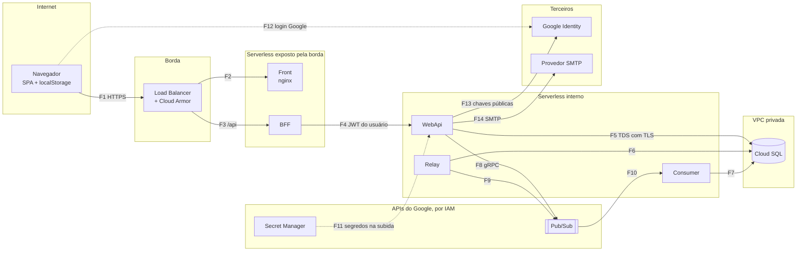

# Arquitetura de segurança, compliance e threat model

Autenticação, autorização, criptografia, segredos, rede, LGPD e as ameaças por STRIDE, com o
que já está no código e o que falta. Retrato do commit `45bcd17`, em 07/10/2026.

A POC não guarda dado real, e os usuários de demonstração e as senhas locais são públicos
por desenho. Este documento separa o que é aceitável nesse contexto do que precisa mudar
antes do primeiro dado real ([plano de ação](#10-plano-de-ação)).

## 1. Princípios

| Princípio | Como aparece |
|---|---|
| Fechado por padrão | Política de fallback exige login; o que é público declara `AllowAnonymous` |
| Defesa em profundidade | Token, role e posse conferidos no BFF e de novo na WebApi |
| Menor exposição | Só o BFF e o front são alcançáveis da internet; a WebApi e o banco não |
| Falhar cedo | Sem chave de 32 bytes, nem a WebApi nem o BFF sobem |
| Segredo fora do código | Proposto para todos os containers; hoje só o relay tem o deploy assim |
| Não confiar no que vem de fora | O Consumer usa da mensagem só o id e lê o valor do banco |
| Não revelar quem tem cadastro | Login e "esqueci a senha" respondem igual para e-mail existente e inexistente |

## 2. Autenticação

| Credencial | Formato | Validade | Onde fica | Como é revogada |
|---|---|---|---|---|
| Senha | PBKDF2 pelo `PasswordHasher` do ASP.NET Core | até trocar | `Usuarios.SenhaHash` | Redefinição |
| Token de acesso | JWT HS256 com `sub`, `email`, `name`, `jti`, `conta`, `role` | 15 min | `localStorage` | Não é revogável; vence |
| Token de renovação | 32 bytes aleatórios, Base64Url | 7 dias, uso único | navegador; o banco guarda só o SHA-256 | Logout; redefinição de senha; reuso detectado revoga todos |
| Link de redefinição | 32 bytes aleatórios | 30 min, uso único | e-mail; o banco guarda só o SHA-256 | Pedido novo invalida o anterior; o uso consome |
| ID token do Google | JWT assinado pelo Google | o do Google | só em trânsito | — |

- **Senha:** de 8 a 128 caracteres, com letra e número. O teto evita que uma senha gigante
  faça o PBKDF2 trabalhar à toa. Senha com hash de uma versão antiga do algoritmo é regravada
  no login.
- **Login:** e-mail inexistente e senha errada recebem a mesma mensagem e gastam o mesmo
  tempo (o PBKDF2 roda contra um hash fictício).
- **Renovação:** cada uso troca o par. Um token já trocado que reaparece indica cópia; como
  não há como saber quem é o legítimo, todas as sessões do usuário caem.
- **Google:** a WebApi confere assinatura, emissor, validade e audiência. No primeiro acesso,
  só com e-mail verificado; se o e-mail já tem cadastro, vincula.

As sequências estão em [C4 nível 3 e 4](../software/02-c4-componentes-e-codigo.md#6-login-renovação-e-detecção-de-reuso).

## 3. Autorização

Duas policies, iguais no BFF e na WebApi: `ClienteOuAdmin` e `SomenteAdmin`. A role diz o
que o usuário pode fazer; a **posse**, sobre qual conta. O Cliente só alcança a conta do
claim `conta`; o Admin alcança qualquer uma. O `PosseDaContaFilter` confere a conta na rota,
no corpo (`IReferenciaConta`) e no recurso devolvido.

| Operação | Anônimo | Cliente | Admin |
|---|---|---|---|
| Cadastro, login, Google, renovação, logout, esqueci e redefinir senha, configuração | sim | sim | sim |
| Quem sou eu (`/auth/eu`) | — | sim | sim |
| Saldo de uma conta | — | só a própria | qualquer |
| Novo lançamento | — | só na própria; a conta vem do token | em qualquer conta |
| Detalhe de um lançamento (WebApi) | — | só da própria, conferido na saída | qualquer |
| Listar contas | — | — | sim |
| Lançamento em lote (WebApi) | — | — | sim |
| `/health` | sim | sim | sim |
| OpenAPI e Swagger | sim, quando ligados | sim | sim |

- **Uma conta por usuário**, garantida pelo índice único `UX_Usuarios_ContaId`.
- A conta sorteada no cadastro nunca reaproveita conta com histórico: ninguém herda o extrato
  de outra pessoa.
- Todo cadastro nasce Cliente. Um Admin só existe pelos dados de demonstração ou por mudança
  direta no banco.
- A role é relida do banco a cada renovação: uma mudança vale em até 15 min.

## 4. Criptografia

**Em trânsito**

| Trecho | Local | GCP |
|---|---|---|
| Navegador → front e BFF | HTTP em `localhost` | TLS no Load Balancer, certificado gerenciado; HSTS proposto |
| BFF → WebApi | HTTP na rede do compose | HTTPS para a URL interna do Cloud Run, pela VPC |
| Aplicações → SQL Server | TDS cifrado com `TrustServerCertificate=True` | `Encrypt=True`, `TrustServerCertificate=False`, CA do Cloud SQL confiada na imagem; instância só aceita conexão cifrada |
| Aplicações → Pub/Sub | emulador sem TLS | gRPC com TLS |
| WebApi → Google | HTTPS | HTTPS |
| WebApi → SMTP | sem TLS (Mailpit) | STARTTLS na 587 |

**Em repouso**

| Dado | Proteção |
|---|---|
| Banco, backups, Pub/Sub, Secret Manager | Cifrados pelo Google por padrão; chave gerenciada pelo cliente (CMEK) é opcional |
| Senhas | PBKDF2. No .NET 9, o padrão do `PasswordHasher` é HMAC-SHA512 com 100 mil iterações e salt aleatório |
| Tokens opacos | SHA-256 sem salt: com 256 bits aleatórios não há dicionário a atacar, e o hash precisa ser determinístico para servir de chave de busca |
| JWT | Assinado, não cifrado: o conteúdo é legível por quem tem o token |
| Sessão no navegador | Sem proteção além da origem; ao alcance de XSS |
| Volume do SQL Server local | Sem cifra; só desenvolvimento |

## 5. Gestão de segredos

| Segredo | Hoje | No repositório público? | Proposto no GCP | Rotação |
|---|---|---|---|---|
| Senha do `sa` (`Lancamentos@2026`) | compose e `appsettings.json` base da WebApi, do relay e do Consumer | **sim** | Não usar `sa`: usuário da aplicação com senha no Secret Manager | Nova versão do segredo e reciclagem das instâncias |
| Chave do JWT de desenvolvimento | `appsettings.Development.json` e compose | **sim** | 32 bytes ou mais, aleatórios, no Secret Manager, a mesma na WebApi e no BFF | Duas chaves aceitas durante 15 min ([ADR-SOL-06](03-adrs/ADR-SOL-06-identidade-propria-jwt.md)) |
| `MinhaChaveCompartilhada` | `appsettings.json` base da WebApi e do BFF, desde o commit `45bcd17` | **sim** | Remover. Com 23 bytes, a aplicação não sobe com ela; é seguro, mas contradiz o README | — |
| Senha dos usuários de demonstração (`Demo@2026`) | código | **sim** | Semeadura desligada (padrão da imagem) | — |
| Senha do SMTP | não há (Mailpit sem autenticação) | não | Secret Manager | Pela política do provedor |
| Client ID do Google | `.env`, fora do Git | não | Configuração; não é segredo | — |
| Chave de publicação no nuget.org | variável de ambiente de quem publica | não | Segredo do GitHub | No nuget.org |

**Regra:** nenhum valor que esteve no repositório é usado fora da máquina de
desenvolvimento. Ligar a proteção de segredos do GitHub (*secret scanning* com bloqueio no
push) evita o próximo.

**Rotação da chave do JWT:** trocar a WebApi e o BFF ao mesmo tempo, ou aceitar duas chaves
de validação (`IssuerSigningKeys`) por uma janela de 15 min, assinar com a nova e depois
remover a antiga. As sessões continuam: o token de renovação não depende da chave.

## 6. Rede e plataforma

| Zona | O que fica nela | Quem alcança |
|---|---|---|
| Internet | Navegador | — |
| Borda | Load Balancer e Cloud Armor | Internet, só por HTTPS |
| Serverless exposto pela borda | Front e BFF (`internal-and-cloud-load-balancing`) | O Load Balancer e o tráfego interno; nada direto da internet |
| Serverless interno | WebApi (`internal`), relay, Consumer | Só tráfego da VPC e do projeto |
| VPC privada | Cloud SQL com IP privado, sem IP público | Só a VPC |
| APIs do Google | Pub/Sub, Secret Manager, Artifact Registry | Só por IAM |

| Controle | Hoje | Proposto |
|---|---|---|
| Swagger | Desligado na imagem; ligado no compose | Desligado em todo ambiente na nuvem |
| CORS | Só no BFF, para `http://localhost:4200` | Desnecessário atrás do Load Balancer |
| Usuário do container | .NET sem root; **nginx como root** | Imagem do nginx sem privilégio |
| Cabeçalhos de segurança | nenhum | No nginx: `Content-Security-Policy`, `Strict-Transport-Security`, `X-Content-Type-Options: nosniff`, `Referrer-Policy: no-referrer`, `frame-ancestors 'none'`. Na API: `Cache-Control: no-store` |
| Limite de requisições | nenhum | Cloud Armor por IP em `/api/auth/*`; teto geral em `/api/*` |
| Corpo de requisição | 30 MB, o padrão do Kestrel | 1 MB |
| IAM | Script do relay com três papéis | Uma service account por container, só com o que usa ([IAM](07-implantacao-e-infraestrutura.md#6-identidades-e-iam)) |
| Usuário de banco | `sa` no local | Usuário só de leitura e escrita; DDL num usuário de migração |

**CSP com o Google.** A política precisa permitir o script e o frame do Google Identity
Services (`https://accounts.google.com/gsi/…`). O Angular injeta os estilos dos componentes
em tags `<style>`: usar o nonce do Angular (`ngCspNonce`) ou aceitar `'unsafe-inline'` só em
`style-src`.

## 7. LGPD e compliance

### 7.1 Dados pessoais tratados

| Dado | Titular | Onde | Finalidade | Base legal proposta (art. 7º) |
|---|---|---|---|---|
| Nome e e-mail | usuário | `Usuarios`; JWT no navegador | Identificar, autenticar, comunicar | Execução de contrato (V) |
| Hash da senha | usuário | `Usuarios` | Autenticar | Execução de contrato (V) |
| `GoogleId` | usuário | `Usuarios` | Login federado | Execução de contrato (V) |
| Conta | usuário | todas as tabelas, logs | Vincular lançamentos ao dono | Execução de contrato (V) |
| Lançamentos | comerciante, quando pessoa física | `LancamentosDiarios`, Pub/Sub | Fluxo de caixa | Execução de contrato (V); guarda por obrigação legal (II) |
| Observação | comerciante e terceiros citados | `LancamentosDiarios` | Anotação livre | Execução de contrato (V), com minimização |
| IP, navegador, URL | usuário | logs do Load Balancer | Segurança | Legítimo interesse (IX) |
| Tokens | usuário | hash no banco; segredo no navegador e no e-mail | Sessão | Execução de contrato (V) |

### 7.2 Princípios (art. 6º) e lacunas

| Princípio | Situação |
|---|---|
| Necessidade | O JWT leva e-mail e nome, que o BFF e a WebApi não usam: tirar. A observação é texto livre: orientar na tela a não incluir dado de terceiros |
| Livre acesso e qualidade | `/auth/eu` devolve o cadastro; não há exportação dos lançamentos nem correção de nome e e-mail |
| Transparência | Não há aviso de privacidade na tela |
| Segurança e prevenção | Este documento; o plano da seção 10 |
| Responsabilização | Falta o registro das operações de tratamento (art. 37) e a trilha de quem lançou |

### 7.3 Direitos do titular (art. 18)

| Direito | Hoje | Proposta |
|---|---|---|
| Confirmação e acesso | Parcial (`/auth/eu`) | Exportação dos dados e dos lançamentos em JSON ou CSV |
| Correção | Não há | Edição de nome; troca de e-mail com confirmação |
| Eliminação e anonimização | Não há; nenhum processo apaga | Anonimizar o usuário e manter os lançamentos, que têm guarda obrigatória (art. 16, I), ligados só à conta |
| Portabilidade | Não há | A mesma exportação |
| Informação sobre compartilhamento | Não há | Aviso de privacidade listando GCP, Google (login) e o provedor de e-mail |
| Revogação do consentimento | Não se aplica à base contratual; o login com Google pode ser desvinculado | Desvincular Google mantendo a senha |

### 7.4 Papéis, terceiros e transferência

- **Controlador:** quem opera o serviço, para os dados de cadastro. Para o conteúdo dos
  lançamentos, avaliar se o serviço atua como operador do comerciante.
- **Encarregado (art. 41):** designar e publicar o contato.
- **Operadores:** Google Cloud (infraestrutura), Google (login federado), provedor de e-mail.
- **Transferência internacional (art. 33):** banco, mensagens e backups em
  `southamerica-east1`, com a região de armazenamento do Pub/Sub fixada. O login com Google e
  o provedor de e-mail podem tratar dados fora do país: citar no aviso de privacidade.

### 7.5 Incidentes

Comunicar à ANPD e aos titulares o incidente que possa causar risco ou dano relevante (art.
48), no prazo da Resolução CD/ANPD nº 15/2024: três dias úteis a partir do conhecimento.
Isso exige detectar (alertas da [observabilidade](10-observabilidade-e-operacao.md#6-slos-e-alertas)),
investigar (logs de auditoria com retenção) e registrar o incidente, mesmo os que não forem
comunicados.

### 7.6 Outras normas

- **PCI DSS:** não se aplica; o sistema não trata dado de cartão.
- **Regulação financeira:** o sistema é o livro-caixa do comerciante, não uma instituição de
  pagamento. Integração com banco ou adquirente mudaria esse enquadramento.
- **Referência técnica:** OWASP ASVS nível 2 como lista de verificação antes de produção.

## 8. Threat model (STRIDE)

### 8.1 Fluxo de dados e fronteiras de confiança

Cada subgrafo é uma fronteira de confiança. As que mais importam: F1 (tudo vem da
internet), F4 (o BFF não é confiável aos olhos da WebApi, que confere de novo) e F10 (a
mensagem não é confiável aos olhos do Consumer, que relê o banco).

### 8.2 Ativos

| Ativo | Propriedade que mais importa |
|---|---|
| Saldo e lançamentos | Integridade: nada somado duas vezes, nada perdido, nada de outra conta |
| Disponibilidade do lançamento | Disponibilidade, independente da consolidação |
| Credenciais: senhas, tokens, chave do JWT, senha do banco | Confidencialidade |
| Dados pessoais | Confidencialidade |
| Trilha de quem fez o quê | Integridade e disponibilidade para investigação |

### 8.3 Ameaças

Risco: probabilidade × impacto, em alto, médio e baixo, considerando o ambiente-alvo.

| Id | STRIDE | Alvo | Ameaça | Controle existente | Lacuna | Recomendação | Risco |
|---|---|---|---|---|---|---|---|
| T01 | S | `/auth/login` | Força bruta e reutilização de senhas vazadas | PBKDF2 encarece cada tentativa; mesma resposta para e-mail inexistente | Sem limite de tentativas nem bloqueio | Cloud Armor por IP; atraso progressivo por conta; captcha depois de falhas; MFA opcional | Alto |
| T02 | S | Sessão | Roubo do token de renovação por XSS | Acesso de 15 min; rotação com detecção de reuso | Sem CSP; token de renovação de 7 dias no `localStorage` | CSP estrita; sessão por cookie `HttpOnly` no BFF | Alto |
| T03 | S | JWT | Token forjado com a chave HS256 | Chave de 32 bytes ou mais validada na subida; algoritmo fixo; emissor e audiência | O BFF guarda uma chave capaz de emitir; a de desenvolvimento é pública | RS256 com JWKS; chave só no Secret Manager | Médio |
| T04 | S | Login com Google | Tomada de cadastro pela vinculação por e-mail | Só e-mail verificado; audiência conferida | Vinculação automática, sem confirmação | Confirmar a senha ou por e-mail na primeira vinculação | Baixo |
| T05 | S | Redefinição de senha | Token do link vazado em log da borda ou no `Referer` | Uso único, 30 min, só o hash no banco | Token na query string | Token no fragmento (`#token=`); `Referrer-Policy: no-referrer` | Médio |
| T06 | T | Mensagem | Mensagem forjada para mudar valor | O Consumer usa só o id e lê o valor do banco; publicar exige IAM | — | Manter; papel de publicação só para WebApi e relay | Baixo |
| T07 | T | Banco | Injeção de SQL | Tudo parametrizado; o único SQL montado por texto é o nome do banco, vindo da configuração e escapado | — | Manter na revisão de código | Baixo |
| T08 | T | Cadeia de suprimentos | Pacote ou imagem base comprometidos | Só nuget.org; `npm ci` com lockfile | Sem varredura, sem digest fixo, sem SBOM | [Build e deploy, seção 6](../software/08-build-e-deploy.md#6-cadeia-de-suprimentos) | Médio |
| T09 | R | Lançamento | Usuário nega ter lançado | `DataRegistro`; logs com conta e sequência | Quem lançou não é gravado | Coluna `CriadoPor`; log de auditoria estruturado | Médio |
| T10 | R | Ações de Admin | Lote e consultas sem trilha de autoria | Log do lote com quantidade e contas | O admin não é identificado | Log de auditoria com o `sub` | Médio |
| T11 | I | Cadastro | Enumeração de e-mails | Login e "esqueci a senha" não revelam | O cadastro devolve 409; o tempo do "esqueci a senha" difere | Resposta neutra no cadastro; envio de e-mail fora da requisição | Médio |
| T12 | I | Lançamento por id | Saber se um id existe em outra conta (403 × 404) | Ids GUID v7 não adivinháveis na prática | Respostas diferentes | 404 nos dois casos | Baixo |
| T13 | I | Repositório público | Segredo de desenvolvimento reaproveitado num ambiente real | Valores marcados como locais | Senha do `sa` e chave de desenvolvimento em texto | Nunca reaproveitar; *secret scanning* | Médio |
| T14 | I | Token no navegador | E-mail e nome legíveis no JWT | — | Claims desnecessários | Tirar `email` e `name` do token | Baixo |
| T15 | I | Logs | Dado pessoal ou segredo em log | Logs sem e-mail, senha nem token | Sem política escrita; a borda registra IP e URL | Política de logs; retenção definida | Baixo |
| T16 | D | API pública | Inundação de requisições; polling de muitas telas | Polling só com pendente | Sem limite; polling fixo de 2 s | Cloud Armor; recuo no polling; corpo até 1 MB | Médio |
| T17 | D | Conta | Uma falha passageira longa deixa a conta em `Erro`, travada | — | `Erro` terminal | Falha passageira sem gastar tentativa; *dead-letter*; reprocesso | Médio |
| T18 | D | Banco | Consultas que varrem a tabela e travas de tabela inteira | Lote limitado a 1.000; contas travadas em ordem | Defeito de tipo do parâmetro | Corrigir o tipo; `READ_COMMITTED_SNAPSHOT` | Médio |
| T19 | E | Endpoints | Rota nova sem autorização | Fallback exige login | — | Teste de integração que falha com rota sem policy | Baixo |
| T20 | E | Posse | Cliente acessa outra conta | Filtro na rota, no corpo e na resposta, nas duas APIs | Sem teste no pipeline HTTP | Testes com `WebApplicationFactory` | Baixo |
| T21 | E | Usuário de banco | Credencial da aplicação com DDL e acesso a tudo | — | `sa` no local | Usuário só de leitura e escrita; esquemas separados para autenticação | Médio |
| T22 | E | Container | Execução com privilégio | .NET sem root | nginx como root | Imagem do nginx sem privilégio | Baixo |
| T23 | E, I | Demonstração | Swagger ou usuários de demonstração ligados em produção | Desligados por padrão na imagem | — | Verificação no deploy | Baixo |

### 8.4 Riscos aceitos na POC

| Risco | Por que aceito agora | Quando deixa de ser aceitável |
|---|---|---|
| HS256 com a chave no BFF | Mínimo para os dois validarem | Antes de produção |
| Sessão no `localStorage` | Simples; sobrevive ao PWA reaberto | Antes de dado real |
| JWT não revogável por 15 min | Validade curta | Se o negócio exigir logout imediato |
| Vinculação do Google pelo e-mail verificado | O Google atesta o e-mail | Se surgir caso de tomada de conta |
| Senhas e usuários de demonstração públicos | Só no local | Nunca fora do local |

## 9. Divergências entre a documentação e o código

| Documento | Diz | O código faz |
|---|---|---|
| [`docs/fluxo_auth.mermeid`](../../fluxo_auth.mermeid) e a imagem de segurança | O BFF gera o JWT e o backend valida | Só a WebApi emite (`EmissorDeTokens`); o BFF valida e repassa. A extensão `.mermeid` também impede o GitHub de desenhar o diagrama |
| [README](../../../README.md#autenticação-e-acesso) | A chave do JWT não fica no `appsettings.json` | Desde o commit `45bcd17`, o `appsettings.json` base tem `MinhaChaveCompartilhada` |
| [README](../../../README.md#iam-da-service-account-do-relay), IAM do relay | `pubsub.publisher`, `cloudsql.client`, `run.invoker` | O `--set-secrets` do script também exige `secretmanager.secretAccessor`. O `cloudsql.client` serve ao Auth Proxy e aos conectores; a conexão direta por IP privado não passa pelo IAM |
| Comentário em `BancoOptions` | Conexão "através do Auth Proxy" | A decisão é IP privado direto |

## 10. Plano de ação

**P0 — antes de qualquer dado real**

1. Tirar a connection string e a chave do JWT do `appsettings.json` base; segredos só no
   Secret Manager, para todos os containers, com `secretAccessor` em cada service account.
2. Usuário de banco da aplicação sem DDL; nunca `sa`.
3. HTTPS pelo Load Balancer; Cloud Armor com limite em `/api/auth/*`.
4. Cabeçalhos de segurança e CSP no nginx; `Cache-Control: no-store` na API.
5. nginx sem root.
6. Token de redefinição no fragmento da URL e `Referrer-Policy: no-referrer`.
7. Conferir no deploy: Swagger e usuários de demonstração desligados.

**P1 — antes de produção**

1. RS256 com JWKS, ou Identity Platform ([ADR-SOL-06](03-adrs/ADR-SOL-06-identidade-propria-jwt.md)).
2. Sessão por cookie `HttpOnly` no BFF ([ADR-SW-14](../software/03-adrs/ADR-SW-14-sessao-no-localstorage.md)).
3. Atraso progressivo e bloqueio temporário por conta no login.
4. Cadastro com resposta neutra; e-mail enviado fora da requisição.
5. `CriadoPor` nos lançamentos e log de auditoria das ações de Admin.
6. Tirar `email` e `name` do JWT; 404 em vez de 403 para lançamento de outra conta.
7. *Secret scanning*, varredura de imagem e SBOM no pipeline.
8. LGPD: aviso de privacidade, registro das operações, encarregado, exportação e
   anonimização, procedimento de incidente.

**P2 — evolução**

1. MFA.
2. CMEK para banco e Pub/Sub, se exigido.
3. Revisão contra o OWASP ASVS nível 2 e teste de intrusão.
