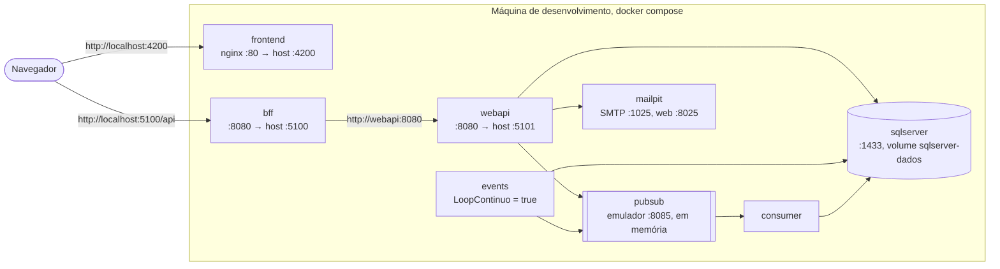
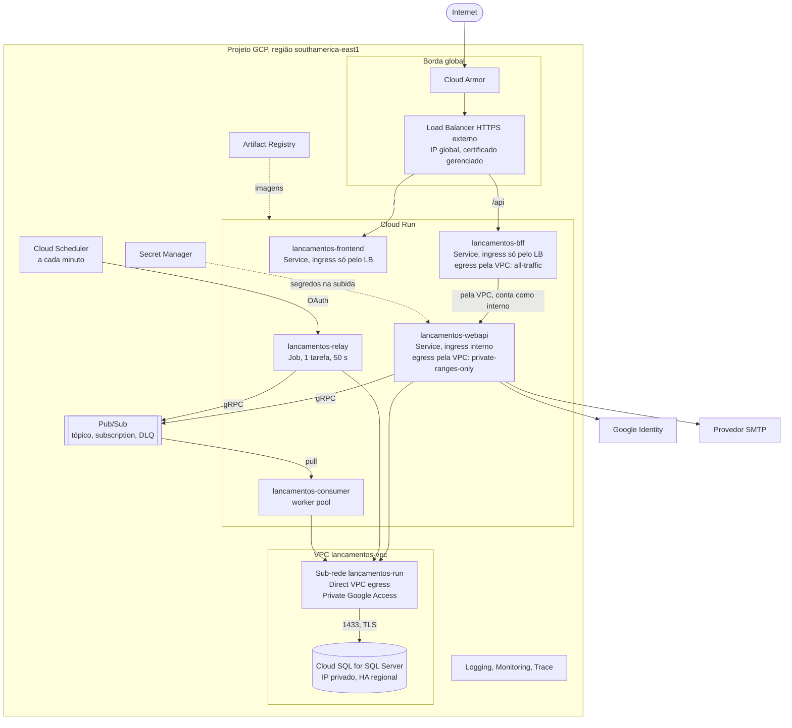

# Topologia de implantação, ambientes e infraestrutura

Onde cada peça roda, como a rede é dividida, quem tem acesso a quê, e o Terraform de
referência para criar tudo. Retrato do commit `45bcd17`, em 07/10/2026.

**O que existe e o que é proposta.** O ambiente local roda inteiro em `docker compose`. No
GCP, só o relay tem script de deploy ([`deploy/events-cloud-run-job.sh`](../../../deploy/events-cloud-run-job.sh)),
e ele não foi executado. Todo o resto deste documento, inclusive o Terraform, é referência:
não foi aplicado nem validado com `terraform plan`.

## 1. Ambientes

| | Local | Dev | Homologação | Produção |
|---|---|---|---|---|
| Onde | `docker compose` na máquina | projeto GCP próprio | projeto GCP próprio | projeto GCP próprio |
| Dados | demonstração | sintéticos | sintéticos | reais |
| Usuários de demonstração | ligados | ligados | desligados | desligados |
| Swagger | ligado | ligado, só na rede interna | desligado | desligado |
| Login com Google | se houver `GOOGLE_CLIENT_ID` | Client ID de dev | Client ID de homologação | Client ID de produção |
| E-mail | Mailpit | provedor, em modo de teste | provedor | provedor |
| Banco | container, volume local | Cloud SQL zonal, pequeno | Cloud SQL como produção, menor | Cloud SQL com alta disponibilidade regional e recuperação pontual |
| Instâncias mínimas de BFF e WebApi | — | 0 | 0 | 1 |
| Deploy | `docker compose up -d --build` | automático no merge na `main` | automático na tag | com aprovação |

Um projeto GCP por ambiente isola IAM, cotas e custos, e um erro em dev não alcança produção.

## 2. Topologia local



- **Ordem de subida por healthcheck.** A WebApi espera SQL Server, emulador e Mailpit
  saudáveis; o BFF, o relay e o Consumer esperam a WebApi saudável, que só responde
  `/health` depois de criar banco e esquema.
- **Mesmas imagens da nuvem**, com variáveis de ambiente para o local:
  `PUBSUB_EMULATOR_HOST`, `PubSub__CriarRecursos=true`, `Relay__LoopContinuo=true`,
  `Swagger__Habilitado=true`, `Auth__SemearUsuariosDemo=true`.
- O navegador chama o BFF em `localhost:5100`, porque o endereço está fixo no build do front.
- `docker compose down` mantém os dados; `down -v` zera.

## 3. Topologia no GCP



## 4. Rede e zonas

| Item | Proposta | Por quê |
|---|---|---|
| VPC | `lancamentos-vpc`, modo personalizado | Sem sub-redes automáticas em todas as regiões |
| Sub-rede do Cloud Run | `lancamentos-run`, `/24` em `southamerica-east1`, com Private Google Access | O Direct VPC egress tira os IPs das instâncias dela; dimensionar pelo máximo de instâncias, conforme a documentação do Direct VPC egress |
| Acesso privado a serviços | Faixa `/20` reservada para o peering do Cloud SQL | O IP privado do Cloud SQL vem dela |
| Cloud SQL | Sem IP público; só cifrado | Nada exposto à internet |
| Egress da WebApi, do relay e do Consumer | `private-ranges-only` | Só o banco passa pela VPC; Pub/Sub, Google e SMTP saem direto, sem Cloud NAT |
| Egress do BFF | `all-traffic` | A chamada à URL da WebApi atravessa a VPC e conta como interna para o ingress `internal` |
| Ingress | Front e BFF: `internal-and-cloud-load-balancing`; WebApi: `internal`; relay e Consumer não recebem tráfego | Só o Load Balancer chega ao que é público |
| DNS | Domínio público apontando para o IP global do Load Balancer | O certificado gerenciado é emitido para ele |

**TLS até o Cloud SQL.** Com `Encrypt=True;TrustServerCertificate=False`, o
`Microsoft.Data.SqlClient` valida o certificado do servidor. Ele é emitido pela CA do Cloud
SQL, que não está nas cadeias públicas: a imagem precisa confiar nessa CA (copiar o
certificado para o repositório de confiança do container), e o nome no certificado precisa
casar com o servidor da connection string. Com IP na connection string, informar o nome
esperado em `HostNameInCertificate` ou usar o nome DNS da instância. `TrustServerCertificate=True`
dentro da VPC é a saída rápida, ao custo de não validar o servidor.

## 5. Componentes no GCP

Ponto de partida para calibrar com medição no ambiente-alvo.

| Serviço | Tipo | CPU e memória | Instâncias | Concorrência por instância | Timeout | Observação |
|---|---|---|---|---|---|---|
| `lancamentos-frontend` | Service | 1 vCPU, 256 MiB | 0 a 5 | 80 | 30 s | A imagem escuta na porta 80: configurar `container_port = 80` |
| `lancamentos-bff` | Service | 1 vCPU, 512 MiB | 1 a 10 | 80 | 30 s | — |
| `lancamentos-webapi` | Service | 1 vCPU, 512 MiB | 1 a 10 | 80 | 30 s | **CPU sempre alocada**: a publicação que passa do teto de 2 s continua depois da resposta e, com CPU só durante a requisição, congelaria |
| `lancamentos-relay` | Job | 1 vCPU, 512 MiB | 1 tarefa, paralelismo 1 | — | 50 s; até 3 retentativas | Disparado a cada minuto pelo Scheduler |
| `lancamentos-consumer` | Worker pool | 1 vCPU, 512 MiB | 1 ou mais | 20 mensagens | — | Confirmar disponibilidade e modelo de escala ([ADR-SOL-09](03-adrs/ADR-SOL-09-consumer-em-worker-pool.md)) |
| Cloud SQL | SQL Server 2022 Standard | 2 vCPU, 7,5 GB (`db-custom-2-7680`) | HA regional | — | — | Backup diário, recuperação pontual, janela de manutenção de madrugada |

**Conexões ao banco.** O pool do ADO.NET permite 100 conexões por processo. Com 10
instâncias da WebApi, mais o Consumer e o relay, o teórico passa de mil. Limitar com
`Max Pool Size` na connection string (por exemplo, 20) e com o máximo de instâncias, e
conferir contra o limite de conexões da instância do Cloud SQL.

**Partida a frio.** O .NET leva alguns segundos para subir. Uma instância mínima no BFF e na
WebApi evita que o primeiro usuário da manhã espere.

## 6. Identidades e IAM

Uma service account por container, só com o que ele usa.

| Service account | Usada por | Papéis | Sobre |
|---|---|---|---|
| `lancamentos-frontend` | front | nenhum | — |
| `lancamentos-bff` | BFF | `secretmanager.secretAccessor` | segredo da chave do JWT |
| `lancamentos-webapi` | WebApi | `secretmanager.secretAccessor`; `pubsub.publisher` | segredos do banco, do JWT e do SMTP; tópico |
| `lancamentos-relay` | relay | `secretmanager.secretAccessor`; `pubsub.publisher` | segredo do banco; tópico |
| `lancamentos-consumer` | Consumer | `secretmanager.secretAccessor`; `pubsub.subscriber` | segredo do banco; subscription |
| `lancamentos-scheduler` | Cloud Scheduler | `run.invoker` | Job do relay |
| Agente de serviço do Pub/Sub | *dead-letter* | `pubsub.publisher`; `pubsub.subscriber` | tópico de mortos; subscription de origem |
| `lancamentos-ci` | pipeline, por Workload Identity Federation | `artifactregistry.writer`; `run.developer`; `iam.serviceAccountUser` nas contas de runtime | projeto |
| `lancamentos-terraform` | IaC | administração dos recursos acima | projeto |

Diferenças para o que está hoje no README e no script do relay:

- **Falta `secretmanager.secretAccessor`** na conta do relay. O `--set-secrets` do script
  exige esse papel.
- **`cloudsql.client` não é necessário** com conexão direta por IP privado. Ele serve ao
  Cloud SQL Auth Proxy e aos conectores, que não existem para .NET.
- O script usa a mesma conta para o relay e para o Scheduler. Separar deixa a conta do
  Scheduler só com o poder de disparar o Job.

## 7. IaC de referência

Terraform com o provedor `hashicorp/google` 6.x. **Referência, não aplicada.** Antes de usar:
`terraform validate` e `terraform plan` num projeto de teste.

Organização sugerida:

```
infra/
├── modulos/
│   ├── rede/  banco/  mensageria/  segredos/  run/  borda/  iam/
└── ambientes/
    ├── dev/   main.tf  terraform.tfvars
    ├── hml/
    └── prd/
```

Abaixo, tudo num arquivo só, para leitura.

### 7.1 Provedor e variáveis

```hcl
terraform {
  required_version = ">= 1.6"

  required_providers {
    google = {
      source  = "hashicorp/google"
      version = "~> 6.0"
    }
  }

  backend "gcs" {
    bucket = "lancamentos-tfstate"
    prefix = "prd"
  }
}

provider "google" {
  project = var.projeto
  region  = var.regiao
}

variable "projeto" {
  type = string
}

variable "regiao" {
  type    = string
  default = "southamerica-east1"
}

variable "dominio" {
  type = string
}

# URL de cada imagem com digest. O pipeline publica as revisões; o Terraform só cria.
variable "imagens" {
  type = map(string)
}

variable "senha_root_sql" {
  type      = string
  sensitive = true
}

variable "senha_app_sql" {
  type      = string
  sensitive = true
}

data "google_project" "atual" {}
```

### 7.2 Rede e banco

```hcl
resource "google_compute_network" "vpc" {
  name                    = "lancamentos-vpc"
  auto_create_subnetworks = false
}

resource "google_compute_subnetwork" "run" {
  name                     = "lancamentos-run"
  network                  = google_compute_network.vpc.id
  region                   = var.regiao
  ip_cidr_range            = "10.10.0.0/24"
  private_ip_google_access = true
}

resource "google_compute_global_address" "psa" {
  name          = "lancamentos-psa"
  purpose       = "VPC_PEERING"
  address_type  = "INTERNAL"
  prefix_length = 20
  network       = google_compute_network.vpc.id
}

resource "google_service_networking_connection" "psa" {
  network                 = google_compute_network.vpc.id
  service                 = "servicenetworking.googleapis.com"
  reserved_peering_ranges = [google_compute_global_address.psa.name]
}

resource "google_sql_database_instance" "lancamentos" {
  name                = "lancamentos-sql"
  region              = var.regiao
  database_version    = "SQLSERVER_2022_STANDARD"
  root_password       = var.senha_root_sql
  deletion_protection = true
  depends_on          = [google_service_networking_connection.psa]

  settings {
    tier              = "db-custom-2-7680"
    availability_type = "REGIONAL"
    disk_autoresize   = true

    ip_configuration {
      ipv4_enabled    = false
      private_network = google_compute_network.vpc.id
      ssl_mode        = "ENCRYPTED_ONLY"
    }

    backup_configuration {
      enabled                        = true
      start_time                     = "05:00"
      location                       = var.regiao
      point_in_time_recovery_enabled = true
      transaction_log_retention_days = 7

      backup_retention_settings {
        retained_backups = 14
      }
    }

    maintenance_window {
      day  = 7
      hour = 6
    }
  }
}

resource "google_sql_database" "lancamentos" {
  name     = "Lancamentos"
  instance = google_sql_database_instance.lancamentos.name
}

# A senha vai para o estado do Terraform. Proteja o bucket, ou crie o usuário por fora.
resource "google_sql_user" "app" {
  name     = "lancamentos_app"
  instance = google_sql_database_instance.lancamentos.name
  password = var.senha_app_sql
}
```

O usuário do banco (`CREATE USER … FOR LOGIN`) e o `READ_COMMITTED_SNAPSHOT` são aplicados
pelo passo de migração ([dados macro](05-dados-macro-e-migracao.md#52-do-local-para-o-gcp)).

### 7.3 Pub/Sub

```hcl
resource "google_pubsub_topic" "lancamentos" {
  name                       = "lancamentos-registrados"
  message_retention_duration = "259200s" # 3 dias, para reprocessar com seek

  message_storage_policy {
    allowed_persistence_regions = [var.regiao]
  }
}

resource "google_pubsub_topic" "dlq" {
  name = "lancamentos-registrados-dlq"

  message_storage_policy {
    allowed_persistence_regions = [var.regiao]
  }
}

resource "google_pubsub_subscription" "consolidacao" {
  name                    = "lancamentos-consolidacao"
  topic                   = google_pubsub_topic.lancamentos.id
  enable_message_ordering = true
  ack_deadline_seconds    = 60

  retry_policy {
    minimum_backoff = "10s"
    maximum_backoff = "600s"
  }

  dead_letter_policy {
    dead_letter_topic     = google_pubsub_topic.dlq.id
    max_delivery_attempts = 5
  }

  expiration_policy {
    ttl = ""
  }
}

resource "google_pubsub_subscription" "dlq_inspecao" {
  name  = "lancamentos-dlq-inspecao"
  topic = google_pubsub_topic.dlq.id

  expiration_policy {
    ttl = ""
  }
}

locals {
  agente_pubsub = "serviceAccount:service-${data.google_project.atual.number}@gcp-sa-pubsub.iam.gserviceaccount.com"
}

resource "google_pubsub_topic_iam_member" "dlq_publica" {
  topic  = google_pubsub_topic.dlq.id
  role   = "roles/pubsub.publisher"
  member = local.agente_pubsub
}

resource "google_pubsub_subscription_iam_member" "dlq_assina" {
  subscription = google_pubsub_subscription.consolidacao.id
  role         = "roles/pubsub.subscriber"
  member       = local.agente_pubsub
}
```

### 7.4 Segredos, imagens e contas de serviço

```hcl
resource "google_secret_manager_secret" "segredos" {
  for_each  = toset(["banco-connection-string", "jwt-chave", "smtp-senha"])
  secret_id = "lancamentos-${each.key}"

  replication {
    user_managed {
      replicas {
        location = var.regiao
      }
    }
  }
}
# O valor de cada segredo é adicionado por fora (gcloud secrets versions add), fora do estado.

resource "google_artifact_registry_repository" "imagens" {
  repository_id = "lancamentos"
  location      = var.regiao
  format        = "DOCKER"
}

resource "google_service_account" "sa" {
  for_each   = toset(["frontend", "bff", "webapi", "relay", "consumer", "scheduler"])
  account_id = "lancamentos-${each.key}"
}

locals {
  acesso_a_segredos = {
    "bff-jwt"        = { sa = "bff", segredo = "jwt-chave" }
    "webapi-jwt"     = { sa = "webapi", segredo = "jwt-chave" }
    "webapi-banco"   = { sa = "webapi", segredo = "banco-connection-string" }
    "webapi-smtp"    = { sa = "webapi", segredo = "smtp-senha" }
    "relay-banco"    = { sa = "relay", segredo = "banco-connection-string" }
    "consumer-banco" = { sa = "consumer", segredo = "banco-connection-string" }
  }
}

resource "google_secret_manager_secret_iam_member" "acesso" {
  for_each  = local.acesso_a_segredos
  secret_id = google_secret_manager_secret.segredos[each.value.segredo].id
  role      = "roles/secretmanager.secretAccessor"
  member    = "serviceAccount:${google_service_account.sa[each.value.sa].email}"
}

resource "google_pubsub_topic_iam_member" "publica" {
  for_each = toset(["webapi", "relay"])
  topic    = google_pubsub_topic.lancamentos.id
  role     = "roles/pubsub.publisher"
  member   = "serviceAccount:${google_service_account.sa[each.key].email}"
}

resource "google_pubsub_subscription_iam_member" "consome" {
  subscription = google_pubsub_subscription.consolidacao.id
  role         = "roles/pubsub.subscriber"
  member       = "serviceAccount:${google_service_account.sa["consumer"].email}"
}
```

### 7.5 Cloud Run

```hcl
resource "google_cloud_run_v2_service" "webapi" {
  name     = "lancamentos-webapi"
  location = var.regiao
  ingress  = "INGRESS_TRAFFIC_INTERNAL_ONLY"

  template {
    service_account = google_service_account.sa["webapi"].email

    scaling {
      min_instance_count = 1
      max_instance_count = 10
    }

    vpc_access {
      network_interfaces {
        network    = google_compute_network.vpc.id
        subnetwork = google_compute_subnetwork.run.id
      }
      egress = "PRIVATE_RANGES_ONLY"
    }

    containers {
      image = var.imagens["webapi"]

      resources {
        limits = {
          cpu    = "1"
          memory = "512Mi"
        }
        cpu_idle = false # CPU fora da requisição, para a publicação em segundo plano
      }

      env {
        name  = "PubSub__ProjectId"
        value = var.projeto
      }

      env {
        name  = "Banco__CriarBanco"
        value = "false"
      }

      env {
        name  = "Auth__RedefinicaoSenha__UrlDoFront"
        value = "https://${var.dominio}/redefinir-senha"
      }

      env {
        name = "Banco__ConnectionString"
        value_source {
          secret_key_ref {
            secret  = google_secret_manager_secret.segredos["banco-connection-string"].secret_id
            version = "latest"
          }
        }
      }

      env {
        name = "Auth__Jwt__Chave"
        value_source {
          secret_key_ref {
            secret  = google_secret_manager_secret.segredos["jwt-chave"].secret_id
            version = "latest"
          }
        }
      }

      # Auth__Email__* e Auth__Google__ClientId seguem o mesmo molde.
    }
  }

  lifecycle {
    ignore_changes = [template[0].containers[0].image]
  }
}

resource "google_cloud_run_v2_service" "bff" {
  name     = "lancamentos-bff"
  location = var.regiao
  ingress  = "INGRESS_TRAFFIC_INTERNAL_LOAD_BALANCER"

  template {
    service_account = google_service_account.sa["bff"].email

    scaling {
      min_instance_count = 1
      max_instance_count = 10
    }

    vpc_access {
      network_interfaces {
        network    = google_compute_network.vpc.id
        subnetwork = google_compute_subnetwork.run.id
      }
      egress = "ALL_TRAFFIC"
    }

    containers {
      image = var.imagens["bff"]

      env {
        name  = "WebApi__BaseUrl"
        value = google_cloud_run_v2_service.webapi.uri
      }

      env {
        name = "Auth__Jwt__Chave"
        value_source {
          secret_key_ref {
            secret  = google_secret_manager_secret.segredos["jwt-chave"].secret_id
            version = "latest"
          }
        }
      }
    }
  }

  lifecycle {
    ignore_changes = [template[0].containers[0].image]
  }
}

resource "google_cloud_run_v2_service" "frontend" {
  name     = "lancamentos-frontend"
  location = var.regiao
  ingress  = "INGRESS_TRAFFIC_INTERNAL_LOAD_BALANCER"

  template {
    service_account = google_service_account.sa["frontend"].email

    containers {
      image = var.imagens["frontend"]

      ports {
        container_port = 80
      }
    }
  }

  lifecycle {
    ignore_changes = [template[0].containers[0].image]
  }
}

# A proteção dos três é o ingress. Para exigir IAM também na WebApi, troque allUsers pela
# conta do BFF, que passa a mandar um token de identidade em X-Serverless-Authorization.
resource "google_cloud_run_v2_service_iam_member" "invocacao" {
  for_each = {
    frontend = google_cloud_run_v2_service.frontend.name
    bff      = google_cloud_run_v2_service.bff.name
    webapi   = google_cloud_run_v2_service.webapi.name
  }
  name     = each.value
  location = var.regiao
  role     = "roles/run.invoker"
  member   = "allUsers"
}

resource "google_cloud_run_v2_job" "relay" {
  name     = "lancamentos-relay"
  location = var.regiao

  template {
    task_count  = 1
    parallelism = 1

    template {
      service_account = google_service_account.sa["relay"].email
      timeout         = "50s"
      max_retries     = 3

      vpc_access {
        network_interfaces {
          network    = google_compute_network.vpc.id
          subnetwork = google_compute_subnetwork.run.id
        }
        egress = "PRIVATE_RANGES_ONLY"
      }

      containers {
        image = var.imagens["events"]

        env {
          name  = "PubSub__ProjectId"
          value = var.projeto
        }

        env {
          name  = "Banco__CriarBanco"
          value = "false"
        }

        env {
          name = "Banco__ConnectionString"
          value_source {
            secret_key_ref {
              secret  = google_secret_manager_secret.segredos["banco-connection-string"].secret_id
              version = "latest"
            }
          }
        }
      }
    }
  }

  lifecycle {
    ignore_changes = [template[0].template[0].containers[0].image]
  }
}

resource "google_cloud_scheduler_job" "relay" {
  name      = "lancamentos-relay-trigger"
  region    = var.regiao
  schedule  = "* * * * *"
  time_zone = "America/Sao_Paulo"

  http_target {
    http_method = "POST"
    uri         = "https://run.googleapis.com/v2/projects/${var.projeto}/locations/${var.regiao}/jobs/${google_cloud_run_v2_job.relay.name}:run"

    oauth_token {
      service_account_email = google_service_account.sa["scheduler"].email
    }
  }
}

resource "google_cloud_run_v2_job_iam_member" "scheduler_executa" {
  name     = google_cloud_run_v2_job.relay.name
  location = var.regiao
  role     = "roles/run.invoker"
  member   = "serviceAccount:${google_service_account.sa["scheduler"].email}"
}

# Consumer: worker pool do Cloud Run (ADR-SOL-09). O recurso é recente; o nome e os campos
# no provedor (talvez só no google-beta) precisam ser confirmados antes. Esboço:
#
#   worker pool "lancamentos-consumer"
#     service account  = lancamentos-consumer
#     imagem           = var.imagens["consumer"]
#     instâncias       = 1
#     vpc_access       = mesma sub-rede, PRIVATE_RANGES_ONLY
#     env              = PubSub__ProjectId, Banco__CriarBanco=false, Banco__ConnectionString (segredo)
```

### 7.6 Load Balancer e Cloud Armor

```hcl
resource "google_compute_region_network_endpoint_group" "neg" {
  for_each = {
    frontend = google_cloud_run_v2_service.frontend.name
    bff      = google_cloud_run_v2_service.bff.name
  }
  name                  = "lancamentos-${each.key}-neg"
  region                = var.regiao
  network_endpoint_type = "SERVERLESS"

  cloud_run {
    service = each.value
  }
}

resource "google_compute_security_policy" "borda" {
  name = "lancamentos-borda"

  rule {
    action   = "throttle"
    priority = 1000

    match {
      expr {
        expression = "request.path.startsWith('/api/auth/')"
      }
    }

    rate_limit_options {
      conform_action = "allow"
      exceed_action  = "deny(429)"
      enforce_on_key = "IP"

      rate_limit_threshold {
        count        = 20
        interval_sec = 60
      }
    }
  }

  rule {
    action   = "allow"
    priority = 2147483647

    match {
      versioned_expr = "SRC_IPS_V1"

      config {
        src_ip_ranges = ["*"]
      }
    }
  }
}

resource "google_compute_backend_service" "be" {
  for_each              = google_compute_region_network_endpoint_group.neg
  name                  = "lancamentos-${each.key}-be"
  load_balancing_scheme = "EXTERNAL_MANAGED"
  security_policy       = each.key == "bff" ? google_compute_security_policy.borda.id : null

  backend {
    group = each.value.id
  }
}

resource "google_compute_url_map" "entrada" {
  name            = "lancamentos-entrada"
  default_service = google_compute_backend_service.be["frontend"].id

  host_rule {
    hosts        = [var.dominio]
    path_matcher = "rotas"
  }

  path_matcher {
    name            = "rotas"
    default_service = google_compute_backend_service.be["frontend"].id

    path_rule {
      paths   = ["/api", "/api/*"]
      service = google_compute_backend_service.be["bff"].id
    }
  }
}

resource "google_compute_managed_ssl_certificate" "certificado" {
  name = "lancamentos-certificado"

  managed {
    domains = [var.dominio]
  }
}

resource "google_compute_target_https_proxy" "https" {
  name             = "lancamentos-https"
  url_map          = google_compute_url_map.entrada.id
  ssl_certificates = [google_compute_managed_ssl_certificate.certificado.id]
}

resource "google_compute_global_address" "entrada" {
  name = "lancamentos-entrada"
}

resource "google_compute_global_forwarding_rule" "https" {
  name                  = "lancamentos-https"
  target                = google_compute_target_https_proxy.https.id
  ip_address            = google_compute_global_address.entrada.address
  port_range            = "443"
  load_balancing_scheme = "EXTERNAL_MANAGED"
}

# O redirecionamento de HTTP para HTTPS é um segundo url_map com
# default_url_redirect { https_redirect = true }, um target_http_proxy e uma regra na porta 80.
```

## 8. Pendências de infraestrutura

| Pendência | Bloqueia | Dono sugerido |
|---|---|---|
| Escolher o domínio | Certificado, origem do Google, link do e-mail de senha | Negócio |
| Confirmar o worker pool na região, ou decidir pelo push | Implantar o Consumer | Arquitetura |
| Front chamando `/api` relativo | Mesma imagem do front em todos os ambientes | Desenvolvimento |
| Bucket do estado do Terraform, com versionamento | Qualquer `terraform apply` | Plataforma |
| CA do Cloud SQL na imagem e nome do certificado | Conexão com `TrustServerCertificate=False` | Desenvolvimento |
| Provedor SMTP e registros SPF, DKIM e DMARC | E-mail de senha na nuvem | Plataforma |
| Orçamento e alerta de custo por projeto | Surpresa na fatura | Plataforma |
| Health checks que testam dependências | Readiness real no Cloud Run ([observabilidade](10-observabilidade-e-operacao.md#8-health-checks)) | Desenvolvimento |
