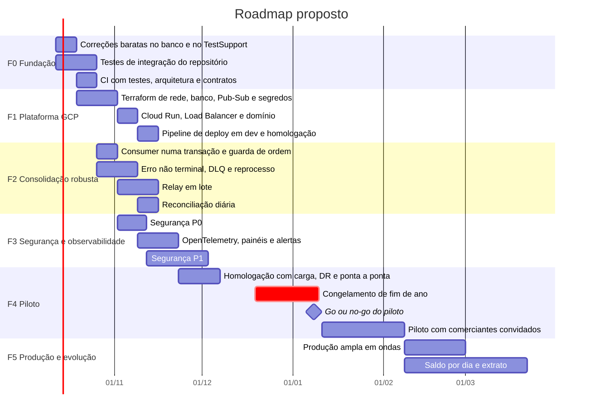

# Plano de transição, roadmap, riscos e dependências

Como sair da POC local e chegar a um piloto em produção no GCP: fases, critérios de saída,
estratégia de rollout, passagem para quem vai operar, dependências e riscos. Retrato do
commit `45bcd17`, em 07/10/2026.

As datas são proposta para dimensionar o esforço, contadas a partir de 12/10/2026, e não
compromisso. Elas supõem uma equipe pequena (duas a três pessoas de desenvolvimento e uma de
plataforma) e precisam ser refeitas com a equipe real.

## 1. Ponto de partida

| Área | Situação |
|---|---|
| Funcional | Lançar, lançar em lote, consolidar, consultar saldo, autenticação completa. Falta o saldo por dia (RF-08) |
| Execução | Tudo em `docker compose`; nada implantado no GCP |
| Medições | Lançamento independente da consolidação; leitura a 200 req/s numa base pequena; capacidade do relay na bancada |
| Defeitos conhecidos | Tipo do parâmetro de conta; consolidação em dois commits; `Erro` terminal; relay de um por conta por minuto |
| Testes | 298 de unidade, 40% das linhas; sem integração; sem CI |
| Segurança | Desenho sólido para POC; segredos locais no repositório público; sem limite de requisições |
| Operação | Logs em texto; sem métricas, traces, alertas nem runbooks executáveis |

## 2. Estado-alvo

O desenho do [SAD-Sol](01-sad-sol.md) rodando em produção, com:

- infraestrutura por Terraform, deploy por pipeline, uma imagem para todos os ambientes;
- os SLOs de [NFRs de solução](08-nfrs-de-solucao.md#22-slos-propostos) medidos e com alertas;
- a consolidação sem caminho de perda silenciosa e com reconciliação diária;
- o P0 e o P1 de [segurança](06-seguranca-e-threat-model.md#10-plano-de-ação) feitos;
- a operação capaz de agir sozinha com os runbooks.

## 3. Fases

| Fase | Objetivo | Entregas | Sai quando |
|---|---|---|---|
| **F0 Fundação** | Base para mudar com segurança | Tipo `varchar(20)` nos parâmetros; `READ_COMMITTED_SNAPSHOT`; índice `(ContaId, Stage)`; `.TestSupport` corrigido; testes de integração do repositório; CI com portões ([build e deploy](../software/08-build-e-deploy.md#3-pipeline-proposto)) | CI verde na `main`; teste de integração prova a sequência e a reserva concorrentes; plano de consulta por índice |
| **F1 Plataforma** | Ambientes dev e homologação no GCP | Terraform ([IaC](07-implantacao-e-infraestrutura.md#7-iac-de-referência)); front com `/api` relativo; domínio e certificado; deploy por pipeline com canário | Uma tag sobe as cinco imagens em homologação sem passo manual |
| **F2 Consolidação** | Nenhuma perda silenciosa | Consolidação numa transação; guarda de ordem no saldo; falha passageira sem gastar tentativa; *dead-letter*; reprocesso pela API do Admin; relay em lote; reconciliação diária | Teste de resiliência com o broker fora por 10 min sem `Erro`; reconciliação zerada depois de carga |
| **F3 Segurança e observabilidade** | Operar sem surpresa | P0 e P1 de segurança; OpenTelemetry; painéis; alertas por SLO; runbooks ([observabilidade](10-observabilidade-e-operacao.md)) | Alerta disparado e atendido pelo runbook num ensaio em homologação |
| **F4 Piloto** | Uso real, controlado | Teste de carga com volume; ensaio de recuperação pontual; piloto com comerciantes convidados; acompanhamento intensivo | SLOs cumpridos por 4 semanas; reconciliação diária limpa; sem incidente de severidade 1 aberto |
| **F5 Produção e evolução** | Abrir e crescer | Entrada em ondas; saldo por dia (RF-08); extrato; totais por tipo na tela; gestão de usuários e contas | Por onda: SLOs mantidos |

**Ordem do que vem antes.** F0 antes de tudo, porque os defeitos de banco invalidam qualquer
medição e o CI protege o resto. F2 antes do piloto, porque um lançamento fora do saldo é o
pior defeito possível para um livro-caixa. O congelamento de fim de ano evita estrear com a
equipe desfalcada e o comércio no pico.

## 4. Rollout

**Em etapas**

| Etapa | Quem usa | Dados | Condição para avançar |
|---|---|---|---|
| Lançamento silencioso | ninguém; só smoke test | sintéticos | Deploy e rollback ensaiados |
| Interno | a própria equipe, com contas reais de teste | reais, da equipe | Uma semana sem defeito novo |
| Piloto | 10 a 50 comerciantes convidados | reais | Os critérios de saída da F4 |
| Ondas | grupos crescentes | reais | SLOs mantidos na onda anterior |

**Por release:** a revisão nova recebe 10% do tráfego, depois 100%
([deploy](../software/08-build-e-deploy.md#52-como-cada-artefato-sobe)). Volta automática se a
taxa de 5xx da revisão nova passar de 1% ou o p95 dobrar em 10 minutos.

**Configurações que mudam por etapa:** login com Google (o Client ID existe ou não),
usuários de demonstração e Swagger (sempre desligados na nuvem), lote pelo BFF (só se o Admin
precisar dele em produção).

**Lista de go ou no-go do piloto**

- SLOs medidos em homologação sob a carga do cenário-alvo, com o piso do desafio (50 req/s,
  até 5% de perda) cumprido com folga.
- Reconciliação limpa depois do teste de carga e do teste de resiliência.
- Recuperação pontual ensaiada, com o tempo medido.
- P0 de segurança completo; P1 avaliado item a item.
- Runbooks ensaiados; escala de plantão definida.
- Aviso de privacidade publicado; encarregado designado; canal de suporte aberto.
- Saldo de abertura dos comerciantes do piloto conferido ([carga inicial](05-dados-macro-e-migracao.md#54-carga-inicial-de-dados-de-um-comerciante)).

**Se o piloto for encerrado:** exportar os lançamentos de cada comerciante, avisar com
antecedência e anonimizar os cadastros.

## 5. Handover

**O que é entregue**

| Item | Onde |
|---|---|
| Código, testes e pipelines | o repositório |
| Documentação de arquitetura, ADRs e contratos | [`docs/arquitetura`](../README.md) |
| Infraestrutura | Terraform, com o estado no bucket do projeto |
| Painéis, alertas e SLOs | Cloud Monitoring, também como código |
| Runbooks | [observabilidade e operação](10-observabilidade-e-operacao.md#10-runbooks) |
| Acessos | Grupos do IAM por papel, nunca usuários diretos |
| Procedimento de segredos e de rotação | [segurança](06-seguranca-e-threat-model.md#5-gestão-de-segredos) |

**Responsabilidades**

| Atividade | Arquitetura | Desenvolvimento | Operação | Segurança e privacidade | Negócio |
|---|---|---|---|---|---|
| Decisões de arquitetura (ADRs) | R | C | C | C | I |
| Mudança de código e de contrato | C | R | I | C | I |
| Deploy e rollback | I | R | R | I | I |
| Resposta a incidente | C | R | R | R se houver dado pessoal | I |
| Comunicação de incidente à ANPD | I | I | C | R | R |
| Reconciliação diária e reprocesso | I | C | R | I | I |
| Prioridade do roadmap | C | C | C | C | R |

R: responsável; C: consultado; I: informado.

**Transferência de conhecimento:** uma sessão sobre o fluxo do lançamento (outbox, ordem por
conta, estágios), uma sobre operação (runbooks e um ensaio de incidente em homologação) e
uma sobre segurança e LGPD.

**Aceite:** a equipe que recebe executa sozinha, em homologação, um deploy com canário, um
rollback, uma recuperação pontual com reconciliação e o runbook de conta travada.

**Acompanhamento:** quatro semanas depois do aceite, com a equipe de origem como segundo
nível do plantão.

## 6. Dependências

| Id | Dependência | Tipo | Necessária para | Dono sugerido | Situação |
|---|---|---|---|---|---|
| DEP-01 | Projetos GCP com faturamento, um por ambiente | externa | F1 | Negócio e plataforma | A providenciar |
| DEP-02 | Domínio e DNS | externa | F1: certificado, origem do Google, link de senha | Negócio | A definir |
| DEP-03 | Client ID do Google por ambiente | externa | Login com Google | Plataforma | Depende da DEP-02 |
| DEP-04 | Provedor SMTP, com SPF, DKIM e DMARC | externa | Redefinição de senha | Plataforma | A definir |
| DEP-05 | Edição e orçamento do SQL Server no Cloud SQL | externa | F1 | Negócio | A decidir ([custo](08-nfrs-de-solucao.md#7-custo)) |
| DEP-06 | Worker pool disponível na região, ou decisão pelo push | técnica | Consumer no GCP | Arquitetura | A confirmar |
| DEP-07 | GitHub Actions com Workload Identity Federation | técnica | F0 e F1 | Plataforma | — |
| DEP-08 | Parecer jurídico: bases legais, retenção, DR fora do país | externa | F4 | Jurídico e encarregado | A pedir |
| DEP-09 | Encarregado de dados designado | externa | F4 | Negócio | — |
| DEP-10 | Relay em lote, da bancada para o produto | interna | Cenário médio | Desenvolvimento | Medido na bancada |
| DEP-11 | Comerciantes do piloto e canal de suporte | externa | F4 | Negócio | — |

## 7. Matriz de riscos

Nível pela combinação: alta × alto é crítico; alta × médio e média × alto são altos; média ×
médio, alta × baixo e baixa × alto são médios; o resto é baixo.

| Id | Risco | Probabilidade | Impacto | Nível | Mitigação | Gatilho para agir | Dono |
|---|---|---|---|---|---|---|---|
| R01 | A consulta do saldo não sustenta volume real (tipo do parâmetro, sem isolamento) | alta | alto | **crítico** | F0: corrigir o tipo, `READ_COMMITTED_SNAPSHOT`, índice; teste de carga com volume | p95 acima da meta no teste | Desenvolvimento |
| R02 | Lançamento aceito fica fora do saldo sem ninguém perceber | média | alto | **alto** | F2: transação única, guarda de ordem, reconciliação diária com alerta | R1, R3 ou R5 com linhas | Desenvolvimento |
| R04 | Recuperação lenta depois de queda do broker: um lançamento por conta por minuto | média | alto | **alto** | Relay em lote antes do cenário médio | Fila acima de mil lançamentos | Desenvolvimento |
| R06 | Força bruta ou senhas vazadas de outros serviços | média | alto | **alto** | Cloud Armor, bloqueio progressivo, MFA | Pico de 401 em `/api/auth/login` | Segurança |
| R15 | Conhecimento concentrado em poucas pessoas | média | alto | **alto** | Documentação, runbooks, handover com aceite prático | Saída de alguém da equipe | Gestão |
| R03 | Conta travada em `Erro` depois de uma queda passageira | média | médio | médio | F2: falha passageira sem gastar tentativa; *dead-letter*; reprocesso; [RB-01](10-observabilidade-e-operacao.md#rb-01--conta-travada-na-publicação) | Alerta de conta em `Erro` | Operação |
| R05 | Segredo do repositório público reaproveitado num ambiente real | baixa | alto | médio | P0 de segurança; *secret scanning* | Qualquer valor do repositório fora do local | Segurança |
| R07 | Custo do SQL Server acima do orçamento | média | médio | médio | Express no piloto; dimensionar; avaliar PostgreSQL | Orçamento em 90% | Negócio |
| R09 | Domínio e Client ID atrasam a F1 | média | médio | médio | Decidir ainda na F0 | F1 começa sem domínio | Negócio |
| R10 | O Pub/Sub real se comporta diferente do emulador (ordem, `ResumePublish`, latência) | média | médio | médio | Testes de integração e a bancada do relay contra o Pub/Sub real em dev | Divergência no teste | Desenvolvimento |
| R11 | Partida a frio do .NET no Cloud Run | alta | baixo | médio | Uma instância mínima no BFF e na WebApi | p95 alto no primeiro acesso do dia | Plataforma |
| R12 | O negócio cobra o saldo por dia antes da F5 | média | médio | médio | O modelo de movimento diário já está desenhado ([migração](05-dados-macro-e-migracao.md#53-evolução-do-esquema)) | Pedido formal | Produto |
| R13 | DR fora do país não aprovado na LGPD | média | médio | médio | Decidir cedo; plano B: só backups na região, com RTO maior | Parecer contrário | Jurídico |
| R14 | Duas abas derrubam a sessão (falso alarme de reuso) | alta | baixo | médio | Sincronizar a sessão entre abas | Reclamação de logout | Desenvolvimento |
| R08 | Worker pool imaturo ou indisponível na região | média | baixo | baixo | Push subscription, ou Service com `/health` | Bloqueio na F1 | Arquitetura |

**Mapa de calor**

| Probabilidade × impacto | Baixo | Médio | Alto |
|---|---|---|---|
| **Alta** | R11, R14 | — | R01 |
| **Média** | R08 | R03, R07, R09, R10, R12, R13 | R02, R04, R06, R15 |
| **Baixa** | — | — | R05 |

A matriz é revista a cada fase; um risco sai quando a mitigação está pronta e verificada.

## 8. Premissas do plano

- A equipe tem acesso a projetos GCP com faturamento a partir da F1.
- O escopo funcional não cresce antes da F5; pedidos novos entram no roadmap depois do
  piloto.
- O piloto usa comerciantes convidados que aceitam acompanhar de perto e reportar defeitos.
- Os valores de capacidade e custo serão refeitos com medição no GCP durante a F4.
